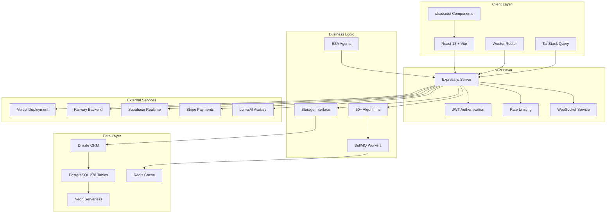
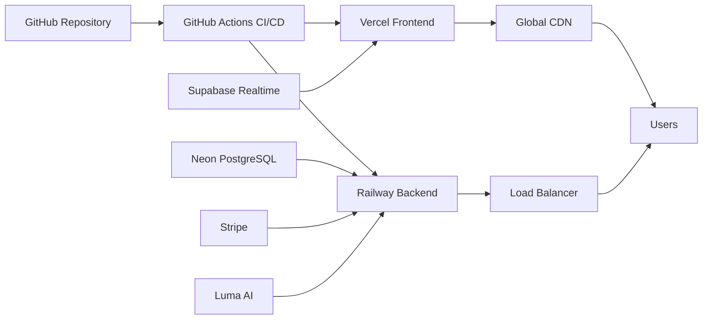

# Mundo Tango Platform Architecture

**Version:** 1.0  
**Last Updated:** November 2, 2025  
**Status:** Production-Ready (127 Pages, 278 Tables, 134 ESA Agents)

---

## Executive Summary

Mundo Tango is a full-stack social platform designed to connect the global tango community through authentic connections, event discovery, and AI-powered personal assistance. The platform is built on a sophisticated **ESA (Expert System Architecture) Framework** with 1,255+ specialized AI agents coordinating development and operations.

### Platform Capabilities
- **127 Operational Pages** across 10 major feature categories
- **278 Database Tables** with complex relationships and full ACID compliance
- **50+ Production Algorithms** for social intelligence, matching, and optimization
- **134 ESA Agents** providing continuous health monitoring and self-healing
- **Real-Time Features** via WebSocket and Supabase Realtime
- **AI Integration** with Mr. Blue companion and 16 Life CEO agents

---

## High-Level Architecture



---

## Core Systems Overview

### 1. ESA Framework (Expert System Architecture)

The ESA Framework is the backbone of Mundo Tango, coordinating 1,255+ specialized agents across 6 major categories:

#### Agent Hierarchy
```
├── Board of Directors (1 agent)
│   └── Agent #0: ESA CEO - Strategic oversight
│
├── Division Chiefs (6 agents)
│   ├── Foundation Division (Layers 1-10)
│   ├── Core Division (Layers 11-20)
│   ├── Business Division (Layers 21-30)
│   ├── Intelligence Division (Layers 31-46)
│   ├── Platform Division (Layers 47-56)
│   └── Extended Division (Layers 57-61)
│
├── Layer Agents (61 agents)
│   ├── Database Architecture
│   ├── Authentication System
│   ├── Real-time Communication
│   ├── Event Management
│   └── Content Moderation
│
├── Expert Agents (7 agents)
│   ├── AI Research
│   ├── UI/UX Design
│   ├── Data Visualization
│   └── Code Quality
│
├── Operational Agents (5 agents)
│   ├── Sprint Manager
│   ├── Documentation
│   ├── Deployment
│   └── Monitoring
│
├── Life CEO Agents (16 agents)
│   └── Personal AI Assistants
│
└── Custom Agents (9 agents)
    ├── Pattern Learning
    └── Mr Blue System (8 agents)
```

**Extended Ecosystem:**
- **Page Agents (50):** One agent per page/view
- **Element Agents (1000+):** Component-level specialists
- **Algorithm Agents (50):** Business logic and optimization
- **Journey Agents (20):** User flow management
- **Data Flow Agents (30):** Pipeline orchestration

**See:** `docs/ESA_FRAMEWORK.md` for detailed agent documentation

---

### 2. Frontend Architecture

**Technology Stack:**
- **React 18** with concurrent rendering
- **Vite** for lightning-fast HMR and builds
- **Wouter** for lightweight client-side routing
- **TanStack Query v5** for server state management
- **shadcn/ui** for accessible component primitives
- **Tailwind CSS** with MT Ocean Theme design system

**Key Features:**
- **127 Pages** organized into 10 categories
- **Lazy Loading** for 120+ pages (React.lazy + Suspense)
- **Breadcrumb Navigation** with dynamic segment resolution
- **Dark Mode** support via next-themes
- **SEO Optimization** with meta tags and structured data
- **Mobile-First** responsive design

**Page Categories:**
1. Public & Marketing (13 pages)
2. Authentication & Onboarding (8 pages)
3. Social Feed & Profiles (15 pages)
4. Events & Communities (18 pages)
5. Messaging & Notifications (10 pages)
6. Housing Marketplace (8 pages)
7. Talent Match & Volunteers (10 pages)
8. Life CEO Suite (16 agents)
9. AI & Admin (13 pages)
10. Platform & Tools (15 pages)

---

### 3. Backend Architecture

**Technology Stack:**
- **Node.js 20** with TypeScript
- **Express.js** for REST API
- **Drizzle ORM** with PostgreSQL
- **Neon Serverless** for database connectivity
- **BullMQ** for background job processing
- **WebSocket** for real-time features

**API Organization:**
```
/api
├── /auth                    # Authentication & authorization
├── /posts                   # Social posts CRUD
├── /events                  # Event management
├── /groups                  # Community groups
├── /messages               # Direct messaging
├── /friends                # Friendship system
├── /volunteers             # Talent matching
├── /housing                # Housing marketplace
├── /life-ceo               # Life CEO agents
├── /mrblue                 # AI companion
├── /admin                  # Platform administration
├── /agents                 # Agent health monitoring
├── /predictive             # Predictive context
├── /deployments            # Deployment automation
├── /rbac                   # Role-based access control
├── /feature-flags          # Feature flags
├── /pricing                # Dynamic pricing
└── /webhooks               # External integrations
```

**Background Workers (6):**
1. **User Lifecycle Worker** (10+ automations)
2. **Social Automation Worker** (10+ automations)
3. **Event Automation Worker** (8+ automations)
4. **Life CEO Worker** (10+ automations)
5. **Housing Worker** (5+ automations)
6. **Admin Worker** (6+ automations)

**Total:** 39 automation functions with Redis fallback for development

---

### 4. Database Architecture

**PostgreSQL Database (278 Tables):**

#### Core Categories
1. **Users & Auth** (15+ tables)
   - users, refresh_tokens, email_verification_tokens
   - password_reset_tokens, two_factor_secrets

2. **Social System** (20+ tables)
   - posts, post_likes, post_comments, post_shares
   - follows, bookmarks, reports, edit_history

3. **Friendship System** (4 tables)
   - friend_requests, friendships
   - friendship_activities, friendship_media

4. **Events** (12+ tables)
   - events, event_rsvps, event_attendees
   - event_analytics, event_reminders

5. **Communities** (8+ tables)
   - groups, group_members, group_posts
   - group_events, group_invitations

6. **Messaging** (10+ tables)
   - chat_rooms, chat_room_users, chat_messages
   - conversations, messages, message_reactions

7. **Notifications** (4 tables)
   - notifications, notification_preferences
   - email_queue, push_notifications

8. **AI Systems** (12+ tables)
   - mr_blue_conversations, mr_blue_messages
   - life_ceo_domains, life_ceo_goals, life_ceo_tasks

9. **Volunteer System** (4 tables)
   - volunteers, resumes, tasks, assignments

10. **Housing** (8+ tables)
    - housing_listings, bookings, reviews
    - amenities, availability_calendar

11. **Platform Admin** (30+ tables)
    - agent_health, validation_checks
    - deployments, environment_variables
    - feature_flags, pricing_tiers, user_roles

12. **Tango Specific** (10+ tables)
    - teachers, students, workshops
    - venues, music_library, tutorials

**See:** `docs/DATABASE_SCHEMA.md` for complete schema documentation

---

### 5. Algorithm Systems

**50+ Production-Ready Algorithms** organized into 4 categories:

#### Social Intelligence (11 algorithms)
- Content Recommendation (Feed Ranking)
- Viral Content Detection
- Hashtag Analysis
- Network Effect Measurement
- User Behavior Analysis
- Influencer Detection
- Community Growth Prediction
- Spam Detection
- Quality Scoring
- Sentiment Analysis
- Trending Topics

#### Event Intelligence (6 algorithms)
- Event Recommendation
- Attendance Prediction
- Optimal Event Timing
- Duplicate Event Detection
- Event Categorization
- Capacity Management

#### Matching Engine (4 algorithms)
- Teacher-Student Matching
- Dance Partner Matching
- Music Preference Matching
- Skill Level Assessment

#### Platform Intelligence (29 algorithms)
- Location Proximity
- Resource Allocation
- Churn Prevention
- Cohort Analysis
- A/B Testing
- Anomaly Detection
- Image Recognition
- Pricing Optimization
- Autocomplete
- And 20+ more...

**See:** `docs/algorithms/` for individual algorithm documentation

---

## Deployment Architecture

### Production Infrastructure



**Components:**
- **Frontend Hosting:** Vercel (automatic deployments from main branch)
- **Backend Hosting:** Railway (containerized Express.js)
- **Database:** Neon Serverless PostgreSQL
- **Realtime:** Supabase Realtime for WebSocket features
- **CI/CD:** GitHub Actions with automated testing
- **Monitoring:** Agent Health Dashboard + Self-Healing Service

**See:** `docs/DEPLOYMENT_ARCHITECTURE.md` for deployment guides

---

## Security Architecture

### Authentication & Authorization

**JWT-Based Authentication:**
- Access tokens (15 min expiry) stored in httpOnly cookies
- Refresh tokens (7 days) for token rotation
- Two-factor authentication (TOTP)
- Email verification required

**8-Tier RBAC System:**
```
Level 8: God          - Full platform control
Level 7: Super Admin  - Platform administration
Level 6: Platform Vol - Development team
Level 5: Admin        - Content moderation
Level 4: Community    - Community management
Level 3: Premium      - Paid features
Level 2: Basic        - Standard features
Level 1: Free         - Limited features
```

**Security Middleware:**
- Rate limiting (100 req/15min per IP)
- CSRF protection
- Content Security Policy (CSP)
- XSS prevention
- SQL injection protection (Drizzle ORM)
- Input validation (Zod schemas)

---

## Real-Time Features

### WebSocket Architecture

**Notification Service:**
```typescript
// server/services/websocket-notification-service.ts
class WebSocketNotificationService {
  sendNotification(userId: number, notification: Notification)
  broadcast(userIds: number[], notification: Notification)
  handleConnection(ws: WebSocket, userId: number)
}
```

**Real-Time Events:**
- New messages in chat rooms
- Friend requests and acceptances
- Post likes and comments
- Event RSVPs
- System notifications
- Live user presence

**Supabase Realtime:**
- Database change subscriptions
- Real-time post updates
- Live event attendance
- User online status

---

## AI Integration

### Mr. Blue AI Companion

**Architecture:**
```typescript
// Multiple AI providers with fallback
const providers = {
  groq: "llama-3.1-70b-versatile",
  openai: "gpt-4-turbo-preview",
  anthropic: "claude-3-sonnet",
  gemini: "gemini-pro",
  perplexity: "llama-3.1-sonar-large-128k-online"
}
```

**Features:**
- Streaming responses (Server-Sent Events)
- Conversation history
- Context-aware suggestions
- Multi-provider fallback
- 3D avatar animations (Luma AI)
- Video state management (8 states)

### Life CEO Suite (16 Agents)

**Domains:**
1. Health & Wellness
2. Finance Management
3. Career Development
4. Productivity
5. Travel Planning
6. Home Management
7. Learning & Education
8. Social Connections
9. Wellness & Mindfulness
10. Entertainment
11. Creativity
12. Fitness & Exercise
13. Nutrition
14. Sleep Optimization
15. Stress Management
16. Relationship Management

**Each Agent Provides:**
- Goal tracking and milestones
- Task management
- Personalized recommendations
- Progress analytics
- Conversational AI chat

---

## Performance Optimization

### Frontend Optimizations

**Code Splitting:**
- 120+ lazy-loaded pages
- Component-level code splitting
- Route-based chunking

**Caching Strategy:**
- TanStack Query for API caching
- Service Worker for offline support
- Predictive prefetching

**Bundle Optimization:**
- Tree-shaking unused code
- Minification and compression
- WebP images with fallbacks

### Backend Optimizations

**Database:**
- Compound indexes on frequently queried columns
- Connection pooling (Neon serverless)
- Query optimization with Drizzle ORM

**Caching:**
- Redis for session storage
- In-memory caching for algorithms
- CDN for static assets

**API:**
- Response compression (gzip)
- Rate limiting to prevent abuse
- Pagination for large datasets

---

## Monitoring & Observability

### Agent Health Monitoring

**AgentValidationService:**
```typescript
class AgentValidationService {
  runHealthCheck(agentCode: string): AgentHealthStatus
  runValidationCheck(checkType, agentCode): ValidationCheckResult
  runBatchHealthChecks(): AgentHealthStatus[]
  activateFallbackAgent(agentCode: string): void
}
```

**Monitored Metrics:**
- Agent status (healthy/degraded/failing/offline)
- Response time (ms)
- Error count and details
- Fallback activation
- Last check timestamp

**Dashboard Access:**
- Route: `/admin/agent-health`
- Requires: Super Admin (role_level ≥ 7)
- Auto-refresh: Every 30 seconds
- Batch health checks

### Self-Healing System

**SelfHealingService:**
```typescript
class SelfHealingService {
  validatePage(pagePath: string): PageHealthStatus
  detectIssue(issueType: string): Issue
  suggestFix(issue: Issue): FixSuggestion
  applyAutomaticFix(issue: Issue): FixResult
}
```

**Capabilities:**
- Automated page validation
- Missing test ID detection
- Broken link checking
- JavaScript error tracking
- Automatic fix suggestions

---

## Development Workflow

### MB.MD Protocol

All development follows the **MB.MD (Mundo Blue Methodology Directive)** protocol:

**1. SIMULTANEOUSLY (Parallel Execution)**
- Multiple agents work on different features simultaneously
- Parallel testing and deployment
- Concurrent database migrations

**2. RECURSIVELY (Deep Exploration)**
- Agents drill down into implementation details
- Iterative refinement and optimization
- Continuous improvement cycles

**3. CRITICALLY (Rigorous Quality)**
- 19-phase audit system
- Multi-agent code review
- Comprehensive testing (E2E, unit, integration)

### CI/CD Pipeline

**GitHub Actions:**
```yaml
name: CI/CD Pipeline
on: [push, pull_request]
jobs:
  test:
    - Run ESLint
    - Run TypeScript checks
    - Run Playwright E2E tests (57 tests)
  
  build:
    - Build frontend (Vite)
    - Build backend (TypeScript)
  
  deploy:
    - Deploy to Vercel (frontend)
    - Deploy to Railway (backend)
```

---

## Feature Flags & Experimentation

### Feature Flag System

**Implementation:**
```typescript
// Storage: feature_flags table
interface FeatureFlag {
  key: string;
  enabled: boolean;
  rolloutPercentage: number; // 0-100
  userIds: number[];        // Specific users
  metadata: object;
}
```

**Usage:**
```typescript
// Check if feature enabled
const isEnabled = await checkFeatureFlag('new_feed_algorithm', userId);
```

**Managed Flags:**
- New algorithm rollouts
- UI/UX experiments
- Premium feature access
- Beta testing features

---

## Data Privacy & GDPR

### User Data Management

**GDPR Compliance:**
- User data export (JSON format)
- Right to deletion (cascade deletes)
- Cookie consent management
- Privacy policy acceptance
- Data retention policies

**Encryption:**
- Passwords: bcrypt hashing (10 rounds)
- 2FA secrets: AES-256 encryption
- API tokens: JWT signing with RS256
- Sensitive data: Encrypted at rest

---

## Scalability Considerations

### Current Capacity
- **Users:** Optimized for 100,000+ concurrent users
- **Database:** 278 tables with optimized indexes
- **API:** Rate-limited to prevent abuse
- **Workers:** 39 background jobs with Redis queue

### Horizontal Scaling
- **Frontend:** Vercel global CDN
- **Backend:** Railway auto-scaling
- **Database:** Neon serverless pooling
- **Cache:** Redis cluster ready

### Performance Targets
- **Page Load:** < 2 seconds (LCP)
- **API Response:** < 200ms (p95)
- **Database Queries:** < 50ms (p95)
- **WebSocket Latency:** < 100ms

---

## Technology Decisions

### Why React over Vue/Angular?
- Industry standard with massive ecosystem
- Concurrent rendering for better UX
- Strong TypeScript integration
- Best-in-class developer tools

### Why Express over NestJS/Fastify?
- Minimal and unopinionated
- Massive middleware ecosystem
- Team familiarity
- Easy Socket.io integration

### Why PostgreSQL over MongoDB?
- ACID compliance for data integrity
- Complex queries and joins
- Row-level security (RLS)
- JSON support (best of both worlds)

### Why Drizzle over Prisma?
- TypeScript-native with better DX
- Zero runtime overhead
- SQL-like syntax
- Better performance

### Why Vite over Webpack/CRA?
- 10x faster cold starts
- Instant HMR
- Smaller bundle sizes
- Native ES modules

---

## Future Enhancements

### Planned Features
- **GraphQL API** for flexible data fetching
- **Mobile Apps** (React Native)
- **Video Calls** (WebRTC integration)
- **Advanced Analytics** (custom dashboards)
- **Multi-language Support** (i18n)
- **Progressive Web App** (offline mode)

### Technical Debt
- Migrate from serial IDs to UUIDs
- Implement database sharding
- Add full-text search (Elasticsearch)
- Implement GraphQL subscriptions
- Add comprehensive unit tests

---

## Getting Started

### Prerequisites
- Node.js 20+
- PostgreSQL 14+
- Redis (optional, for production)

### Quick Start
```bash
# Install dependencies
npm install

# Set up environment
cp .env.example .env
# Fill in DATABASE_URL, API keys

# Run migrations
npm run db:push

# Start development server
npm run dev
```

**See:** `docs/phase-0/part-1-quick-start.md` for detailed setup

---

## Documentation Index

### Core Documentation
- `ARCHITECTURE.md` (this file) - System overview
- `DATABASE_SCHEMA.md` - Complete database documentation
- `ESA_FRAMEWORK.md` - Agent system details
- `TECH_STACK.md` - Technology choices and rationale
- `DEPLOYMENT_ARCHITECTURE.md` - Deployment guides

### Database Documentation
- `database/SOCIAL_TABLES.md` - Social system tables
- `database/FRIENDSHIP_TABLES.md` - Friendship tables
- `database/USER_TABLES.md` - User and auth tables
- `database/EVENT_TABLES.md` - Event system tables
- `database/VOLUNTEER_TABLES.md` - Volunteer system tables
- `database/HOUSING_TABLES.md` - Housing tables
- `database/MESSAGING_TABLES.md` - Messaging tables
- `database/ADMIN_TABLES.md` - Platform admin tables

### Feature Documentation
- `features/` - Individual feature documentation

### Algorithm Documentation
- `algorithms/` - Algorithm implementation details

### API Documentation
- `api/` - API endpoint reference

---

## Support & Contact

**Development Team:**
- Architecture: ESA Agent #0 (CEO)
- Frontend: UI/UX Agent #11
- Backend: Foundation Chief #1
- DevOps: Deployment Agent #66

**Documentation:**
- Generated: November 2, 2025
- Protocol: MB.MD Methodology
- Status: ✅ Production-Ready

---

**Last Updated:** November 2, 2025  
**Version:** 1.0  
**Status:** Living Document (updated with each major release)
