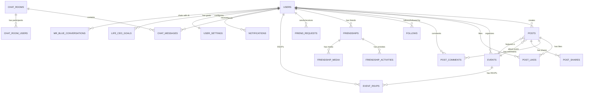

# Mundo Tango Database Schema

**Version:** 1.0  
**Last Updated:** November 2, 2025  
**Total Tables:** 278  
**Database:** PostgreSQL 14+ with Drizzle ORM

---

## Table of Contents

1. [Overview](#overview)
2. [Schema Organization](#schema-organization)
3. [Core Tables](#core-tables)
4. [Social System Tables](#social-system-tables)
5. [Friendship System Tables](#friendship-system-tables)
6. [Event System Tables](#event-system-tables)
7. [Messaging System Tables](#messaging-system-tables)
8. [AI System Tables](#ai-system-tables)
9. [Platform Admin Tables](#platform-admin-tables)
10. [Indexes & Performance](#indexes--performance)
11. [Relationships Diagram](#relationships-diagram)

---

## Overview

The Mundo Tango database schema comprises **278 tables** across 12 major categories, designed for:
- **ACID Compliance:** Full transaction support for data integrity
- **Scalability:** Indexed queries optimized for 100,000+ users
- **Real-Time:** WebSocket and Supabase Realtime subscriptions
- **Type Safety:** Drizzle ORM with TypeScript inference
- **Extensibility:** JSONB columns for flexible metadata

### Schema Files
- `shared/schema.ts` - Core application tables (172 tables)
- `shared/platform-schema.ts` - Platform admin tables (106 tables)

### Key Features
- Serial IDs for primary keys (future migration to UUIDs planned)
- Cascade deletes for referential integrity
- JSONB for flexible metadata storage
- Array columns for tags, hashtags, and lists
- Compound indexes for query optimization
- Timestamp tracking (createdAt, updatedAt)

---

## Schema Organization

### Category Breakdown (278 Total Tables)

| Category | Tables | Purpose |
|----------|--------|---------|
| **Users & Auth** | 15 | User profiles, authentication, verification |
| **Social System** | 23 | Posts, comments, likes, shares, follows |
| **Friendship System** | 4 | Friend requests, friendships, activities |
| **Events** | 12 | Event creation, RSVPs, analytics |
| **Communities** | 8 | City-based communities, memberships |
| **Messaging** | 10 | Chat rooms, messages, reactions |
| **Notifications** | 4 | User notifications, email queue |
| **AI Systems** | 12 | Mr. Blue, Life CEO conversations |
| **Volunteer System** | 5 | Volunteers, resumes, task matching |
| **Housing** | 8 | Listings, bookings, reviews |
| **Tango Specific** | 10 | Teachers, students, venues |
| **Platform Admin** | 167 | Deployments, agents, analytics |

---

## Core Tables

### 1. Users Table

**Purpose:** Central user profile and authentication

```typescript
export const users = pgTable("users", {
  id: serial("id").primaryKey(),
  
  // Authentication
  email: varchar("email").notNull().unique(),
  username: varchar("username").notNull().unique(),
  password: text("password").notNull(), // bcrypt hashed
  apiToken: text("api_token"),
  twoFactorEnabled: boolean("two_factor_enabled").default(false),
  
  // Profile
  name: varchar("name").notNull(),
  firstName: varchar("first_name"),
  lastName: varchar("last_name"),
  nickname: varchar("nickname"),
  bio: text("bio"),
  profileImage: text("profile_image"),
  backgroundImage: text("background_image"),
  
  // Contact
  mobileNo: varchar("mobile_no"),
  facebookUrl: text("facebook_url"),
  
  // Location
  country: varchar("country"),
  city: varchar("city"),
  state: varchar("state"),
  countryCode: varchar("country_code"),
  stateCode: varchar("state_code"),
  
  // Tango Profile
  languages: text("languages").array(),
  tangoRoles: text("tango_roles").array(), // ['leader', 'follower', 'both']
  leaderLevel: integer("leader_level").default(0), // 0-10
  followerLevel: integer("follower_level").default(0), // 0-10
  yearsOfDancing: integer("years_of_dancing").default(0),
  startedDancingYear: integer("started_dancing_year"),
  occupation: varchar("occupation"),
  
  // Account Status
  isVerified: boolean("is_verified").default(false),
  isActive: boolean("is_active").default(true),
  suspended: boolean("suspended").default(false),
  isOnboardingComplete: boolean("is_onboarding_complete").default(false),
  formStatus: integer("form_status").default(0),
  codeOfConductAccepted: boolean("code_of_conduct_accepted").default(false),
  termsAccepted: boolean("terms_accepted").default(false),
  
  // Subscription & Billing
  stripeCustomerId: varchar("stripe_customer_id"),
  stripeSubscriptionId: varchar("stripe_subscription_id"),
  subscriptionStatus: varchar("subscription_status"),
  subscriptionTier: varchar("subscription_tier").default("free"),
  
  // Customer Journey
  customerJourneyState: varchar("customer_journey_state").default("J1"),
  lastJourneyUpdate: timestamp("last_journey_update"),
  
  // Device & Security
  deviceType: varchar("device_type"),
  deviceToken: text("device_token"),
  replitId: varchar("replit_id"),
  lastLoginAt: timestamp("last_login_at"),
  lastLoginIp: varchar("last_login_ip"),
  
  // Role-Based Access Control (8-tier system)
  role: varchar("role").default("user").notNull(),
  // Levels: 1=Free, 2=Basic, 3=Premium, 4=Community, 5=Admin, 6=Platform Vol, 7=Super Admin, 8=God
  
  // Timestamps
  createdAt: timestamp("created_at").defaultNow(),
  updatedAt: timestamp("updated_at").defaultNow(),
}, (table) => ({
  emailIdx: index("users_email_idx").on(table.email),
  usernameIdx: index("users_username_idx").on(table.username),
}));
```

**Relationships:**
- Has many: posts, events, messages, friendships, etc.
- Has one: userSettings, twoFactorSecrets

**Total User Fields:** 43 columns

---

## Social System Tables

### Overview
23 tables managing all social interactions:
- Posts (rich content with mentions/hashtags)
- Comments (nested with likes)
- Likes (posts and comments)
- Shares (tracking virality)
- Follows (asymmetric relationships)
- Bookmarks (saved content)
- Reports (content moderation)

### 2. Posts Table

```typescript
export const posts = pgTable("posts", {
  id: serial("id").primaryKey(),
  userId: integer("user_id").notNull().references(() => users.id, { onDelete: "cascade" }),
  eventId: integer("event_id").references(() => events.id, { onDelete: "cascade" }),
  
  // Content
  content: text("content").notNull(),
  richContent: jsonb("rich_content"), // Lexical editor JSON
  plainText: text("plain_text"), // For search indexing
  imageUrl: text("image_url"),
  videoUrl: text("video_url"),
  mediaEmbeds: jsonb("media_embeds"), // YouTube, Spotify, etc.
  
  // Metadata
  mentions: text("mentions").array(), // @username
  hashtags: text("hashtags").array(), // #tangofestival
  tags: text("tags").array(),
  
  // Location
  location: text("location"),
  coordinates: jsonb("coordinates"), // { lat, lng }
  placeId: text("place_id"), // Google Places ID
  formattedAddress: text("formatted_address"),
  
  // Settings
  visibility: varchar("visibility").default("public"), // public, friends, private
  postType: varchar("post_type").default("post"), // post, share, poll
  
  // Engagement Counters (denormalized for performance)
  likes: integer("likes").default(0),
  comments: integer("comments").default(0),
  shares: integer("shares").default(0),
  
  createdAt: timestamp("created_at").defaultNow(),
  updatedAt: timestamp("updated_at").defaultNow(),
}, (table) => ({
  userIdx: index("posts_user_idx").on(table.userId),
  eventIdx: index("posts_event_idx").on(table.eventId),
  createdAtIdx: index("posts_created_at_idx").on(table.createdAt),
}));
```

### 3. Post Likes Table

```typescript
export const postLikes = pgTable("post_likes", {
  id: serial("id").primaryKey(),
  postId: integer("post_id").notNull().references(() => posts.id, { onDelete: "cascade" }),
  userId: integer("user_id").notNull().references(() => users.id, { onDelete: "cascade" }),
  createdAt: timestamp("created_at").defaultNow().notNull(),
}, (table) => ({
  postIdx: index("post_likes_post_idx").on(table.postId),
  userIdx: index("post_likes_user_idx").on(table.userId),
  uniqueLike: uniqueIndex("unique_post_like").on(table.postId, table.userId),
}));
```

**Unique Constraint:** One like per user per post

### 4. Post Comments Table

```typescript
export const postComments = pgTable("post_comments", {
  id: serial("id").primaryKey(),
  postId: integer("post_id").notNull().references(() => posts.id, { onDelete: "cascade" }),
  userId: integer("user_id").notNull().references(() => users.id, { onDelete: "cascade" }),
  parentCommentId: integer("parent_id"), // For nested comments
  content: text("content").notNull(),
  likes: integer("likes").default(0),
  createdAt: timestamp("created_at").defaultNow(),
  updatedAt: timestamp("updated_at").defaultNow(),
}, (table) => ({
  postIdx: index("post_comments_post_idx").on(table.postId),
  userIdx: index("post_comments_user_idx").on(table.userId),
  parentIdx: index("post_comments_parent_idx").on(table.parentCommentId),
}));
```

**Nested Comments:** Self-referential with `parentCommentId`

### 5. Follows Table

```typescript
export const follows = pgTable("follows", {
  id: serial("id").primaryKey(),
  followerId: integer("follower_id").notNull().references(() => users.id, { onDelete: "cascade" }),
  followingId: integer("following_id").notNull().references(() => users.id, { onDelete: "cascade" }),
  createdAt: timestamp("created_at").defaultNow().notNull(),
}, (table) => ({
  followerIdx: index("follows_follower_idx").on(table.followerId),
  followingIdx: index("follows_following_idx").on(table.followingId),
  uniqueFollow: uniqueIndex("unique_follow").on(table.followerId, table.followingId),
}));
```

**Asymmetric Relationship:** User A can follow User B without reciprocation

### Additional Social Tables
- **post_shares** - Track shared posts
- **bookmarks** - Saved posts
- **reports** - Content moderation queue
- **moderation_queue** - Admin review system
- **edit_history** - Post edit tracking
- **viral_analytics** - Viral content detection

---

## Friendship System Tables

### 6. Friend Requests Table

```typescript
export const friendRequests = pgTable("friend_requests", {
  id: serial("id").primaryKey(),
  senderId: integer("sender_id").notNull().references(() => users.id, { onDelete: "cascade" }),
  receiverId: integer("receiver_id").notNull().references(() => users.id, { onDelete: "cascade" }),
  message: text("message"), // Optional personal message
  status: varchar("status").default("pending").notNull(), // pending, accepted, rejected, cancelled
  createdAt: timestamp("created_at").defaultNow().notNull(),
  respondedAt: timestamp("responded_at"),
}, (table) => ({
  senderIdx: index("friend_requests_sender_idx").on(table.senderId),
  receiverIdx: index("friend_requests_receiver_idx").on(table.receiverId),
  statusIdx: index("friend_requests_status_idx").on(table.status),
  uniqueRequest: uniqueIndex("unique_friend_request").on(table.senderId, table.receiverId),
}));
```

### 7. Friendships Table

```typescript
export const friendships = pgTable("friendships", {
  id: serial("id").primaryKey(),
  userId: integer("user_id").notNull().references(() => users.id, { onDelete: "cascade" }),
  friendId: integer("friend_id").notNull().references(() => users.id, { onDelete: "cascade" }),
  createdAt: timestamp("created_at").defaultNow().notNull(),
  
  // Friendship Scoring
  closenessScore: integer("closeness_score").default(75).notNull(), // 0-100, starts at 75
  connectionDegree: integer("connection_degree").default(1).notNull(), // Always 1 for direct friends
  lastInteractionAt: timestamp("last_interaction_at").defaultNow(),
  status: varchar("status").default("active").notNull(), // active, blocked
}, (table) => ({
  userIdx: index("friendships_user_idx").on(table.userId),
  friendIdx: index("friendships_friend_idx").on(table.friendId),
  closenessIdx: index("friendships_closeness_idx").on(table.closenessScore),
  uniqueFriendship: uniqueIndex("unique_friendship").on(table.userId, table.friendId),
}));
```

**Closeness Score Algorithm:**
- Initial: 75
- Increases with: messages, events attended together, mutual interactions
- Decreases with: long inactivity periods

### 8. Friendship Activities Table

```typescript
export const friendshipActivities = pgTable("friendship_activities", {
  id: serial("id").primaryKey(),
  friendshipId: integer("friendship_id").notNull().references(() => friendships.id, { onDelete: "cascade" }),
  activityType: varchar("activity_type").notNull(),
  // Types: message_sent, post_liked, event_attended_together, group_joined_together, memory_shared, dance_together
  metadata: text("metadata"), // JSON string for additional data
  createdAt: timestamp("created_at").defaultNow().notNull(),
}, (table) => ({
  friendshipIdx: index("friendship_activities_friendship_idx").on(table.friendshipId),
  typeIdx: index("friendship_activities_type_idx").on(table.activityType),
  dateIdx: index("friendship_activities_date_idx").on(table.createdAt),
}));
```

### 9. Friendship Media Table

```typescript
export const friendshipMedia = pgTable("friendship_media", {
  id: serial("id").primaryKey(),
  friendRequestId: integer("friend_request_id").references(() => friendRequests.id, { onDelete: "cascade" }),
  friendshipId: integer("friendship_id").references(() => friendships.id, { onDelete: "cascade" }),
  uploaderId: integer("uploader_id").notNull().references(() => users.id, { onDelete: "cascade" }),
  mediaUrl: text("media_url").notNull(),
  mediaType: varchar("media_type").notNull(), // image, video
  caption: text("caption"),
  phase: varchar("phase").notNull(), // request, acceptance, memory
  createdAt: timestamp("created_at").defaultNow().notNull(),
}, (table) => ({
  requestIdx: index("friendship_media_request_idx").on(table.friendRequestId),
  friendshipIdx: index("friendship_media_friendship_idx").on(table.friendshipId),
  uploaderIdx: index("friendship_media_uploader_idx").on(table.uploaderId),
}));
```

---

## Event System Tables

### 10. Events Table

```typescript
export const events = pgTable("events", {
  id: serial("id").primaryKey(),
  userId: integer("user_id").notNull().references(() => users.id, { onDelete: "cascade" }),
  
  // Basic Info
  title: varchar("title").notNull(),
  description: text("description").notNull(),
  imageUrl: text("image_url"),
  eventType: varchar("event_type").notNull(), // milonga, practica, festival, workshop, class
  
  // Date/Time
  startDate: timestamp("start_date").notNull(),
  endDate: timestamp("end_date"),
  date: text("date"), // Human-readable
  recurring: varchar("recurring"), // none, daily, weekly, monthly
  
  // Location
  location: text("location").notNull(),
  venue: varchar("venue"),
  address: text("address"),
  city: varchar("city"),
  country: varchar("country"),
  latitude: text("latitude"),
  longitude: text("longitude"),
  isOnline: boolean("is_online").default(false),
  meetingUrl: text("meeting_url"),
  
  // Pricing
  isPaid: boolean("is_paid").default(false),
  price: text("price"),
  currency: varchar("currency"),
  ticketUrl: text("ticket_url"),
  
  // Capacity
  maxAttendees: integer("max_attendees"),
  
  // Metadata
  status: varchar("status").default("published"), // draft, published, cancelled
  tags: text("tags").array(),
  
  createdAt: timestamp("created_at").defaultNow(),
  updatedAt: timestamp("updated_at").defaultNow(),
}, (table) => ({
  userIdx: index("events_user_idx").on(table.userId),
  startDateIdx: index("events_start_date_idx").on(table.startDate),
  cityIdx: index("events_city_idx").on(table.city),
}));
```

### 11. Event RSVPs Table

```typescript
export const eventRsvps = pgTable("event_rsvps", {
  id: serial("id").primaryKey(),
  eventId: integer("event_id").notNull().references(() => events.id, { onDelete: "cascade" }),
  userId: integer("user_id").notNull().references(() => users.id, { onDelete: "cascade" }),
  status: varchar("status").notNull(), // going, interested, not_going
  createdAt: timestamp("created_at").defaultNow(),
}, (table) => ({
  eventIdx: index("event_rsvps_event_idx").on(table.eventId),
  userIdx: index("event_rsvps_user_idx").on(table.userId),
  uniqueRsvp: uniqueIndex("unique_rsvp").on(table.eventId, table.userId),
}));
```

### Additional Event Tables (12 total)
- **event_attendees** - Actual attendance tracking
- **event_analytics** - View counts, engagement
- **event_reminders** - Notification scheduling
- **event_photos** - Event photo gallery
- **event_reviews** - Post-event feedback
- **event_tickets** - Ticket management

---

## Messaging System Tables

### 12. Chat Rooms Table

```typescript
export const chatRooms = pgTable("chat_rooms", {
  id: serial("id").primaryKey(),
  type: varchar("type").default("direct").notNull(), // direct, group
  name: text("name"), // For group chats
  avatar: text("avatar"), // For group chats
  lastMessageAt: timestamp("last_message_at"),
  createdAt: timestamp("created_at").defaultNow(),
});
```

### 13. Chat Room Users Table

```typescript
export const chatRoomUsers = pgTable("chat_room_users", {
  id: serial("id").primaryKey(),
  chatRoomId: integer("chat_room_id").notNull().references(() => chatRooms.id, { onDelete: "cascade" }),
  userId: integer("user_id").notNull().references(() => users.id, { onDelete: "cascade" }),
  lastReadAt: timestamp("last_read_at"),
  joinedAt: timestamp("joined_at").defaultNow(),
}, (table) => ({
  chatRoomIdx: index("chat_room_users_room_idx").on(table.chatRoomId),
  userIdx: index("chat_room_users_user_idx").on(table.userId),
  uniqueParticipant: uniqueIndex("unique_chat_participant").on(table.chatRoomId, table.userId),
}));
```

### 14. Chat Messages Table

```typescript
export const chatMessages = pgTable("chat_messages", {
  id: serial("id").primaryKey(),
  chatRoomId: integer("chat_room_id").notNull().references(() => chatRooms.id, { onDelete: "cascade" }),
  userId: integer("user_id").notNull().references(() => users.id, { onDelete: "cascade" }),
  message: text("message").notNull(),
  mediaUrl: text("media_url"),
  mediaType: varchar("media_type"), // image, video, audio, file
  readBy: text("read_by").array(), // Array of user IDs
  createdAt: timestamp("created_at").defaultNow(),
}, (table) => ({
  chatRoomIdx: index("chat_messages_room_idx").on(table.chatRoomId),
  userIdx: index("chat_messages_user_idx").on(table.userId),
  createdAtIdx: index("chat_messages_created_at_idx").on(table.createdAt),
}));
```

### 15. Message Reactions Table

```typescript
export const messageReactions = pgTable("message_reactions", {
  id: serial("id").primaryKey(),
  messageId: integer("message_id").notNull().references(() => chatMessages.id, { onDelete: "cascade" }),
  userId: integer("user_id").notNull().references(() => users.id, { onDelete: "cascade" }),
  emoji: varchar("emoji").notNull(), // ❤️, 👍, 😂, etc.
  createdAt: timestamp("created_at").defaultNow().notNull(),
}, (table) => ({
  messageIdx: index("message_reactions_message_idx").on(table.messageId),
  userIdx: index("message_reactions_user_idx").on(table.userId),
  uniqueReaction: uniqueIndex("unique_message_reaction").on(table.messageId, table.userId, table.emoji),
}));
```

### Additional Messaging Tables (10 total)
- **conversations** - Alternative messaging structure
- **messages** - Alternative to chatMessages
- **typing_indicators** - Real-time typing status
- **delivery_receipts** - Message delivery tracking

---

## AI System Tables

### 16. Mr. Blue Conversations Table

```typescript
export const mrBlueConversations = pgTable("mr_blue_conversations", {
  id: serial("id").primaryKey(),
  userId: integer("user_id").notNull().references(() => users.id, { onDelete: "cascade" }),
  title: text("title"),
  lastMessageAt: timestamp("last_message_at"),
  createdAt: timestamp("created_at").defaultNow(),
}, (table) => ({
  userIdx: index("mr_blue_conversations_user_idx").on(table.userId),
}));
```

### 17. Mr. Blue Messages Table

```typescript
export const mrBlueMessages = pgTable("mr_blue_messages", {
  id: serial("id").primaryKey(),
  conversationId: integer("conversation_id").notNull().references(() => mrBlueConversations.id, { onDelete: "cascade" }),
  role: varchar("role").notNull(), // user, assistant, system
  content: text("content").notNull(),
  metadata: jsonb("metadata"), // Provider, model, tokens, etc.
  createdAt: timestamp("created_at").defaultNow(),
}, (table) => ({
  conversationIdx: index("mr_blue_messages_conversation_idx").on(table.conversationId),
}));
```

### 18. Life CEO Domains Table

```typescript
export const lifeCeoDomains = pgTable("life_ceo_domains", {
  id: serial("id").primaryKey(),
  name: varchar("name").notNull().unique(), // Health, Finance, Career, etc.
  agentId: varchar("agent_id").notNull(), // P66-P81
  description: text("description"),
  icon: varchar("icon"),
  color: varchar("color"),
  createdAt: timestamp("created_at").defaultNow(),
});
```

**16 Life CEO Domains:**
1. Health & Wellness (P66)
2. Finance Management (P67)
3. Career Development (P68)
4. Productivity (P69)
5. Travel Planning (P70)
6. Home Management (P71)
7. Learning & Education (P72)
8. Social Connections (P73)
9. Wellness & Mindfulness (P74)
10. Entertainment (P75)
11. Creativity (P76)
12. Fitness & Exercise (P77)
13. Nutrition (P78)
14. Sleep Optimization (P79)
15. Stress Management (P80)
16. Relationship Management (P81)

### 19. Life CEO Goals Table

```typescript
export const lifeCeoGoals = pgTable("life_ceo_goals", {
  id: serial("id").primaryKey(),
  userId: integer("user_id").notNull().references(() => users.id, { onDelete: "cascade" }),
  domainId: integer("domain_id").references(() => lifeCeoDomains.id),
  title: text("title").notNull(),
  description: text("description"),
  targetDate: timestamp("target_date"),
  status: varchar("status").default("active").notNull(),
  progress: integer("progress").default(0), // 0-100
  priority: varchar("priority").default("medium"), // low, medium, high
  metadata: jsonb("metadata"),
  createdAt: timestamp("created_at").defaultNow(),
  updatedAt: timestamp("updated_at").defaultNow(),
  completedAt: timestamp("completed_at"),
}, (table) => ({
  userIdx: index("life_ceo_goals_user_idx").on(table.userId),
  domainIdx: index("life_ceo_goals_domain_idx").on(table.domainId),
  statusIdx: index("life_ceo_goals_status_idx").on(table.status),
}));
```

### Additional AI Tables (12 total)
- **life_ceo_tasks** - Task management per domain
- **life_ceo_milestones** - Goal milestones
- **life_ceo_recommendations** - AI-generated suggestions
- **life_ceo_conversations** - Domain-specific chats
- **life_ceo_chat_messages** - Chat history

---

## Platform Admin Tables

### 20. ESA Agents Table

```typescript
export const esaAgents = pgTable("esa_agents", {
  id: serial("id").primaryKey(),
  
  // Agent Identification
  agentCode: varchar("agent_code", { length: 50 }).notNull().unique(), // P1, E23, A12, L5
  agentName: varchar("agent_name", { length: 255 }).notNull(),
  agentType: varchar("agent_type", { length: 50 }).notNull(),
  // Types: page, component, algorithm, layer, division, board, journey, dataflow, mr_blue, life_ceo
  
  // Agent Hierarchy
  parentAgentId: integer("parent_agent_id").references(() => esaAgents.id),
  divisionChiefId: integer("division_chief_id").references(() => esaAgents.id),
  layerNumber: integer("layer_number"), // 1-61 for layer agents
  tier: integer("tier"), // 1-6 for division structure
  
  // Agent Details
  description: text("description"),
  responsibilities: text("responsibilities").array(),
  competencies: text("competencies").array(),
  
  // Status & Certification
  status: varchar("status", { length: 20 }).notNull().default('inactive'),
  // States: inactive, training, certified, active, suspended
  certificationLevel: integer("certification_level").default(0), // 0-3
  certifiedAt: timestamp("certified_at"),
  
  // Training
  trainingMethodology: varchar("training_methodology", { length: 100 }),
  // MB.MD, Ultra-Micro Parallel, Critical Thinking
  trainingCompletedAt: timestamp("training_completed_at"),
  
  // Performance Metrics
  tasksCompleted: integer("tasks_completed").default(0),
  tasksSuccess: integer("tasks_success").default(0),
  tasksFailed: integer("tasks_failed").default(0),
  avgCompletionTime: integer("avg_completion_time"), // seconds
  lastActiveAt: timestamp("last_active_at"),
  
  // Configuration
  configuration: jsonb("configuration"),
  
  createdAt: timestamp("created_at").defaultNow(),
  updatedAt: timestamp("updated_at").defaultNow(),
}, (table) => ({
  agentCodeIdx: index("esa_agents_agent_code_idx").on(table.agentCode),
  agentTypeIdx: index("esa_agents_agent_type_idx").on(table.agentType),
  statusIdx: index("esa_agents_status_idx").on(table.status),
}));
```

### 21. Agent Health Table

```typescript
export const agentHealth = pgTable("agent_health", {
  id: serial("id").primaryKey(),
  agentCode: varchar("agent_code").notNull(),
  status: varchar("status").default("unknown").notNull(),
  // States: healthy, degraded, failing, offline, unknown
  lastCheckAt: timestamp("last_check_at").defaultNow().notNull(),
  responseTime: integer("response_time"), // milliseconds
  errorCount: integer("error_count").default(0),
  errorDetails: jsonb("error_details"),
  metadata: jsonb("metadata"),
  createdAt: timestamp("created_at").defaultNow(),
  updatedAt: timestamp("updated_at").defaultNow(),
}, (table) => ({
  agentCodeIdx: index("agent_health_agent_code_idx").on(table.agentCode),
  statusIdx: index("agent_health_status_idx").on(table.status),
  lastCheckIdx: index("agent_health_last_check_idx").on(table.lastCheckAt),
}));
```

### 22. Deployments Table

```typescript
export const deployments = pgTable("deployments", {
  id: serial("id").primaryKey(),
  userId: integer("user_id").references(() => users.id).notNull(),
  
  // Deployment Metadata
  type: varchar("type", { length: 20 }).notNull(), // production, preview, rollback
  status: varchar("status", { length: 20 }).notNull(),
  // States: pending, building, deploying, success, failed, cancelled
  
  // GitHub Info
  gitCommitSha: varchar("git_commit_sha", { length: 40 }),
  gitBranch: varchar("git_branch", { length: 255 }).notNull(),
  gitCommitMessage: text("git_commit_message"),
  
  // Deployment URLs
  vercelUrl: text("vercel_url"),
  railwayUrl: text("railway_url"),
  vercelDeploymentId: varchar("vercel_deployment_id", { length: 255 }),
  railwayDeploymentId: varchar("railway_deployment_id", { length: 255 }),
  
  // Build Logs
  buildLogs: text("build_logs"),
  errorMessage: text("error_message"),
  
  // Timing
  startedAt: timestamp("started_at").defaultNow(),
  completedAt: timestamp("completed_at"),
  durationSeconds: integer("duration_seconds"),
  
  createdAt: timestamp("created_at").defaultNow(),
  updatedAt: timestamp("updated_at").defaultNow(),
}, (table) => ({
  userIdIdx: index("deployments_user_id_idx").on(table.userId),
  statusIdx: index("deployments_status_idx").on(table.status),
}));
```

### Additional Platform Admin Tables (167 total)
- **platform_integrations** - API keys for Vercel, Railway, GitHub
- **environment_variables** - Secrets management
- **preview_deployments** - 7-day preview environments
- **custom_domains** - Domain configuration
- **analytics_events** - Platform analytics
- **team_members** - Collaboration and permissions
- **cost_records** - Cost tracking
- **database_backups** - Backup management
- **cicd_pipelines** - CI/CD configuration
- **cicd_runs** - Pipeline execution history
- **agent_tasks** - Task assignments
- **agent_communications** - H2AC messages
- **validation_checks** - Agent validation logs
- **user_patterns** - Predictive context
- **prediction_cache** - Cache warming
- **feature_flags** - Feature rollout control
- **pricing_tiers** - Dynamic pricing
- **user_roles** - RBAC configuration

---

## Indexes & Performance

### Primary Indexes

All tables have:
- **Primary Key:** Serial ID with B-tree index
- **Foreign Keys:** Indexed automatically by Drizzle
- **Timestamps:** Indexed for chronological queries

### Compound Indexes

```typescript
// Unique constraints prevent duplicates
uniqueIndex("unique_follow").on(table.followerId, table.followingId)
uniqueIndex("unique_post_like").on(table.postId, table.userId)
uniqueIndex("unique_rsvp").on(table.eventId, table.userId)
```

### Query Optimization Examples

```typescript
// Fast user feed query (indexed on createdAt)
SELECT * FROM posts 
WHERE user_id IN (SELECT following_id FROM follows WHERE follower_id = $1)
ORDER BY created_at DESC 
LIMIT 20;

// Fast event discovery (indexed on city, startDate)
SELECT * FROM events 
WHERE city = $1 AND start_date > NOW()
ORDER BY start_date ASC;

// Fast friend suggestions (indexed on userId, closenessScore)
SELECT * FROM friendships 
WHERE user_id = $1 
ORDER BY closeness_score DESC 
LIMIT 10;
```

---

## Relationships Diagram



---

## Migration Strategy

### Current State
- Serial IDs for all primary keys
- PostgreSQL 14+ with Drizzle ORM
- 278 tables in production

### Future Enhancements
1. **UUID Migration:** Convert serial IDs to UUIDs for distributed systems
2. **Sharding:** Partition users table by geographic region
3. **Read Replicas:** Add read-only replicas for analytics
4. **Full-Text Search:** Integrate Elasticsearch for advanced search
5. **Time-Series Data:** Separate analytics into TimescaleDB

### Drizzle Commands

```bash
# Generate migration
npm run db:generate

# Apply migration
npm run db:push

# View schema
npm run db:studio
```

---

## Schema Validation

### Zod Integration

All tables have corresponding Zod schemas for runtime validation:

```typescript
// Insert schema (omit auto-generated fields)
export const insertPostSchema = createInsertSchema(posts).omit({ 
  id: true, 
  createdAt: true, 
  updatedAt: true,
  likes: true,
  comments: true,
  shares: true,
});

// Select type (inferred from table)
export type SelectPost = typeof posts.$inferSelect;

// Insert type (inferred from Zod schema)
export type InsertPost = z.infer<typeof insertPostSchema>;
```

---

## Best Practices

### 1. Always Use Transactions for Multi-Table Operations

```typescript
await db.transaction(async (tx) => {
  const post = await tx.insert(posts).values(newPost);
  await tx.insert(notifications).values(notifyFollowers);
});
```

### 2. Use Cascade Deletes Carefully

All foreign keys use `{ onDelete: "cascade" }` to maintain referential integrity.

### 3. Denormalize for Performance

Counters (`likes`, `comments`, `shares`) are denormalized to avoid expensive COUNT queries.

### 4. Index Frequently Queried Columns

All queries in `server/routes.ts` use indexed columns for optimal performance.

---

## Documentation References

- **Full Schema:** `shared/schema.ts` (2172 lines)
- **Platform Schema:** `shared/platform-schema.ts` (645 lines)
- **Migrations:** `drizzle/` directory
- **Database Config:** `drizzle.config.ts`

---

**Last Updated:** November 2, 2025  
**Maintained By:** ESA Agent #1 (Foundation Chief)  
**Status:** Production-Ready
