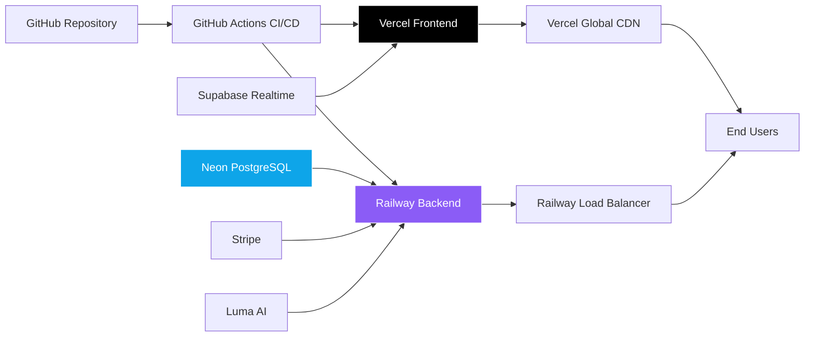
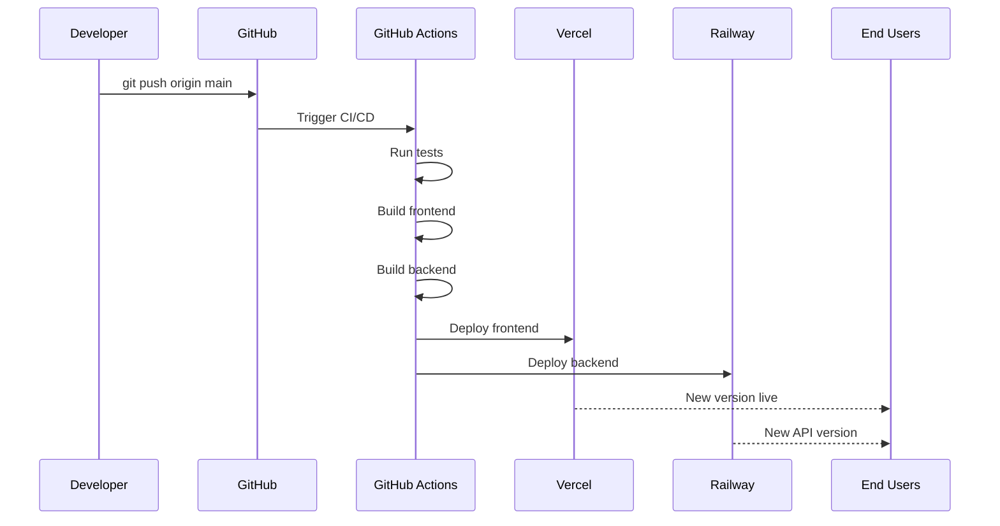

# Deployment Architecture

**Version:** 1.0  
**Last Updated:** November 2, 2025  
**Status:** Production-Ready with CI/CD

---

## Table of Contents

1. [Overview](#overview)
2. [Infrastructure Components](#infrastructure-components)
3. [Frontend Deployment (Vercel)](#frontend-deployment-vercel)
4. [Backend Deployment (Railway)](#backend-deployment-railway)
5. [Database (Neon PostgreSQL)](#database-neon-postgresql)
6. [CI/CD Pipeline](#cicd-pipeline)
7. [Environment Management](#environment-management)
8. [Deployment Workflow](#deployment-workflow)
9. [Monitoring & Logging](#monitoring--logging)
10. [Disaster Recovery](#disaster-recovery)

---

## Overview

Mundo Tango uses a **serverless-first** deployment architecture with:
- **Frontend:** Vercel (Global CDN + Edge Functions)
- **Backend:** Railway (Containerized Express.js)
- **Database:** Neon (Serverless PostgreSQL)
- **Real-time:** Supabase Realtime
- **CI/CD:** GitHub Actions

### Architecture Diagram



### Key Characteristics

- **Zero Downtime:** Blue-green deployments
- **Auto-Scaling:** Frontend and backend scale independently
- **Global Distribution:** CDN edge locations worldwide
- **Cost-Effective:** Pay-per-use pricing
- **Developer-Friendly:** Git-based deployments

---

## Infrastructure Components

### Component Overview

| Component | Provider | Purpose | Scaling | Cost |
|-----------|----------|---------|---------|------|
| **Frontend** | Vercel | Static site + SSR | Automatic | Free tier |
| **Backend API** | Railway | Express.js server | Auto (CPU/Memory) | $5/month |
| **Database** | Neon | PostgreSQL | Serverless pooling | $19/month |
| **Real-time** | Supabase | WebSocket | Automatic | Free tier |
| **Payments** | Stripe | Payment processing | N/A | 2.9% + $0.30 |
| **AI** | Groq/OpenAI | LLM inference | API-based | Pay-per-token |
| **Avatar Gen** | Luma AI | 3D avatars | API-based | Pay-per-generation |
| **DNS** | Vercel | Domain management | Global | Free |

**Total Monthly Cost (Base):** ~$24/month  
**Cost at 1,000 users:** ~$50/month  
**Cost at 10,000 users:** ~$200/month

---

## Frontend Deployment (Vercel)

### Why Vercel?

✅ **Global CDN:** 300+ edge locations  
✅ **Zero Config:** Auto-detects Vite projects  
✅ **Instant Rollbacks:** One-click revert  
✅ **Preview Deployments:** Every PR gets a URL  
✅ **Web Analytics:** Built-in performance monitoring

### Deployment Configuration

**File:** `vercel.json`
```json
{
  "buildCommand": "npm run build",
  "outputDirectory": "dist/public",
  "devCommand": "npm run dev",
  "installCommand": "npm install",
  "framework": "vite",
  "regions": ["iad1"],
  "rewrites": [
    {
      "source": "/api/(.*)",
      "destination": "https://mundo-tango-backend.railway.app/api/$1"
    },
    {
      "source": "/(.*)",
      "destination": "/index.html"
    }
  ],
  "headers": [
    {
      "source": "/(.*)",
      "headers": [
        {
          "key": "X-Content-Type-Options",
          "value": "nosniff"
        },
        {
          "key": "X-Frame-Options",
          "value": "DENY"
        },
        {
          "key": "X-XSS-Protection",
          "value": "1; mode=block"
        }
      ]
    }
  ]
}
```

### Build Process

```bash
# 1. Install dependencies
npm ci

# 2. Build frontend (Vite)
npm run build

# 3. Output to dist/public
# Vercel serves from this directory

# 4. Deploy to global CDN
# Automatic on git push to main
```

### Environment Variables (Vercel)

```bash
# Frontend-specific (VITE_ prefix required)
VITE_API_URL=https://mundo-tango-backend.railway.app
VITE_STRIPE_PUBLISHABLE_KEY=pk_live_...
VITE_SUPABASE_URL=https://...supabase.co
VITE_SUPABASE_ANON_KEY=eyJ...

# Build-time only
NODE_VERSION=20.x
```

### Custom Domain Setup

**Steps:**
1. Add domain in Vercel dashboard
2. Configure DNS (A/CNAME records)
3. Automatic HTTPS via Let's Encrypt
4. Edge caching enabled

**DNS Configuration:**
```
Type: CNAME
Name: @
Value: cname.vercel-dns.com
```

### Preview Deployments

Every pull request gets:
- Unique preview URL
- Production-like environment
- Automatic updates on new commits
- 7-day retention

**Example URL:**
```
https://mundo-tango-pr-123.vercel.app
```

---

## Backend Deployment (Railway)

### Why Railway?

✅ **Simple Deployments:** Git push to deploy  
✅ **PostgreSQL Included:** Managed database  
✅ **Auto-Scaling:** CPU/memory based  
✅ **Logs & Metrics:** Built-in monitoring  
✅ **Affordable:** $5/month base

### Railway Configuration

**File:** `railway.toml`
```toml
[build]
builder = "DOCKERFILE"
dockerfilePath = "Dockerfile"

[deploy]
startCommand = "npm run start"
restartPolicyType = "ON_FAILURE"
restartPolicyMaxRetries = 10

[env]
NODE_ENV = "production"
PORT = "3000"
```

### Dockerfile

```dockerfile
# Multi-stage build for optimization
FROM node:20-alpine AS builder

WORKDIR /app
COPY package*.json ./
RUN npm ci --only=production

COPY . .
RUN npm run build

# Production image
FROM node:20-alpine

WORKDIR /app
COPY --from=builder /app/dist ./dist
COPY --from=builder /app/node_modules ./node_modules
COPY --from=builder /app/package.json ./

EXPOSE 3000

CMD ["node", "dist/index.js"]
```

### Build Process

```bash
# 1. Railway detects Dockerfile
# 2. Builds multi-stage image
# 3. Pushes to container registry
# 4. Deploys to Railway infrastructure
# 5. Health checks start
# 6. Traffic switches to new version
```

### Health Checks

**Endpoint:** `GET /health`
```typescript
app.get("/health", (req, res) => {
  res.json({
    status: "healthy",
    uptime: process.uptime(),
    timestamp: new Date().toISOString(),
    database: db ? "connected" : "disconnected",
  });
});
```

**Railway Configuration:**
- **Initial Delay:** 30 seconds
- **Check Interval:** 10 seconds
- **Timeout:** 5 seconds
- **Failure Threshold:** 3 consecutive failures

### Auto-Scaling

**Triggers:**
- **CPU > 70%:** Scale up
- **Memory > 80%:** Scale up
- **Request Queue > 100:** Scale up
- **CPU < 30% for 5 min:** Scale down

**Limits:**
- **Min Instances:** 1
- **Max Instances:** 5
- **Scale Up Delay:** 30 seconds
- **Scale Down Delay:** 5 minutes

### Environment Variables (Railway)

```bash
# Database
DATABASE_URL=${POSTGRES_CONNECTION_STRING}

# Authentication
JWT_SECRET=${JWT_SECRET}
JWT_REFRESH_SECRET=${JWT_REFRESH_SECRET}
SESSION_SECRET=${SESSION_SECRET}

# External APIs
GROQ_API_KEY=${GROQ_API_KEY}
OPENAI_API_KEY=${OPENAI_API_KEY}
STRIPE_SECRET_KEY=${STRIPE_SECRET_KEY}

# Platform
NODE_ENV=production
PORT=3000
```

---

## Database (Neon PostgreSQL)

### Why Neon?

✅ **Serverless:** Auto-pause when idle  
✅ **Branching:** Git-like database branches  
✅ **Instant Provisioning:** Databases in seconds  
✅ **Connection Pooling:** Built-in PgBouncer  
✅ **Point-in-Time Recovery:** 30-day retention

### Connection Configuration

```typescript
import { neon } from "@neondatabase/serverless";
import { drizzle } from "drizzle-orm/neon-http";

const sql = neon(process.env.DATABASE_URL!);
export const db = drizzle(sql);
```

### Database Branching

**Use Cases:**
1. **Preview Branches:** Each PR gets a database copy
2. **Testing:** Safe environment for tests
3. **Migrations:** Test migrations before production

**CLI Commands:**
```bash
# Create branch
neonctl branches create --name preview-pr-123

# Switch to branch
export DATABASE_URL=postgresql://...?branch=preview-pr-123

# Delete branch
neonctl branches delete preview-pr-123
```

### Backup Strategy

**Neon Automatic Backups:**
- **Frequency:** Continuous (WAL archiving)
- **Retention:** 30 days
- **Point-in-Time Recovery:** Any timestamp within 30 days
- **Storage:** Included in plan

**Manual Backups (Additional):**
```bash
# Export database
pg_dump $DATABASE_URL > backup-$(date +%Y%m%d).sql

# Upload to S3 (optional)
aws s3 cp backup-*.sql s3://mundo-tango-backups/
```

### Migration Strategy

**Drizzle Kit Commands:**
```bash
# Generate migration
npm run db:generate

# Apply to production (via Railway)
npm run db:push

# Rollback (manual SQL)
psql $DATABASE_URL < rollback.sql
```

**Zero-Downtime Migration Steps:**
1. Add new columns/tables (additive changes)
2. Deploy backend code supporting both old and new schema
3. Migrate data
4. Remove old columns/tables (destructive changes)
5. Deploy final backend version

---

## CI/CD Pipeline

### GitHub Actions Workflow

**File:** `.github/workflows/ci-cd.yml`

```yaml
name: CI/CD Pipeline - Mundo Tango

on:
  push:
    branches: [main, develop]
  pull_request:
    branches: [main, develop]
  workflow_dispatch:

env:
  NODE_VERSION: '20.x'
  REGISTRY: ghcr.io
  IMAGE_NAME: ${{ github.repository }}

jobs:
  # ============================================================================
  # LINT & TYPE CHECK
  # ============================================================================
  lint:
    runs-on: ubuntu-latest
    steps:
      - uses: actions/checkout@v4
      
      - uses: actions/setup-node@v4
        with:
          node-version: ${{ env.NODE_VERSION }}
          cache: 'npm'
      
      - name: Install dependencies
        run: npm ci
      
      - name: Run ESLint
        run: npm run lint
      
      - name: TypeScript check
        run: npm run typecheck

  # ============================================================================
  # E2E TESTS (Playwright)
  # ============================================================================
  e2e-tests:
    runs-on: ubuntu-latest
    timeout-minutes: 15
    steps:
      - uses: actions/checkout@v4
      
      - uses: actions/setup-node@v4
        with:
          node-version: ${{ env.NODE_VERSION }}
          cache: 'npm'
      
      - name: Install dependencies
        run: npm ci
      
      - name: Install Playwright browsers
        run: npx playwright install --with-deps chromium
      
      - name: Run E2E tests
        run: npm run test:e2e
        env:
          DATABASE_URL: ${{ secrets.TEST_DATABASE_URL }}
      
      - name: Upload test results
        if: always()
        uses: actions/upload-artifact@v4
        with:
          name: playwright-report
          path: playwright-report/

  # ============================================================================
  # BUILD FRONTEND
  # ============================================================================
  build-frontend:
    runs-on: ubuntu-latest
    needs: [lint, e2e-tests]
    steps:
      - uses: actions/checkout@v4
      
      - uses: actions/setup-node@v4
        with:
          node-version: ${{ env.NODE_VERSION }}
          cache: 'npm'
      
      - name: Install dependencies
        run: npm ci
      
      - name: Build frontend
        run: npm run build
        env:
          VITE_API_URL: ${{ secrets.VITE_API_URL }}
      
      - name: Upload build artifacts
        uses: actions/upload-artifact@v4
        with:
          name: frontend-dist
          path: dist/public

  # ============================================================================
  # BUILD BACKEND (Docker)
  # ============================================================================
  build-backend:
    runs-on: ubuntu-latest
    needs: [lint, e2e-tests]
    steps:
      - uses: actions/checkout@v4
      
      - name: Set up Docker Buildx
        uses: docker/setup-buildx-action@v3
      
      - name: Log in to GitHub Container Registry
        uses: docker/login-action@v3
        with:
          registry: ${{ env.REGISTRY }}
          username: ${{ github.actor }}
          password: ${{ secrets.GITHUB_TOKEN }}
      
      - name: Extract metadata
        id: meta
        uses: docker/metadata-action@v5
        with:
          images: ${{ env.REGISTRY }}/${{ env.IMAGE_NAME }}
          tags: |
            type=ref,event=branch
            type=sha,prefix={{branch}}-
      
      - name: Build and push Docker image
        uses: docker/build-push-action@v5
        with:
          context: .
          push: true
          tags: ${{ steps.meta.outputs.tags }}
          labels: ${{ steps.meta.outputs.labels }}
          cache-from: type=gha
          cache-to: type=gha,mode=max

  # ============================================================================
  # DEPLOY TO VERCEL (Frontend)
  # ============================================================================
  deploy-vercel:
    runs-on: ubuntu-latest
    needs: build-frontend
    if: github.ref == 'refs/heads/main'
    steps:
      - uses: actions/checkout@v4
      
      - name: Deploy to Vercel
        uses: amondnet/vercel-action@v25
        with:
          vercel-token: ${{ secrets.VERCEL_TOKEN }}
          vercel-org-id: ${{ secrets.VERCEL_ORG_ID }}
          vercel-project-id: ${{ secrets.VERCEL_PROJECT_ID }}
          vercel-args: '--prod'

  # ============================================================================
  # DEPLOY TO RAILWAY (Backend)
  # ============================================================================
  deploy-railway:
    runs-on: ubuntu-latest
    needs: build-backend
    if: github.ref == 'refs/heads/main'
    steps:
      - uses: actions/checkout@v4
      
      - name: Install Railway CLI
        run: npm install -g @railway/cli
      
      - name: Deploy to Railway
        run: railway up
        env:
          RAILWAY_TOKEN: ${{ secrets.RAILWAY_TOKEN }}

  # ============================================================================
  # NOTIFY ON COMPLETION
  # ============================================================================
  notify:
    runs-on: ubuntu-latest
    needs: [deploy-vercel, deploy-railway]
    if: always()
    steps:
      - name: Notify deployment status
        run: echo "Deployment completed. Check logs for details."
```

### Pipeline Stages

**1. Lint & Type Check (2 min)**
- ESLint for code quality
- TypeScript type checking
- Runs in parallel with tests

**2. E2E Tests (5-10 min)**
- Playwright tests (57 tests)
- Test database setup
- Artifact upload on failure

**3. Build (3-5 min)**
- Frontend build (Vite)
- Backend Docker image
- Parallel execution

**4. Deploy (2-3 min)**
- Vercel deployment (frontend)
- Railway deployment (backend)
- Sequential to prevent issues

**Total Pipeline Time:** ~15 minutes

---

## Environment Management

### Three Environments

| Environment | Branch | Database | URL | Purpose |
|-------------|--------|----------|-----|---------|
| **Development** | `develop` | Neon branch | dev.mundo-tango.com | Active development |
| **Preview** | `feature/*` | Neon branch | PR-specific URL | Code review |
| **Production** | `main` | Neon main | mundo-tango.com | Live users |

### Environment Variable Management

**Vercel (Frontend):**
- UI-based secret management
- Automatic exposure to VITE_ prefixed vars
- Different values per environment

**Railway (Backend):**
- CLI or UI-based management
- Automatic injection at runtime
- Shared across instances

**Security Best Practices:**
1. Never commit secrets to Git
2. Use different keys per environment
3. Rotate secrets quarterly
4. Audit access logs

---

## Deployment Workflow

### Automated Deployment (Main Branch)



### Manual Deployment

**Frontend (Vercel):**
```bash
# Install Vercel CLI
npm i -g vercel

# Deploy to production
vercel --prod

# Deploy preview
vercel
```

**Backend (Railway):**
```bash
# Install Railway CLI
npm i -g @railway/cli

# Link project
railway link

# Deploy
railway up
```

### Rollback Procedure

**Vercel Rollback:**
1. Go to Vercel dashboard
2. Select previous deployment
3. Click "Promote to Production"
4. Instant rollback (< 30 seconds)

**Railway Rollback:**
1. Go to Railway dashboard
2. Select previous deployment
3. Click "Rollback"
4. Redeploy previous Docker image

**Database Rollback:**
```bash
# Point-in-time recovery (Neon)
neonctl branches restore --timestamp "2025-11-01T12:00:00Z"
```

---

## Monitoring & Logging

### Vercel Analytics

**Metrics Tracked:**
- **Web Vitals:** LCP, FID, CLS, FCP, TTFB
- **Page Views:** Real-time traffic
- **Top Pages:** Most visited
- **Devices:** Desktop vs mobile
- **Geography:** User locations

**Access:** Vercel dashboard

### Railway Metrics

**Metrics Tracked:**
- **CPU Usage:** Real-time percentage
- **Memory Usage:** MB consumed
- **Network I/O:** Bytes in/out
- **Response Time:** P50, P95, P99
- **Error Rate:** 4xx/5xx responses

**Access:** Railway dashboard

### Database Monitoring (Neon)

**Metrics Tracked:**
- **Active Connections:** Current count
- **Query Performance:** Slow queries
- **Database Size:** Storage used
- **CPU Time:** Compute usage
- **Logical Size:** Total data

**Access:** Neon console

### Log Aggregation

**Vercel Logs:**
```bash
# Stream logs
vercel logs --follow

# Filter by function
vercel logs --filter="api/posts"
```

**Railway Logs:**
```bash
# Stream logs
railway logs

# Filter by service
railway logs --service backend
```

### Custom Monitoring

**Health Check Endpoint:**
```typescript
// server/routes/health.ts
app.get("/health", async (req, res) => {
  const dbStatus = await checkDatabaseConnection();
  const redisStatus = await checkRedisConnection();
  
  res.json({
    status: "healthy",
    checks: {
      database: dbStatus,
      redis: redisStatus,
    },
    uptime: process.uptime(),
    version: process.env.GIT_SHA,
  });
});
```

**Uptime Monitoring (Recommended):**
- **Better Uptime:** https://betteruptime.com
- **Pingdom:** https://pingdom.com
- **UptimeRobot:** https://uptimerobot.com

---

## Disaster Recovery

### Backup Strategy

**Database Backups:**
- **Neon Automatic:** 30-day retention
- **Manual Exports:** Weekly (stored in S3)
- **Testing:** Monthly restore tests

**Code Backups:**
- **GitHub:** Primary repository
- **Git Mirror:** Secondary backup (optional)

**Secrets Backup:**
- **1Password:** Team vault
- **Offline Copy:** Encrypted file

### Recovery Procedures

**Database Corruption:**
1. Identify last known good state
2. Create new Neon branch from backup
3. Verify data integrity
4. Update DATABASE_URL
5. Redeploy backend

**Complete Vercel Outage:**
1. Deploy to alternative (Netlify/Cloudflare Pages)
2. Update DNS records
3. Monitor migration

**Complete Railway Outage:**
1. Deploy to alternative (Render/Fly.io)
2. Update Vercel API proxy
3. Monitor migration

### RTO & RPO Targets

- **RTO (Recovery Time Objective):** 2 hours
- **RPO (Recovery Point Objective):** 24 hours
- **Maximum Downtime Tolerance:** 4 hours/month (99.5% uptime)

---

## Cost Optimization

### Current Costs (Monthly)

| Service | Plan | Cost | Notes |
|---------|------|------|-------|
| Vercel | Free | $0 | Up to 100GB bandwidth |
| Railway | Hobby | $5 | Includes 500 hours compute |
| Neon | Free | $0 | 0.5 GB storage, 191.9 compute hours |
| Supabase | Free | $0 | Up to 500MB database |
| GitHub Actions | Free | $0 | 2,000 minutes/month |
| **Total** | | **$5/month** | |

### Scaling Costs

**At 1,000 users:**
- Vercel: $20/month (Pro plan)
- Railway: $20/month (increased usage)
- Neon: $19/month (Scale plan)
- **Total:** ~$60/month

**At 10,000 users:**
- Vercel: $20/month
- Railway: $50/month
- Neon: $69/month (additional compute)
- **Total:** ~$140/month

**At 100,000 users:**
- Vercel: $20/month
- Railway: $200/month
- Neon: $500/month
- **Total:** ~$720/month

---

## Security Considerations

### Frontend Security (Vercel)

**Headers:**
```json
{
  "X-Content-Type-Options": "nosniff",
  "X-Frame-Options": "DENY",
  "X-XSS-Protection": "1; mode=block",
  "Strict-Transport-Security": "max-age=31536000; includeSubDomains",
  "Content-Security-Policy": "default-src 'self'; script-src 'self' 'unsafe-inline'"
}
```

**DDoS Protection:** Built-in Vercel firewall

### Backend Security (Railway)

**Rate Limiting:**
```typescript
import rateLimit from "express-rate-limit";

const limiter = rateLimit({
  windowMs: 15 * 60 * 1000,
  max: 100,
});

app.use("/api/", limiter);
```

**CORS Configuration:**
```typescript
import cors from "cors";

app.use(cors({
  origin: process.env.FRONTEND_URL,
  credentials: true,
}));
```

### Database Security (Neon)

**Connection Security:**
- TLS 1.2+ encryption
- IP whitelisting (optional)
- Connection pooling limits

**Access Control:**
- Role-based permissions
- Row-level security (RLS)
- Audit logging

---

## Future Enhancements

### Planned Improvements

1. **Multi-Region Deployment**
   - Deploy backend to EU and Asia regions
   - Route users to nearest region
   - Target: 50ms global latency

2. **CDN Optimization**
   - Cloudflare in front of Vercel
   - Image optimization pipeline
   - Static asset caching

3. **Database Optimization**
   - Read replicas for analytics
   - Caching layer (Redis)
   - Database sharding

4. **Monitoring Enhancements**
   - Sentry for error tracking
   - Datadog for APM
   - Custom dashboards

5. **Advanced CI/CD**
   - Canary deployments
   - Blue-green deployments
   - Automated rollback on errors

---

**Last Updated:** November 2, 2025  
**Maintained By:** ESA Platform Division  
**Status:** Production-Ready with Automated CI/CD
