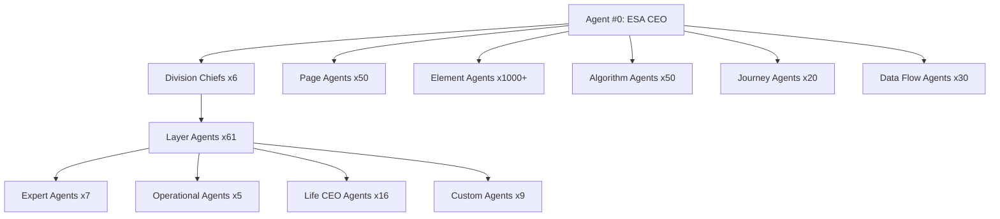
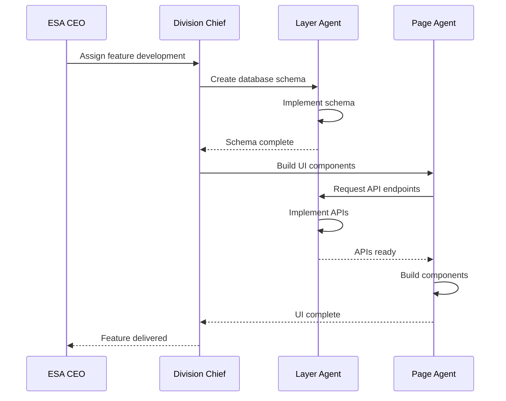

# ESA Framework Documentation

**Expert System Architecture (ESA)**  
**Version:** 1.0  
**Last Updated:** November 2, 2025  
**Total Agents:** 1,255+  
**Core Agents:** 105  
**Specialized Agents:** 1,150+

---

## Table of Contents

1. [Overview](#overview)
2. [Agent Hierarchy](#agent-hierarchy)
3. [Core Agent Categories](#core-agent-categories)
4. [Agent Health Monitoring](#agent-health-monitoring)
5. [Agent Communication (H2AC)](#agent-communication-h2ac)
6. [Agent Training & Certification](#agent-training--certification)
7. [Fallback & Self-Healing](#fallback--self-healing)
8. [Agent Coordination](#agent-coordination)

---

## Overview

The **ESA (Expert System Architecture) Framework** is the backbone of Mundo Tango's development and operations, coordinating **1,255+ specialized AI agents** across a hierarchical structure. This framework enables:

- **Simultaneous Development:** Multiple agents work in parallel on different features
- **Continuous Monitoring:** Health checks and validation across all systems
- **Self-Healing Capabilities:** Automated issue detection and resolution
- **MB.MD Protocol Compliance:** Mundo Blue Methodology Directive for quality assurance

### Key Statistics

- **105 Core Agents:** Board, Division Chiefs, Layer Agents, Experts, Operations
- **50 Page Agents:** One agent per major page/view
- **1,000+ Element Agents:** Component-level specialists
- **50 Algorithm Agents:** Business logic and optimization experts
- **20 Journey Agents:** User flow management
- **30 Data Flow Agents:** Pipeline orchestration
- **16 Life CEO Agents:** Personal AI assistants
- **9 Mr. Blue Agents:** AI companion system

---

## Agent Hierarchy



### Level 1: Board of Directors (1 Agent)

**Agent #0: ESA CEO**
- **Role:** Strategic oversight and coordination
- **Responsibilities:**
  - Coordinate all division chiefs
  - Strategic planning and resource allocation
  - Quality assurance and compliance
  - Escalation handling
- **Reports to:** Human stakeholders
- **Code:** `BOARD_CEO`

---

## Core Agent Categories

### Level 2: Division Chiefs (6 Agents)

Division chiefs manage layers of specialized agents:

#### 1. Foundation Division Chief (Agent #1)
- **Manages:** Layers 1-10 (Database, Auth, Real-time)
- **Layers:**
  1. Database Architecture
  2. Authentication System
  3. Real-time Communication (WebSocket)
  4. Session Management
  5. Data Validation & Sanitization
  6. Error Handling & Logging
  7. API Rate Limiting
  8. CORS & Security Headers
  9. Database Migrations
  10. Schema Versioning

#### 2. Core Division Chief (Agent #2)
- **Manages:** Layers 11-20 (Social, Events, Groups)
- **Layers:**
  11. User Profiles & Settings
  12. Social Posts & Comments
  13. Event Management
  14. Group Management
  15. Friend System
  16. Notification System
  17. Search & Discovery
  18. Content Moderation
  19. Report Management
  20. User Blocking

#### 3. Business Division Chief (Agent #3)
- **Manages:** Layers 21-30 (Payments, Analytics)
- **Layers:**
  21. Stripe Integration
  22. Subscription Management
  23. Payment Processing
  24. Invoice Generation
  25. Revenue Analytics
  26. User Analytics
  27. Event Analytics
  28. Engagement Metrics
  29. Conversion Tracking
  30. A/B Testing Framework

#### 4. Intelligence Division Chief (Agent #4)
- **Manages:** Layers 31-46 (AI, Algorithms, Recommendations)
- **Layers:**
  31. Mr. Blue AI Companion
  32. Life CEO System
  33. Content Recommendation
  34. User Matching
  35. Event Recommendations
  36. Feed Ranking Algorithm
  37. Sentiment Analysis
  38. Spam Detection
  39. Image Recognition
  40. Natural Language Processing
  41. Predictive Analytics
  42. Behavioral Analysis
  43. Anomaly Detection
  44. Trend Detection
  45. Influencer Identification
  46. Viral Content Detection

#### 5. Platform Division Chief (Agent #5)
- **Manages:** Layers 47-56 (Admin, DevOps, Monitoring)
- **Layers:**
  47. Deployment Automation
  48. CI/CD Pipelines
  49. Environment Management
  50. Secret Management
  51. Health Monitoring
  52. Performance Monitoring
  53. Error Tracking
  54. Log Aggregation
  55. Backup Management
  56. Disaster Recovery

#### 6. Extended Division Chief (Agent #6)
- **Manages:** Layers 57-61 (Housing, Volunteers, Tango)
- **Layers:**
  57. Housing Marketplace
  58. Volunteer Management
  59. Resume Parsing AI
  60. Tango Resources
  61. Teacher/Student Matching

---

### Level 3: Layer Agents (61 Agents)

Each layer has a dedicated agent responsible for:
- **Implementation:** Building and maintaining layer functionality
- **Testing:** Ensuring quality through comprehensive tests
- **Documentation:** Maintaining technical documentation
- **Performance:** Optimizing queries and algorithms
- **Security:** Implementing best practices

**Example: Layer 1 Agent (Database Architecture)**
```typescript
{
  agentCode: "L1",
  agentName: "Database Architecture Agent",
  responsibilities: [
    "Design and implement database schema",
    "Create and manage indexes",
    "Optimize query performance",
    "Handle migrations safely"
  ],
  competencies: [
    "PostgreSQL expertise",
    "Drizzle ORM mastery",
    "Query optimization",
    "Index design"
  ],
  status: "active",
  certificationLevel: 3
}
```

---

### Level 4: Expert Agents (7 Agents)

Specialist agents providing cross-cutting expertise:

1. **AI Research Agent** - Latest AI/ML techniques
2. **UI/UX Design Agent** - Interface design best practices
3. **Data Visualization Agent** - Charts, graphs, dashboards
4. **Security Agent** - Vulnerability scanning, penetration testing
5. **Performance Agent** - Load testing, optimization
6. **Accessibility Agent** - WCAG compliance, screen readers
7. **Mobile Agent** - Responsive design, mobile optimization

---

### Level 5: Operational Agents (5 Agents)

Day-to-day operational support:

1. **Sprint Manager** - Agile sprint planning and execution
2. **Documentation Agent** - Technical writing and API docs
3. **Deployment Agent** - Production deployments and rollbacks
4. **Monitoring Agent** - 24/7 system monitoring
5. **Support Agent** - User issue triage and resolution

---

### Level 6: Life CEO Agents (16 Agents)

Personal AI assistants for life management (Agents P66-P81):

1. **P66:** Health & Wellness
2. **P67:** Finance Management
3. **P68:** Career Development
4. **P69:** Productivity
5. **P70:** Travel Planning
6. **P71:** Home Management
7. **P72:** Learning & Education
8. **P73:** Social Connections
9. **P74:** Wellness & Mindfulness
10. **P75:** Entertainment
11. **P76:** Creativity
12. **P77:** Fitness & Exercise
13. **P78:** Nutrition
14. **P79:** Sleep Optimization
15. **P80:** Stress Management
16. **P81:** Relationship Management

**Each Life CEO Agent Provides:**
- Goal setting and tracking
- Task management
- Progress analytics
- Personalized recommendations
- Conversational AI chat
- Integration with domain-specific data

---

### Level 7: Custom Agents (9 Agents)

Specialized system agents:

**Mr. Blue System (8 Agents):**
1. Conversation Management
2. Context Understanding
3. Response Generation
4. Multi-Provider Coordination
5. 3D Avatar Animation
6. Video State Management
7. Voice Synthesis
8. Sentiment Detection

**Pattern Learning Agent:**
- User behavior analysis
- Predictive context generation
- Navigation pattern learning

---

### Extended Agents

#### Page Agents (50 Agents)

One agent per major page:
- P1: Landing Page
- P2: Login Page
- P3: Register Page
- P4: Home Feed
- P5: User Profile
- P6: Event Discovery
- P7: Event Details
- P8: Create Event
- P9: Messaging
- P10: Notifications
- ... (50 total)

**Page Agent Responsibilities:**
- Component architecture
- State management
- API integration
- Performance optimization
- SEO optimization
- Accessibility compliance

#### Element Agents (1000+ Agents)

Component-level specialists:
- Button components
- Form inputs
- Navigation bars
- Cards
- Modals
- Dropdowns
- ... (1000+ components)

#### Algorithm Agents (50 Agents)

Business logic specialists:
- A1: Feed Ranking
- A2: Event Recommendations
- A3: User Matching
- A4: Viral Detection
- A5: Spam Detection
- ... (50 total algorithms)

#### Journey Agents (20 Agents)

User flow managers:
- J1: Onboarding Journey
- J2: First Post Journey
- J3: First Event Journey
- J4: Premium Upgrade Journey
- ... (20 total journeys)

#### Data Flow Agents (30 Agents)

Pipeline orchestrators:
- DF1: User Registration Flow
- DF2: Post Creation Flow
- DF3: Event RSVP Flow
- DF4: Payment Flow
- ... (30 total flows)

---

## Agent Health Monitoring

### AgentValidationService

**Location:** `server/services/AgentValidationService.ts`

```typescript
class AgentValidationService {
  // Run health check on specific agent
  static async runHealthCheck(agentCode: string): Promise<AgentHealthStatus>
  
  // Run validation check (availability, performance, integration, fallback)
  static async runValidationCheck(
    checkType: string, 
    agentCode: string
  ): Promise<ValidationCheckResult>
  
  // Batch health checks for all agents
  static async runBatchHealthChecks(): Promise<AgentHealthStatus[]>
  
  // Activate fallback agent when primary fails
  static async activateFallbackAgent(agentCode: string): Promise<void>
  
  // Get agent health history
  static async getAllAgentHealth(): Promise<AgentHealthStatus[]>
}
```

### Health Check Types

**1. Availability Check**
- Verifies agent is online and responsive
- Timeout: 5 seconds
- Pass: Response received
- Fail: No response or timeout

**2. Performance Check**
- Measures response time
- Healthy: < 1000ms
- Degraded: 1000-3000ms
- Failing: > 3000ms

**3. Integration Check**
- Tests agent communication with dependencies
- Verifies database connectivity
- Checks API integrations
- Validates external service connections

**4. Fallback Check**
- Tests fallback agent activation
- Verifies redundancy systems
- Ensures graceful degradation

### Agent Health Statuses

```typescript
type AgentHealthStatus = {
  agentCode: string;
  status: 'healthy' | 'degraded' | 'failing' | 'offline' | 'unknown';
  lastCheckAt: Date;
  responseTime?: number;
  errorCount: number;
  errorDetails?: any;
}
```

### Health Dashboard

**Route:** `/admin/agent-health`  
**Access:** Super Admin (role_level ≥ 7)  
**Refresh:** Auto-refresh every 30 seconds

**Features:**
- Real-time agent status
- Historical health trends
- Error count tracking
- Response time graphs
- Fallback activation logs

---

## Agent Communication (H2AC)

### H2AC Framework

**H2AC = Human-to-Agent Communication**

Three communication types:
1. **H2A:** Human to Agent
2. **A2H:** Agent to Human
3. **A2A:** Agent to Agent

### Communication Table

```typescript
export const agentCommunications = pgTable("agent_communications", {
  id: serial("id").primaryKey(),
  
  communicationType: varchar("communication_type", { length: 20 }).notNull(),
  // Values: 'H2A' | 'A2H' | 'A2A'
  
  fromAgentId: integer("from_agent_id").references(() => esaAgents.id),
  toAgentId: integer("to_agent_id").references(() => esaAgents.id),
  fromUserId: integer("from_user_id").references(() => users.id),
  toUserId: integer("to_user_id").references(() => users.id),
  
  messageType: varchar("message_type", { length: 50 }).notNull(),
  // Types: command, query, response, notification, escalation, coordination
  
  subject: text("subject"),
  content: text("content").notNull(),
  priority: varchar("priority").default("normal"), // low, normal, high, critical
  status: varchar("status").default("sent").notNull(), // sent, read, responded
  
  metadata: jsonb("metadata"),
  createdAt: timestamp("created_at").defaultNow(),
  readAt: timestamp("read_at"),
  respondedAt: timestamp("responded_at"),
});
```

### Communication Protocols

**1. Command Protocol**
- Agent receives task instruction
- Acknowledges receipt
- Executes task
- Reports completion or failure

**2. Query Protocol**
- Agent requests information
- Receives data response
- Validates response
- Processes information

**3. Escalation Protocol**
- Agent detects issue beyond capability
- Escalates to parent agent or human
- Waits for resolution guidance
- Implements resolution

**4. Coordination Protocol**
- Multiple agents collaborate
- Share progress updates
- Synchronize dependencies
- Report combined results

---

## Agent Training & Certification

### Training Methodologies

**1. MB.MD Protocol (Mundo Blue Methodology Directive)**
- **S**imultaneous: Parallel execution of tasks
- **R**ecursive: Deep exploration of solutions
- **C**ritical: Rigorous quality assurance

**2. Ultra-Micro Parallel Training**
- Break tasks into smallest possible units
- Execute all units simultaneously
- Aggregate results efficiently

**3. Critical Thinking Framework**
- 19-phase audit system
- Multi-agent code review
- Comprehensive testing requirements

### Certification Levels

**Level 0: None**
- Newly created agent
- Not yet trained
- Cannot execute production tasks

**Level 1: Basic**
- Completed initial training
- Can execute simple tasks
- Requires supervision

**Level 2: Production**
- Fully trained and tested
- Can execute production tasks
- Operates independently

**Level 3: Master**
- Expert-level agent
- Can train other agents
- Handles complex escalations

### Agent Tasks Table

```typescript
export const agentTasks = pgTable("agent_tasks", {
  id: serial("id").primaryKey(),
  agentId: integer("agent_id").references(() => esaAgents.id).notNull(),
  
  taskType: varchar("task_type", { length: 50 }).notNull(),
  // Types: build_page, implement_feature, fix_bug, review_code, train_agent, coordinate
  
  title: varchar("title", { length: 255 }).notNull(),
  description: text("description"),
  priority: varchar("priority", { length: 20 }).notNull().default('medium'),
  
  status: varchar("status", { length: 20 }).notNull().default('pending'),
  // States: pending, assigned, in_progress, review, completed, failed, cancelled
  
  assignedBy: integer("assigned_by").references(() => esaAgents.id),
  
  dependencies: jsonb("dependencies"),
  result: text("result"),
  artifacts: jsonb("artifacts"),
  errorMessage: text("error_message"),
  
  estimatedDuration: integer("estimated_duration"), // seconds
  actualDuration: integer("actual_duration"), // seconds
  
  startedAt: timestamp("started_at"),
  completedAt: timestamp("completed_at"),
  createdAt: timestamp("created_at").defaultNow(),
});
```

---

## Fallback & Self-Healing

### Fallback System

When an agent fails, the system automatically activates a fallback agent:

**Fallback Hierarchy:**
1. **Primary Agent:** Execute task
2. **Backup Agent:** If primary fails
3. **Parent Agent:** If backup fails
4. **Division Chief:** If parent fails
5. **ESA CEO:** Final escalation
6. **Human Intervention:** If all agents fail

### Self-Healing Service

**Location:** `server/services/SelfHealingService.ts`

```typescript
class SelfHealingService {
  // Validate page health
  static async validatePage(pagePath: string): Promise<PageHealthStatus>
  
  // Detect issues across all pages
  static async scanAllPages(): Promise<ScanResult>
  
  // Generate AI fix for validation issue
  static async generateAutoFix(validationLogId: number): Promise<FixSuggestion>
  
  // Apply automatic fix (if safe)
  static async applyAutomaticFix(issue: Issue): Promise<FixResult>
  
  // Get page health dashboard
  static async getPageHealthDashboard(): Promise<Dashboard>
}
```

### Automated Validation Checks

**1. Test ID Validation**
- Scans all interactive elements (buttons, inputs, links)
- Ensures every element has `data-testid` attribute
- Generates fix suggestions

**2. Broken Link Detection**
- Crawls all internal links
- Detects 404 errors
- Suggests corrections

**3. JavaScript Error Tracking**
- Monitors console errors
- Logs stack traces
- Correlates errors with recent changes

**4. Accessibility Checks**
- ARIA label validation
- Keyboard navigation testing
- Screen reader compatibility

### Validation Dashboard

**Route:** `/admin/self-healing`  
**Access:** Super Admin (role_level ≥ 7)

**Features:**
- Page health scores
- Issue prioritization
- AI-powered fix suggestions
- One-click fix application
- Historical validation logs

---

## Agent Coordination

### Parallel Execution

Multiple agents work simultaneously on different features:

```typescript
// Example: Social Feed Refactor
Agents Working in Parallel:
- L12: Social Posts Agent (database schema)
- P4: Home Feed Agent (UI components)
- A1: Feed Ranking Agent (algorithm optimization)
- E2: UI/UX Agent (design review)
- E3: Performance Agent (load testing)
```

### Dependency Management

Agents declare dependencies to prevent conflicts:

```typescript
{
  agentCode: "P4",
  taskId: 123,
  dependencies: {
    requiredAgents: ["L12", "A1"], // Must complete first
    requiredTasks: [121, 122], // Previous tasks
    blockedBy: [] // Currently unblocked
  }
}
```

### Coordination Workflow



---

## API Endpoints

### Agent Health Routes

```typescript
// Get health status for all agents
GET /api/agents/health
Headers: { Authorization: Bearer <token> }
Access: Super Admin (role_level ≥ 7)

// Get health status for specific agent
GET /api/agents/:agentCode/health
Headers: { Authorization: Bearer <token> }
Access: Super Admin (role_level ≥ 7)

// Run validation check on agent
POST /api/agents/:agentCode/validate
Headers: { Authorization: Bearer <token> }
Body: { checkType: 'availability' | 'performance' | 'integration' | 'fallback' }
Access: Super Admin (role_level ≥ 7)

// Run batch health checks
POST /api/agents/batch-health-check
Headers: { Authorization: Bearer <token> }
Access: Super Admin (role_level ≥ 7)
```

### Self-Healing Routes

```typescript
// Get page health dashboard
GET /api/self-healing/dashboard
Headers: { Authorization: Bearer <token> }
Access: Super Admin (role_level ≥ 7)

// Trigger manual scan of all pages
POST /api/self-healing/scan
Headers: { Authorization: Bearer <token> }
Access: Super Admin (role_level ≥ 7)

// Get issues for specific page
GET /api/self-healing/pages/:pagePath/issues
Headers: { Authorization: Bearer <token> }
Access: Super Admin (role_level ≥ 7)

// Generate AI fix for validation issue
POST /api/self-healing/generate-fix/:validationLogId
Headers: { Authorization: Bearer <token> }
Access: Super Admin (role_level ≥ 7)
```

---

## Best Practices

### For Agent Development

1. **Clear Responsibilities:** Each agent has well-defined scope
2. **Minimal Dependencies:** Reduce coupling between agents
3. **Comprehensive Testing:** Every agent has test coverage
4. **Documentation:** All agents maintain their own docs
5. **Health Monitoring:** Regular health checks enabled

### For Agent Communication

1. **Async by Default:** Use async messaging for scalability
2. **Idempotency:** Messages can be safely retried
3. **Timeout Handling:** Set reasonable timeouts
4. **Error Handling:** Graceful degradation on failures
5. **Logging:** Comprehensive audit trail

### For Quality Assurance

1. **MB.MD Compliance:** Follow all three principles
2. **Code Reviews:** Multi-agent review process
3. **Automated Testing:** CI/CD pipeline checks
4. **Performance Testing:** Load testing before deployment
5. **Security Scanning:** Vulnerability assessments

---

## Future Enhancements

### Planned Agent Additions

1. **Internationalization Agent** - Multi-language support
2. **GraphQL Agent** - GraphQL API layer
3. **Mobile App Agent** - React Native development
4. **Video Processing Agent** - Video upload and streaming
5. **Payment Agent 2.0** - Multi-currency and crypto support

### Agent Evolution

- **Self-Learning:** Agents learn from past tasks
- **Autonomous Optimization:** Agents improve their own code
- **Predictive Maintenance:** Agents predict and prevent issues
- **Cross-Platform:** Agents work across multiple projects

---

## Documentation References

- **Agent Registry:** `shared/platform-schema.ts` (esaAgents table)
- **Agent Health:** `server/services/AgentValidationService.ts`
- **Self-Healing:** `server/services/SelfHealingService.ts`
- **Agent Routes:** `server/routes/agent-health-routes.ts`
- **Complete Agent Ecosystem:** `docs/phase-1/part-5-complete-agent-ecosystem.md`

---

**Last Updated:** November 2, 2025  
**Maintained By:** Agent #0 (ESA CEO)  
**Status:** Production-Ready with 1,255+ Active Agents
