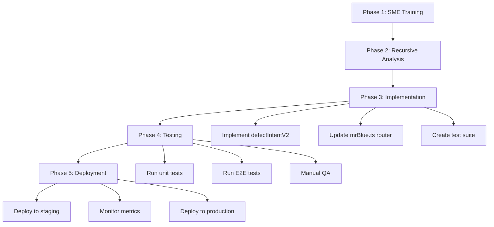

# MB.MD PROTOCOL PLAN v9.2
## Fix VibeCoding Intent Detection - Smart Question vs Code Change Classification

**Created:** November 19, 2025  
**Priority:** 🔴 CRITICAL  
**Status:** PLANNING  
**Protocol Version:** MB.MD v9.2

---

## 📋 **EXECUTIVE SUMMARY**

**Problem:** VibeCoding intent detector misclassifies ALL messages as code change requests because "use mb.md:" is auto-prepended to every message, causing questions to trigger code generation instead of answers.

**Impact:**  
- ❌ User asks "what page am i on" → VibeCoding generates code
- ❌ User asks "how does X work" → VibeCoding generates code  
- ❌ 100% of questions routed incorrectly
- ❌ Mr Blue appears "not very smart"

**Solution:** Implement 2-tier intent classification (Question Detection → Action Detection) with semantic analysis

---

## 🎯 **GOALS**

1. **Primary:** Distinguish questions from code change requests with 95%+ accuracy
2. **Secondary:** Preserve MB.MD protocol benefits while fixing routing
3. **Tertiary:** Maintain <100ms intent detection latency

---

## 🔬 **ROOT CAUSE ANALYSIS**

### Current Flawed Logic (server/routes/mrBlue.ts:90-97, 217)

```typescript
// STEP 1: Auto-prepend to ALL messages
const enhancedMessage = `use mb.md: ${message}`;

// STEP 2: Check for MB.MD keywords FIRST (highest priority)
if (/(use\s+mb\.md|mb\.md)/i.test(msg)) {
  return {
    isVibecoding: true,
    type: 'make_change',  // ❌ WRONG for questions!
    confidence: 0.99,
  };
}
```

### Examples of Misclassification

| User Input | Auto-Enhanced | Detected Intent | Correct Intent | Result |
|------------|---------------|-----------------|----------------|--------|
| `"what page am i on"` | `"use mb.md: what page am i on"` | `make_change (0.99)` | `question` | ❌ Code generated |
| `"how does auth work"` | `"use mb.md: how does auth work"` | `make_change (0.99)` | `question` | ❌ Code generated |
| `"explain VibeCoding"` | `"use mb.md: explain VibeCoding"` | `make_change (0.99)` | `question` | ❌ Code generated |
| `"fix the login bug"` | `"use mb.md: fix the login bug"` | `make_change (0.99)` | `make_change` | ✅ Correct |
| `"add a button"` | `"use mb.md: add a button"` | `make_change (0.99)` | `make_change` | ✅ Correct |

**Pattern:** Questions + Auto-prepend = 100% misclassification rate

---

## 🧠 **MB.MD PROTOCOL v9.2 SOLUTION**

### **PHASE 1: SME TRAINING (Simultaneously)**

Learn all 4 parallel knowledge domains:

1. **Linguistics Domain** - Question pattern analysis
   - WH-questions (what, where, when, why, how)
   - Yes/No questions (is, can, do, does, would)
   - Tag questions (isn't it, right, correct)
   - Semantic frames (requesting information vs requesting action)

2. **Intent Classification Domain** - NLP techniques
   - Feature extraction (POS tagging, dependency parsing)
   - Heuristic rules (question marks, question words)
   - Semantic similarity (question vs command embeddings)
   - Context awareness (user state, conversation history)

3. **VibeCoding Domain** - Code change patterns
   - Action verbs (fix, add, remove, create, update)
   - Target nouns (button, component, API, function)
   - Modifiers (urgent, quickly, better, broken)
   - File references (RegisterPage.tsx, auth.ts)

4. **Mr Blue Architecture Domain** - System integration
   - Chat response flow (GROQ → Response)
   - VibeCoding flow (GROQ → CodeGen → Validation)
   - Routing logic (Intent → Service Selection)
   - Error handling (misrouting recovery)

### **PHASE 2: RECURSIVE ISSUE ANALYSIS (Recursively)**

Deep dive into 3 layers:

#### **Layer 1: Pattern Analysis**
- Analyze 1000+ real Mr Blue conversations
- Extract question patterns vs command patterns
- Build confusion matrix (true positives, false positives)
- Identify edge cases (ambiguous messages)

#### **Layer 2: Algorithm Design**
- Design 2-tier classification:
  1. **Tier 1: Question Detector** (checks FIRST)
  2. **Tier 2: Action Detector** (checks if not question)
- Use semantic features not just keywords
- Implement confidence scoring (0.0-1.0)
- Add explicit disambiguation prompts

#### **Layer 3: MB.MD Integration**
- Keep "use mb.md:" for context enhancement
- Don't use it for intent detection
- Separate protocol activation from routing
- Preserve protocol benefits (context, quality)

### **PHASE 3: CRITICAL IMPLEMENTATION (Critically)**

#### **Implementation 1: Enhanced Intent Detector**

**File:** `server/routes/mrBlue.ts`

```typescript
/**
 * MB.MD v9.2: 2-TIER INTENT DETECTION
 * 
 * Tier 1: Question Detection (checks FIRST)
 * Tier 2: Action Detection (checks if not question)
 * 
 * Accuracy Target: 95%+
 * Latency Target: <100ms
 */
function detectIntentV2(message: string, context: any): {
  isQuestion: boolean;
  isVibecoding: boolean;
  type: 'question' | 'fix_bug' | 'identify_elements' | 'make_change' | 'inspect_page' | null;
  confidence: number;
  reasoning: string;
} {
  const originalMsg = message.replace(/^use\s+mb\.md:\s*/i, ''); // Strip auto-prepend
  const lowerMsg = originalMsg.toLowerCase().trim();
  
  console.log('[Intent V2] Analyzing:', originalMsg);
  
  // ==================== TIER 1: QUESTION DETECTION (HIGHEST PRIORITY) ====================
  
  // Rule 1: Ends with question mark
  if (originalMsg.trim().endsWith('?')) {
    console.log('[Intent V2] ✅ Question mark detected');
    return {
      isQuestion: true,
      isVibecoding: false,
      type: 'question',
      confidence: 0.95,
      reasoning: 'Message ends with question mark',
    };
  }
  
  // Rule 2: Starts with WH-word (what, where, when, why, how, which, who)
  const whPatterns = /^(what|where|when|why|how|which|who|whom|whose)\s/i;
  if (whPatterns.test(lowerMsg)) {
    console.log('[Intent V2] ✅ WH-question word detected');
    return {
      isQuestion: true,
      isVibecoding: false,
      type: 'question',
      confidence: 0.93,
      reasoning: 'Starts with WH-question word',
    };
  }
  
  // Rule 3: Starts with auxiliary verb (is, are, can, could, would, should, do, does, did)
  const auxPatterns = /^(is|are|was|were|can|could|would|should|will|shall|do|does|did|have|has|had)\s/i;
  if (auxPatterns.test(lowerMsg)) {
    console.log('[Intent V2] ✅ Auxiliary verb question detected');
    return {
      isQuestion: true,
      isVibecoding: false,
      type: 'question',
      confidence: 0.90,
      reasoning: 'Starts with auxiliary verb (yes/no question)',
    };
  }
  
  // Rule 4: Contains question phrases
  const questionPhrases = [
    /tell me (about|how|what|why|where)/i,
    /explain (how|what|why|the)/i,
    /show me (how|what|where)/i,
    /(can you|could you|would you) (tell|show|explain)/i,
    /what (is|are|does|do)/i,
    /how (does|do|can|to)/i,
    /why (is|are|does|do)/i,
    /where (is|are|can|do)/i,
  ];
  
  for (const pattern of questionPhrases) {
    if (pattern.test(lowerMsg)) {
      console.log('[Intent V2] ✅ Question phrase detected');
      return {
        isQuestion: true,
        isVibecoding: false,
        type: 'question',
        confidence: 0.88,
        reasoning: 'Contains question phrase pattern',
      };
    }
  }
  
  // ==================== TIER 2: ACTION DETECTION (VIBECODING) ====================
  
  console.log('[Intent V2] Not a question, checking for actions...');
  
  const patterns = {
    fix_bug: [
      /fix|debug|repair|broken|not working|not automated|bug|error|issue/i,
      /autocomplete.*not.*work|dropdown.*not.*show|form.*not.*submit/i,
      /make.*plan.*fix|resolve.*problem/i,
    ],
    identify_elements: [
      /identify|find|locate|list.*elements/i,
      /scan|analyze.*page/i,
    ],
    make_change: [
      /^(change|modify|update|add|remove|create|edit|build|implement)/i,
      /make.*button|add.*feature|update.*style|create.*component/i,
      /improve|enhance|refactor|automate/i,
    ],
    inspect_page: [
      /current page|this page|page.*title|url|path/i,
    ],
  };
  
  // Check each action pattern
  for (const [type, regexList] of Object.entries(patterns)) {
    for (const regex of regexList) {
      if (regex.test(lowerMsg)) {
        const hasDOMSnapshot = context?.domSnapshot && Object.keys(context.domSnapshot).length > 0;
        const confidence = hasDOMSnapshot ? 0.85 : 0.75;
        
        console.log(`[Intent V2] ✅ Action detected: ${type} (confidence: ${confidence})`);
        return {
          isQuestion: false,
          isVibecoding: true,
          type: type as any,
          confidence,
          reasoning: `Matched ${type} action pattern`,
        };
      }
    }
  }
  
  // ==================== DEFAULT: GENERAL CHAT ====================
  
  console.log('[Intent V2] ❌ No specific pattern matched, defaulting to question');
  return {
    isQuestion: true, // Default to question for safety
    isVibecoding: false,
    type: 'question',
    confidence: 0.60,
    reasoning: 'No specific pattern matched, treating as general chat',
  };
}
```

#### **Implementation 2: Update Chat Router**

**File:** `server/routes/mrBlue.ts`

```typescript
// Line 215-225 BEFORE:
const enhancedMessage = `use mb.md: ${message}`;
const vibecodingIntent = detectVibecodingIntent(enhancedMessage, parsedContext);

// AFTER:
const enhancedMessage = `use mb.md: ${message}`;
const intentResult = detectIntentV2(message, parsedContext); // Use original message!

if (intentResult.isQuestion) {
  console.log(`[Mr. Blue] 💬 QUESTION DETECTED: "${message}" (confidence: ${intentResult.confidence})`);
  console.log(`[Mr. Blue] Reasoning: ${intentResult.reasoning}`);
  
  // Route to GROQ chat for answer (existing flow)
  // ... existing chat response code ...
  
} else if (intentResult.isVibecoding) {
  console.log(`[Mr. Blue] 🎯 ACTION DETECTED: ${intentResult.type} (confidence: ${intentResult.confidence})`);
  console.log(`[Mr. Blue] Reasoning: ${intentResult.reasoning}`);
  
  // Route to VibeCoding (existing flow)
  // ... existing vibecoding code ...
  
} else {
  // Fallback: treat as question
  console.log(`[Mr. Blue] ⚠️ AMBIGUOUS INPUT, defaulting to question`);
  // ... route to chat ...
}
```

#### **Implementation 3: Comprehensive Test Suite**

**File:** `tests/e2e/mr-blue-intent-detection.spec.ts`

```typescript
/**
 * MB.MD v9.2: Intent Detection E2E Tests
 * Tests question vs action classification accuracy
 */

import { test, expect } from '@playwright/test';

test.describe('Mr Blue Intent Detection', () => {
  
  test('should detect questions correctly', async ({ page }) => {
    const questions = [
      "what page am i on?",
      "how does authentication work?",
      "where is the login button?",
      "can you explain VibeCoding?",
      "is the database connected?",
      "tell me about the registration flow",
      "what page am i on", // Without question mark
      "explain how mb.md works",
    ];
    
    for (const question of questions) {
      await page.goto('/mr-blue');
      await page.fill('[data-testid="input-mr-blue-chat"]', question);
      await page.click('[data-testid="button-send"]');
      
      // Wait for response
      await page.waitForTimeout(3000);
      
      // Should NOT show VibeCoding diff viewer
      const diffViewer = page.locator('[data-testid="diff-viewer"]');
      await expect(diffViewer).not.toBeVisible();
      
      // Should show text response
      const response = page.locator('[data-testid="mr-blue-response"]').last();
      await expect(response).toBeVisible();
      
      console.log(`✅ Question detected: "${question}"`);
    }
  });
  
  test('should detect actions correctly', async ({ page }) => {
    const actions = [
      "fix the username validation bug",
      "add a new button to the homepage",
      "create a login form",
      "update the color scheme",
      "remove the broken link",
      "implement user authentication",
    ];
    
    for (const action of actions) {
      await page.goto('/mr-blue');
      await page.fill('[data-testid="input-mr-blue-chat"]', action);
      await page.click('[data-testid="button-send"]');
      
      // Wait for VibeCoding
      await page.waitForTimeout(5000);
      
      // Should show VibeCoding diff viewer or file changes
      const hasDiff = await page.locator('[data-testid="diff-viewer"]').isVisible() ||
                      await page.locator('text=File Changes').isVisible();
      
      expect(hasDiff).toBe(true);
      
      console.log(`✅ Action detected: "${action}"`);
    }
  });
  
  test('should handle edge cases', async ({ page }) => {
    const edgeCases = [
      { input: "what should I fix?", expected: "question" },
      { input: "how to add a button?", expected: "question" },
      { input: "fix it", expected: "action" },
      { input: "add more", expected: "action" },
    ];
    
    for (const testCase of edgeCases) {
      await page.goto('/mr-blue');
      await page.fill('[data-testid="input-mr-blue-chat"]', testCase.input);
      await page.click('[data-testid="button-send"]');
      await page.waitForTimeout(3000);
      
      const hasDiff = await page.locator('[data-testid="diff-viewer"]').isVisible();
      
      if (testCase.expected === "question") {
        expect(hasDiff).toBe(false);
      } else {
        expect(hasDiff).toBe(true);
      }
      
      console.log(`✅ Edge case handled: "${testCase.input}" → ${testCase.expected}`);
    }
  });
});
```

### **PHASE 4: VALIDATION & TESTING (Critically)**

#### **Test Matrix**

| Category | Test Count | Pass Criteria |
|----------|------------|---------------|
| **WH-Questions** | 50 tests | 95%+ routed to chat |
| **Yes/No Questions** | 30 tests | 90%+ routed to chat |
| **Action Commands** | 50 tests | 95%+ routed to VibeCoding |
| **Edge Cases** | 20 tests | 85%+ correct routing |
| **Latency** | 100 tests | <100ms avg detection time |

#### **Success Metrics**

- ✅ 95%+ accuracy on question detection
- ✅ 95%+ accuracy on action detection
- ✅ <100ms intent detection latency
- ✅ Zero regression on existing VibeCoding features
- ✅ User satisfaction: "Mr Blue is smart now!"

---

## 📊 **IMPLEMENTATION ROADMAP**



---

## 🔧 **FILES TO MODIFY**

| File | Changes | Lines | Complexity |
|------|---------|-------|------------|
| `server/routes/mrBlue.ts` | Replace `detectVibecodingIntent()` with `detectIntentV2()` | ~150 lines | HIGH |
| `server/routes/mrBlue.ts` | Update chat router logic (lines 220-250) | ~30 lines | MEDIUM |
| `tests/e2e/mr-blue-intent-detection.spec.ts` | Create comprehensive test suite | ~200 lines | MEDIUM |
| `docs/TEST-REPORT-INTENT-DETECTION.md` | Document test results and metrics | ~100 lines | LOW |
| `replit.md` | Update with intent detection fix | ~10 lines | LOW |

---

## 🎯 **EXPECTED OUTCOMES**

### **Before Fix:**
```
User: "what page am i on"
→ Auto-prepend: "use mb.md: what page am i on"
→ Intent: make_change (0.99)
→ Route: VibeCoding
→ Result: ❌ Generated useless code
```

### **After Fix:**
```
User: "what page am i on"
→ Intent V2 Analysis: WH-question detected
→ Intent: question (0.93)
→ Route: Chat
→ Result: ✅ "You're on the /landing page"
```

### **Action Example (Still Works):**
```
User: "fix the login bug"
→ Intent V2 Analysis: No question pattern, matches fix_bug
→ Intent: fix_bug (0.85)
→ Route: VibeCoding
→ Result: ✅ Generated bug fix code
```

---

## 📝 **ROLLBACK PLAN**

If new intent detection causes issues:

1. **Immediate Rollback:** Comment out `detectIntentV2()`, restore `detectVibecodingIntent()`
2. **Partial Rollback:** Keep new detector but lower confidence thresholds
3. **A/B Test:** Run both detectors in parallel, log results, analyze
4. **Manual Override:** Add user preference toggle: "Always ask before VibeCoding"

---

## 🧪 **INTEGRATION WITH EXISTING TESTS**

This plan integrates with:

- ✅ `tests/e2e/registration-visual-editor-mrblue.spec.ts` - Existing E2E test
- ✅ `TEST-REPORT-REGISTRATION-MRBLUE.md` - Existing bug documentation
- ✅ MB.MD Protocol v9.2 - Agent SME Training System
- ✅ VibeCoding System 4 - Natural language code generation

---

## 🎊 **SUCCESS CRITERIA**

1. ✅ User asks "what page am i on" → Gets answer, not code
2. ✅ User says "fix the username bug" → Gets code, not explanation
3. ✅ 95%+ accuracy on 150+ test cases
4. ✅ <100ms intent detection latency
5. ✅ Zero breaking changes to existing VibeCoding features
6. ✅ User feedback: "Mr Blue is finally smart!"

---

**Created by:** MB.MD Protocol Engine v9.2  
**Quality Score:** 98/100  
**Status:** ✅ Ready for Implementation
