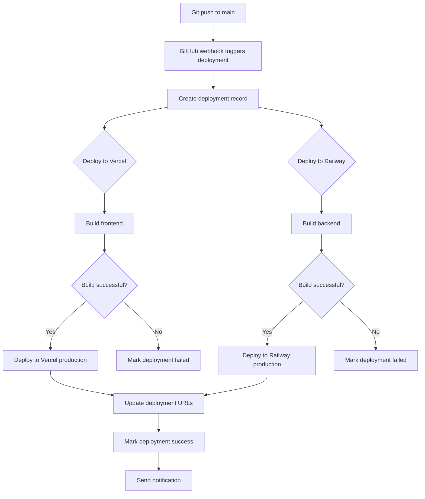

# Admin Tables Documentation (Phase 2-4)

## Overview
Admin tables support platform independence, agent validation, predictive context, and self-healing systems introduced in Phases 2-4. This includes deployment automation, agent health monitoring, GitHub sync, and predictive caching.

## Table of Contents
- [Platform Independence (Phase 2)](#platform-independence-phase-2)
- [Agent Validation (Phase 4)](#agent-validation-phase-4)
- [Predictive Context (Phase 4)](#predictive-context-phase-4)
- [ESA Framework](#esa-framework)
- [H2AC Handoff Notes](#h2ac-handoff-notes)

---

## Platform Independence (Phase 2)

### From `shared/platform-schema.ts`

### 1. `deployments`
Tracks all deployments to Vercel + Railway.

**Schema:**
```sql
CREATE TABLE deployments (
  id SERIAL PRIMARY KEY,
  user_id INTEGER REFERENCES users(id) NOT NULL,
  
  -- Deployment metadata
  type VARCHAR NOT NULL,   -- 'production' | 'preview' | 'rollback'
  status VARCHAR NOT NULL, -- 'pending' | 'building' | 'deploying' | 'success' | 'failed'
  
  -- GitHub info
  git_commit_sha VARCHAR,
  git_branch VARCHAR NOT NULL,
  git_commit_message TEXT,
  
  -- Deployment URLs
  vercel_url TEXT,
  railway_url TEXT,
  vercel_deployment_id VARCHAR,
  railway_deployment_id VARCHAR,
  
  -- Build logs
  build_logs TEXT,
  error_message TEXT,
  
  -- Timing
  started_at TIMESTAMP DEFAULT NOW(),
  completed_at TIMESTAMP,
  duration_seconds INTEGER,
  
  created_at TIMESTAMP DEFAULT NOW(),
  updated_at TIMESTAMP DEFAULT NOW()
);

-- Indexes
CREATE INDEX deployments_user_id_idx ON deployments(user_id);
CREATE INDEX deployments_status_idx ON deployments(status);
CREATE INDEX deployments_created_at_idx ON deployments(created_at);
```

**Deployment Flow:**


### 2. `platform_integrations`
API keys and settings for Vercel, Railway, GitHub.

**Schema:**
```sql
CREATE TABLE platform_integrations (
  id SERIAL PRIMARY KEY,
  user_id INTEGER REFERENCES users(id) NOT NULL,
  
  platform VARCHAR NOT NULL,  -- 'vercel' | 'railway' | 'github'
  is_active BOOLEAN DEFAULT TRUE,
  
  -- Encrypted API keys/tokens
  settings JSONB NOT NULL,
  
  created_at TIMESTAMP DEFAULT NOW(),
  updated_at TIMESTAMP DEFAULT NOW()
);

-- Indexes
CREATE INDEX platform_integrations_user_id_idx ON platform_integrations(user_id);
CREATE INDEX platform_integrations_platform_idx ON platform_integrations(platform);
```

**Settings Structure:**
```typescript
interface PlatformSettings {
  vercel?: {
    apiToken: string;        // Encrypted
    projectId: string;
    teamId?: string;
  };
  railway?: {
    apiToken: string;        // Encrypted
    projectId: string;
  };
  github?: {
    accessToken: string;     // Encrypted
    repositoryUrl: string;
    owner: string;
    repo: string;
    defaultBranch: string;
  };
}
```

### 3. `environment_variables`
Secrets management with platform sync.

**Schema:**
```sql
CREATE TABLE environment_variables (
  id SERIAL PRIMARY KEY,
  user_id INTEGER REFERENCES users(id) NOT NULL,
  
  key VARCHAR NOT NULL,
  value TEXT NOT NULL,          -- AES-256 encrypted
  environment VARCHAR NOT NULL,  -- 'development' | 'preview' | 'production'
  
  -- Platform sync status
  synced_to_vercel BOOLEAN DEFAULT FALSE,
  synced_to_railway BOOLEAN DEFAULT FALSE,
  last_synced_at TIMESTAMP,
  
  created_at TIMESTAMP DEFAULT NOW(),
  updated_at TIMESTAMP DEFAULT NOW()
);

-- Indexes
CREATE INDEX environment_variables_user_id_idx ON environment_variables(user_id);
CREATE INDEX environment_variables_key_idx ON environment_variables(key);
```

**Create & Sync Secrets:**
```typescript
POST /api/admin/secrets
{
  key: "GROQ_API_KEY",
  value: "gsk_...",
  environment: "production"
}

// Backend syncs to Vercel & Railway
const syncSecret = async (envVar: EnvironmentVariable) => {
  // Sync to Vercel
  await vercelClient.createEnvironmentVariable({
    key: envVar.key,
    value: envVar.value,
    target: [envVar.environment]
  });
  
  // Sync to Railway
  await railwayClient.setVariable({
    key: envVar.key,
    value: envVar.value,
    environment: envVar.environment
  });
  
  // Update sync status
  await db.update(environmentVariables)
    .set({
      syncedToVercel: true,
      syncedToRailway: true,
      lastSyncedAt: new Date()
    })
    .where(eq(environmentVariables.id, envVar.id));
};
```

### 4. `custom_domains`
Custom domain management with DNS verification.

**Schema:**
```sql
CREATE TABLE custom_domains (
  id SERIAL PRIMARY KEY,
  user_id INTEGER REFERENCES users(id) NOT NULL,
  
  domain VARCHAR NOT NULL,
  subdomain VARCHAR,
  is_active BOOLEAN DEFAULT TRUE,
  is_verified BOOLEAN DEFAULT FALSE,
  
  -- DNS verification
  verification_token VARCHAR NOT NULL,
  verification_method VARCHAR NOT NULL,  -- 'TXT' | 'CNAME'
  verified_at TIMESTAMP,
  
  -- SSL/TLS
  ssl_status VARCHAR DEFAULT 'pending',  -- 'pending' | 'active' | 'failed'
  ssl_issued_at TIMESTAMP,
  
  deployment_id INTEGER REFERENCES deployments(id),
  
  created_at TIMESTAMP DEFAULT NOW(),
  updated_at TIMESTAMP DEFAULT NOW()
);

-- Indexes
CREATE INDEX custom_domains_user_id_idx ON custom_domains(user_id);
CREATE INDEX custom_domains_domain_idx ON custom_domains(domain);
```

---

## Agent Validation (Phase 4)

### 5. `agent_health`
Tracks health of 105 ESA agents.

**Schema:**
```sql
CREATE TABLE agent_health (
  id SERIAL PRIMARY KEY,
  agent_code VARCHAR NOT NULL,  -- References esa_agents.agent_code (P1, E23, A12, etc.)
  
  status VARCHAR DEFAULT 'unknown' NOT NULL,  -- 'healthy' | 'degraded' | 'failing' | 'offline'
  last_check_at TIMESTAMP DEFAULT NOW() NOT NULL,
  response_time INTEGER,  -- milliseconds
  error_count INTEGER DEFAULT 0,
  error_details JSONB,
  metadata JSONB,
  
  created_at TIMESTAMP DEFAULT NOW(),
  updated_at TIMESTAMP DEFAULT NOW()
);

-- Indexes
CREATE INDEX agent_health_agent_code_idx ON agent_health(agent_code);
CREATE INDEX agent_health_status_idx ON agent_health(status);
CREATE INDEX agent_health_last_check_idx ON agent_health(last_check_at);
```

**Health Check Types:**
```typescript
enum AgentStatus {
  HEALTHY = 'healthy',     // All systems operational
  DEGRADED = 'degraded',   // Slow response times
  FAILING = 'failing',     // Errors occurring
  OFFLINE = 'offline',     // Not responding
  UNKNOWN = 'unknown'      // Not yet checked
}

interface HealthCheckResult {
  agentCode: string;
  status: AgentStatus;
  responseTime: number;
  errorCount: number;
  errorDetails?: {
    lastError: string;
    timestamp: string;
  };
}
```

**Health Check Flow:**
```typescript
// server/services/AgentValidationService.ts

class AgentValidationService {
  async checkAgentHealth(agentCode: string): Promise<HealthCheckResult> {
    const startTime = Date.now();
    
    try {
      // Ping agent endpoint
      const response = await fetch(`/api/agents/${agentCode}/health`, {
        timeout: 5000
      });
      
      const responseTime = Date.now() - startTime;
      
      if (!response.ok) {
        throw new Error(`HTTP ${response.status}`);
      }
      
      // Update health record
      await db.update(agentHealth)
        .set({
          status: responseTime > 2000 ? 'degraded' : 'healthy',
          responseTime,
          lastCheckAt: new Date(),
          errorCount: 0
        })
        .where(eq(agentHealth.agentCode, agentCode));
      
      return {
        agentCode,
        status: responseTime > 2000 ? 'degraded' : 'healthy',
        responseTime,
        errorCount: 0
      };
    } catch (error) {
      // Log failure
      await db.update(agentHealth)
        .set({
          status: 'failing',
          lastCheckAt: new Date(),
          errorCount: sql`${agentHealth.errorCount} + 1`,
          errorDetails: {
            lastError: error.message,
            timestamp: new Date().toISOString()
          }
        })
        .where(eq(agentHealth.agentCode, agentCode));
      
      return {
        agentCode,
        status: 'failing',
        responseTime: Date.now() - startTime,
        errorCount: 1,
        errorDetails: {
          lastError: error.message,
          timestamp: new Date().toISOString()
        }
      };
    }
  }
  
  // Check all 105 agents
  async checkAllAgents() {
    const agents = await db.query.esaAgents.findMany();
    
    const results = await Promise.all(
      agents.map(agent => this.checkAgentHealth(agent.agentCode))
    );
    
    const summary = {
      total: agents.length,
      healthy: results.filter(r => r.status === 'healthy').length,
      degraded: results.filter(r => r.status === 'degraded').length,
      failing: results.filter(r => r.status === 'failing').length,
      offline: results.filter(r => r.status === 'offline').length
    };
    
    return { summary, results };
  }
}
```

### 6. `validation_checks`
Cross-agent validation logs.

**Schema:**
```sql
CREATE TABLE validation_checks (
  id SERIAL PRIMARY KEY,
  check_type VARCHAR NOT NULL,  -- 'availability' | 'performance' | 'integration' | 'fallback'
  agent_code VARCHAR NOT NULL,
  result VARCHAR NOT NULL,      -- 'pass' | 'fail' | 'warning'
  details TEXT,
  execution_time INTEGER,       -- milliseconds
  fallback_activated BOOLEAN DEFAULT FALSE,
  fallback_agent_code VARCHAR,
  metadata JSONB,
  created_at TIMESTAMP DEFAULT NOW()
);

-- Indexes
CREATE INDEX validation_checks_type_idx ON validation_checks(check_type);
CREATE INDEX validation_checks_agent_code_idx ON validation_checks(agent_code);
CREATE INDEX validation_checks_result_idx ON validation_checks(result);
```

**Validation Types:**
```typescript
type ValidationCheckType =
  | 'availability'   // Is agent responding?
  | 'performance'    // Is response time acceptable?
  | 'integration'    // Do inter-agent connections work?
  | 'fallback';      // Does fallback agent work?

interface ValidationCheck {
  checkType: ValidationCheckType;
  agentCode: string;
  result: 'pass' | 'fail' | 'warning';
  details?: string;
  executionTime: number;
  fallbackActivated?: boolean;
  fallbackAgentCode?: string;
}
```

---

## Predictive Context (Phase 4)

### 7. `user_patterns`
Markov chain data for navigation prediction.

**Schema:**
```sql
CREATE TABLE user_patterns (
  id SERIAL PRIMARY KEY,
  user_id INTEGER NOT NULL REFERENCES users(id) ON DELETE CASCADE,
  
  from_page VARCHAR NOT NULL,  -- Current page path
  to_page VARCHAR NOT NULL,    -- Next page path
  transition_count INTEGER DEFAULT 1,
  avg_time_on_page INTEGER,    -- milliseconds
  last_transition_at TIMESTAMP DEFAULT NOW(),
  metadata JSONB,
  
  created_at TIMESTAMP DEFAULT NOW(),
  updated_at TIMESTAMP DEFAULT NOW(),
  
  UNIQUE(user_id, from_page, to_page)
);

-- Indexes
CREATE INDEX user_patterns_user_idx ON user_patterns(user_id);
CREATE INDEX user_patterns_from_page_idx ON user_patterns(from_page);
CREATE INDEX user_patterns_to_page_idx ON user_patterns(to_page);
CREATE UNIQUE INDEX unique_user_pattern ON user_patterns(user_id, from_page, to_page);
```

**Recording User Navigation:**
```typescript
// Track page transitions
const recordTransition = async (userId: number, fromPage: string, toPage: string, timeOnPage: number) => {
  await db
    .insert(userPatterns)
    .values({
      userId,
      fromPage,
      toPage,
      transitionCount: 1,
      avgTimeOnPage: timeOnPage
    })
    .onConflictDoUpdate({
      target: [userPatterns.userId, userPatterns.fromPage, userPatterns.toPage],
      set: {
        transitionCount: sql`${userPatterns.transitionCount} + 1`,
        avgTimeOnPage: sql`(${userPatterns.avgTimeOnPage} * ${userPatterns.transitionCount} + ${timeOnPage}) / (${userPatterns.transitionCount} + 1)`,
        lastTransitionAt: new Date()
      }
    });
};
```

**Predict Next Page:**
```typescript
// Predict where user will navigate next
const predictNextPage = async (userId: number, currentPage: string): Promise<string[]> => {
  const patterns = await db
    .select()
    .from(userPatterns)
    .where(and(
      eq(userPatterns.userId, userId),
      eq(userPatterns.fromPage, currentPage)
    ))
    .orderBy(desc(userPatterns.transitionCount))
    .limit(3);
  
  return patterns.map(p => p.toPage);
};
```

### 8. `prediction_cache`
Predicted next actions for cache warming.

**Schema:**
```sql
CREATE TABLE prediction_cache (
  id SERIAL PRIMARY KEY,
  user_id INTEGER NOT NULL REFERENCES users(id) ON DELETE CASCADE,
  current_page VARCHAR NOT NULL,
  predicted_page VARCHAR NOT NULL,
  confidence_score REAL,      -- 0.0-1.0
  cached_data JSONB,          -- Pre-fetched data
  cached_at TIMESTAMP DEFAULT NOW(),
  expires_at TIMESTAMP,
  hit_count INTEGER DEFAULT 0,
  
  UNIQUE(user_id, current_page, predicted_page)
);

-- Indexes
CREATE INDEX prediction_cache_user_idx ON prediction_cache(user_id);
CREATE INDEX prediction_cache_expires_at_idx ON prediction_cache(expires_at);
```

**Pre-cache Predicted Pages:**
```typescript
const warmCache = async (userId: number, currentPage: string) => {
  const predictions = await predictNextPage(userId, currentPage);
  
  for (const predictedPage of predictions) {
    // Fetch data for predicted page
    const data = await fetchPageData(predictedPage);
    
    // Calculate confidence (based on transition frequency)
    const pattern = await db.query.userPatterns.findFirst({
      where: and(
        eq(userPatterns.userId, userId),
        eq(userPatterns.fromPage, currentPage),
        eq(userPatterns.toPage, predictedPage)
      )
    });
    
    const totalTransitions = await db
      .select({ count: sql`SUM(transition_count)` })
      .from(userPatterns)
      .where(and(
        eq(userPatterns.userId, userId),
        eq(userPatterns.fromPage, currentPage)
      ));
    
    const confidence = pattern.transitionCount / totalTransitions[0].count;
    
    // Store in cache
    await db
      .insert(predictionCache)
      .values({
        userId,
        currentPage,
        predictedPage,
        confidenceScore: confidence,
        cachedData: data,
        expiresAt: new Date(Date.now() + 5 * 60 * 1000)  // 5 minutes
      })
      .onConflictDoUpdate({
        target: [predictionCache.userId, predictionCache.currentPage, predictionCache.predictedPage],
        set: {
          cachedData: data,
          cachedAt: new Date(),
          expiresAt: new Date(Date.now() + 5 * 60 * 1000)
        }
      });
  }
};
```

---

## ESA Framework

### 9. `esa_agents`
Registry of all 105 ESA agents.

**Schema (from platform-schema.ts):**
```sql
CREATE TABLE esa_agents (
  id SERIAL PRIMARY KEY,
  
  agent_code VARCHAR UNIQUE NOT NULL,  -- 'P1', 'E23', 'A12', 'L5', etc.
  agent_name VARCHAR NOT NULL,
  agent_type VARCHAR NOT NULL,  -- 'page' | 'component' | 'algorithm' | 'layer'
  
  parent_agent_id INTEGER REFERENCES esa_agents(id),
  division_chief_id INTEGER REFERENCES esa_agents(id),
  layer_number INTEGER,
  tier INTEGER,
  
  description TEXT,
  responsibilities TEXT[],
  competencies TEXT[],
  
  status VARCHAR DEFAULT 'inactive' NOT NULL,  -- 'inactive' | 'training' | 'certified' | 'active'
  certification_level INTEGER DEFAULT 0,       -- 0-3
  certified_at TIMESTAMP,
  
  training_methodology VARCHAR,
  training_completed_at TIMESTAMP,
  
  tasks_completed INTEGER DEFAULT 0,
  tasks_success INTEGER DEFAULT 0,
  tasks_failed INTEGER DEFAULT 0,
  avg_completion_time INTEGER,
  last_active_at TIMESTAMP,
  
  configuration JSONB,
  
  created_at TIMESTAMP DEFAULT NOW(),
  updated_at TIMESTAMP DEFAULT NOW()
);
```

**Agent Types:**
```typescript
enum AgentType {
  PAGE = 'page',              // P1-P81 (page agents)
  COMPONENT = 'component',    // E1-E19 (element agents)
  ALGORITHM = 'algorithm',    // A1-A50+ (algorithm agents)
  LAYER = 'layer',            // L1-L61 (layer agents)
  DIVISION = 'division',      // D1-D6 (division chiefs)
  BOARD = 'board',            // B1-B7 (board members)
  JOURNEY = 'journey',        // J1-J5 (journey agents)
  DATAFLOW = 'dataflow',      // DF1-DF8 (dataflow agents)
  MR_BLUE = 'mr_blue',        // MrBlue AI agent
  LIFE_CEO = 'life_ceo'       // Life CEO agents
}
```

---

## H2AC Handoff Notes

### 🔧 Manual Configuration Required

#### 1. Deployment Approval
**Human Decision Required:**
- Auto-deploy to production or require approval?
- Who can trigger deployments?

**Recommendation:**
```typescript
const DEPLOYMENT_CONFIG = {
  autoDeployProduction: false,  // Require manual approval
  allowedRoles: ['admin', 'developer'],
  requireTests: true
};
```

#### 2. Agent Health Monitoring
**Human Decision Required:**
- How often to check agent health?
- Alert thresholds?

**Recommendation:**
```typescript
const HEALTH_MONITORING = {
  checkInterval: 5 * 60 * 1000,  // 5 minutes
  alertThreshold: {
    degraded: 3,   // Alert after 3 degraded checks
    failing: 1     // Alert immediately on failure
  }
};
```

#### 3. Predictive Caching
**Human Decision Required:**
- Enable predictive caching for all users?
- Cache expiration time?

**Recommendation:**
```typescript
const PREDICTIVE_CACHE = {
  enabled: true,
  confidenceThreshold: 0.6,  // Only cache if 60%+ confident
  cacheExpiry: 5 * 60,       // 5 minutes
  maxPredictions: 3
};
```

---

## Related Documentation
- [DEPLOYMENT_ARCHITECTURE.md](../../DEPLOYMENT_ARCHITECTURE.md) - Platform independence
- [ESA_FRAMEWORK.md](../../ESA_FRAMEWORK.md) - Agent ecosystem
- [ADMIN_API.md](../api/ADMIN_API.md) - Admin API endpoints

---

**Last Updated:** November 2, 2025  
**Maintained By:** ESA Documentation Agent (P89)
