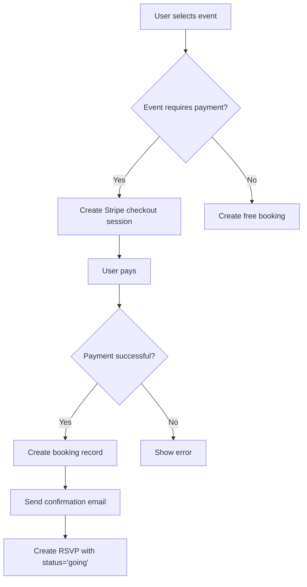

# Event Tables Documentation

## Overview
The event system in Mundo Tango supports comprehensive event management including tango milongas, workshops, festivals, and online events. This document covers 12+ tables powering event discovery, RSVPs, venues, and teachers.

## Table of Contents
- [Core Event Tables](#core-event-tables)
- [RSVP & Attendance](#rsvp--attendance)
- [Workshops & Classes](#workshops--classes)
- [Venues & Teachers](#venues--teachers)
- [Event Discovery](#event-discovery)
- [Schemas & Types](#schemas--types)
- [H2AC Handoff Notes](#h2ac-handoff-notes)

---

## Core Event Tables

### 1. `events`
The primary event table supporting all event types.

**Schema:**
```sql
CREATE TABLE events (
  id SERIAL PRIMARY KEY,
  user_id INTEGER NOT NULL REFERENCES users(id) ON DELETE CASCADE,  -- Event organizer
  
  -- Basic info
  title VARCHAR NOT NULL,
  description TEXT NOT NULL,
  image_url TEXT,
  event_type VARCHAR NOT NULL,  -- 'milonga' | 'workshop' | 'festival' | 'online' | 'social'
  
  -- Timing
  start_date TIMESTAMP NOT NULL,
  end_date TIMESTAMP,
  date TEXT,  -- For display purposes
  
  -- Location
  location TEXT NOT NULL,
  venue VARCHAR,
  address TEXT,
  city VARCHAR,
  country VARCHAR,
  latitude TEXT,
  longitude TEXT,
  
  -- Online event
  is_online BOOLEAN DEFAULT FALSE,
  meeting_url TEXT,
  
  -- Pricing
  price TEXT,
  currency VARCHAR,
  ticket_url TEXT,
  is_paid BOOLEAN DEFAULT FALSE,
  max_attendees INTEGER,
  
  -- Recurrence
  recurring VARCHAR,  -- null | 'daily' | 'weekly' | 'monthly'
  
  -- Status
  status VARCHAR DEFAULT 'published',  -- 'draft' | 'published' | 'cancelled'
  tags TEXT[],
  
  created_at TIMESTAMP DEFAULT NOW(),
  updated_at TIMESTAMP DEFAULT NOW()
);

-- Indexes
CREATE INDEX events_user_idx ON events(user_id);
CREATE INDEX events_start_date_idx ON events(start_date);
CREATE INDEX events_city_idx ON events(city);
```

**Event Types:**
```typescript
enum EventType {
  MILONGA = 'milonga',       // Social dance event
  WORKSHOP = 'workshop',     // Teaching session
  FESTIVAL = 'festival',     // Multi-day event
  ONLINE = 'online',         // Virtual event
  SOCIAL = 'social',         // Other social gatherings
  PRACTICE = 'practice'      // Practice sessions
}
```

**Example Event Creation:**
```typescript
POST /api/events
{
  title: "Friday Night Milonga at La Catedral",
  description: "Traditional tango milonga with live orchestra...",
  eventType: "milonga",
  startDate: "2025-11-15T20:00:00Z",
  endDate: "2025-11-16T02:00:00Z",
  location: "La Catedral, Buenos Aires",
  venue: "La Catedral",
  address: "Sarmiento 4006, Buenos Aires, Argentina",
  city: "Buenos Aires",
  country: "Argentina",
  latitude: "-34.6037",
  longitude: "-58.4271",
  isPaid: true,
  price: "$15",
  currency: "USD",
  maxAttendees: 200,
  tags: ["traditional", "live-music", "beginner-friendly"]
}
```

---

## RSVP & Attendance

### 2. `event_rsvps`
User RSVPs to events.

**Schema:**
```sql
CREATE TABLE event_rsvps (
  id SERIAL PRIMARY KEY,
  event_id INTEGER NOT NULL REFERENCES events(id) ON DELETE CASCADE,
  user_id INTEGER NOT NULL REFERENCES users(id) ON DELETE CASCADE,
  status VARCHAR NOT NULL,  -- 'going' | 'interested' | 'not_going'
  created_at TIMESTAMP DEFAULT NOW(),
  
  UNIQUE(event_id, user_id)
);

-- Indexes
CREATE INDEX event_rsvps_event_idx ON event_rsvps(event_id);
CREATE INDEX event_rsvps_user_idx ON event_rsvps(user_id);
CREATE UNIQUE INDEX unique_rsvp ON event_rsvps(event_id, user_id);
```

**RSVP Statuses:**
- **`going`**: User will attend
- **`interested`**: User is interested but not committed
- **`not_going`**: User explicitly declined

**RSVP API:**
```typescript
// RSVP to event
POST /api/events/:id/rsvp
{
  status: "going"
}

// Get event attendees
GET /api/events/:id/attendees

// Response
{
  going: 45,
  interested: 12,
  attendees: [
    {
      id: 123,
      name: "John Doe",
      profileImage: "...",
      status: "going"
    }
  ]
}
```

### 3. `bookings`
Paid event bookings (for workshops, classes).

**Schema:**
```sql
CREATE TABLE bookings (
  id SERIAL PRIMARY KEY,
  user_id INTEGER NOT NULL REFERENCES users(id) ON DELETE CASCADE,
  event_id INTEGER REFERENCES events(id) ON DELETE CASCADE,
  workshop_id INTEGER REFERENCES workshops(id) ON DELETE CASCADE,
  
  confirmation_number VARCHAR NOT NULL UNIQUE,
  guests INTEGER DEFAULT 1,
  total_amount INTEGER NOT NULL,  -- in cents
  status VARCHAR DEFAULT 'confirmed',  -- 'confirmed' | 'cancelled' | 'refunded'
  
  created_at TIMESTAMP DEFAULT NOW()
);

-- Indexes
CREATE INDEX bookings_user_idx ON bookings(user_id);
CREATE INDEX bookings_confirmation_idx ON bookings(confirmation_number);
```

**Booking Flow:**


---

## Workshops & Classes

### 4. `workshops`
Workshop and class sessions.

**Schema:**
```sql
CREATE TABLE workshops (
  id SERIAL PRIMARY KEY,
  title VARCHAR NOT NULL,
  description TEXT NOT NULL,
  instructor_id INTEGER REFERENCES teachers(id),
  instructor_name VARCHAR NOT NULL,
  image_url TEXT,
  
  -- Timing
  start_date TIMESTAMP NOT NULL,
  end_date TIMESTAMP NOT NULL,
  duration_minutes INTEGER,
  
  -- Location
  venue VARCHAR,
  address TEXT,
  city VARCHAR,
  country VARCHAR,
  is_online BOOLEAN DEFAULT FALSE,
  meeting_url TEXT,
  
  -- Pricing
  price INTEGER NOT NULL,  -- in cents
  currency VARCHAR DEFAULT 'USD',
  max_participants INTEGER,
  
  -- Requirements
  skill_level VARCHAR,  -- 'beginner' | 'intermediate' | 'advanced'
  prerequisites TEXT,
  
  created_at TIMESTAMP DEFAULT NOW()
);

-- Indexes
CREATE INDEX workshops_instructor_idx ON workshops(instructor_id);
CREATE INDEX workshops_start_date_idx ON workshops(start_date);
CREATE INDEX workshops_city_idx ON workshops(city);
```

**Workshop Skill Levels:**
```typescript
enum SkillLevel {
  BEGINNER = 'beginner',           // No experience required
  INTERMEDIATE = 'intermediate',   // 1-2 years experience
  ADVANCED = 'advanced',           // 3+ years experience
  ALL_LEVELS = 'all_levels'        // Mixed skill levels
}
```

---

## Venues & Teachers

### 5. `venues`
Dance venues and studios.

**Schema:**
```sql
CREATE TABLE venues (
  id SERIAL PRIMARY KEY,
  name VARCHAR NOT NULL,
  description TEXT,
  address TEXT NOT NULL,
  city VARCHAR NOT NULL,
  country VARCHAR NOT NULL,
  latitude TEXT,
  longitude TEXT,
  
  -- Amenities
  capacity INTEGER,
  floor_type VARCHAR,  -- 'wood' | 'concrete' | 'tile' | 'other'
  has_parking BOOLEAN DEFAULT FALSE,
  has_coat_check BOOLEAN DEFAULT FALSE,
  wheelchair_accessible BOOLEAN DEFAULT FALSE,
  
  -- Contact
  phone VARCHAR,
  email VARCHAR,
  website TEXT,
  
  -- Images
  images TEXT[],
  
  created_at TIMESTAMP DEFAULT NOW()
);

-- Indexes
CREATE INDEX venues_city_idx ON venues(city);
CREATE INDEX venues_country_idx ON venues(country);
```

**Venue Search:**
```typescript
// Find venues in a city
GET /api/venues?city=Buenos%20Aires

// Find venues near coordinates
GET /api/venues?lat=-34.6037&lng=-58.4271&radius=5

// Response
{
  venues: [
    {
      id: 1,
      name: "La Catedral",
      address: "Sarmiento 4006",
      city: "Buenos Aires",
      distance: 2.3,  // km from search point
      capacity: 200,
      floorType: "wood",
      rating: 4.7
    }
  ]
}
```

### 6. `teachers`
Tango instructors and performers.

**Schema:**
```sql
CREATE TABLE teachers (
  id SERIAL PRIMARY KEY,
  name VARCHAR NOT NULL,
  bio TEXT,
  profile_image TEXT,
  
  -- Specialization
  specialties TEXT[],  -- ['vals', 'milonga', 'nuevo', 'salon']
  years_of_experience INTEGER,
  
  -- Contact
  email VARCHAR,
  phone VARCHAR,
  website TEXT,
  
  -- Social media
  instagram_handle VARCHAR,
  youtube_channel TEXT,
  
  -- Location
  based_in_city VARCHAR,
  based_in_country VARCHAR,
  
  -- Media
  videos TEXT[],  -- YouTube video IDs
  
  created_at TIMESTAMP DEFAULT NOW()
);

-- Indexes
CREATE INDEX teachers_city_idx ON teachers(based_in_city);
```

---

## Event Discovery

### 7. Event Search & Filtering

**Search Query:**
```sql
-- Find upcoming milongas in Buenos Aires
SELECT e.* 
FROM events e
WHERE 
  e.city = 'Buenos Aires'
  AND e.event_type = 'milonga'
  AND e.start_date >= NOW()
  AND e.status = 'published'
ORDER BY e.start_date ASC
LIMIT 20;
```

**API Endpoint:**
```typescript
GET /api/events?city=Buenos%20Aires&type=milonga&from=2025-11-01

// Response
{
  events: [
    {
      id: 123,
      title: "Friday Night Milonga",
      startDate: "2025-11-15T20:00:00Z",
      venue: "La Catedral",
      attendeeCount: 45,
      userRsvpStatus: "going"
    }
  ],
  total: 156,
  page: 1,
  limit: 20
}
```

**Filter Options:**
```typescript
interface EventFilters {
  city?: string;
  country?: string;
  eventType?: EventType;
  from?: Date;
  to?: Date;
  isPaid?: boolean;
  isOnline?: boolean;
  tags?: string[];
  radius?: number;       // km from lat/lng
  lat?: number;
  lng?: number;
}
```

### 8. Event Recommendations

Powered by `server/algorithms/eventRecommendation.ts`:

```typescript
interface EventRecommendationFactors {
  locationMatch: number;      // Events in user's city
  friendsAttending: number;   // Friends going to event
  pastAttendance: number;     // Similar events user attended
  danceLevelMatch: number;    // Event matches user's skill level
  newness: number;            // Prioritize newly posted events
}

const recommendEvents = (userId: number) => {
  // Fetch user's location, friends, past RSVPs
  const user = await getUser(userId);
  const friends = await getUserFriends(userId);
  const pastEvents = await getUserEventHistory(userId);
  
  // Score all upcoming events
  const scoredEvents = await db.query.events.findMany({
    where: and(
      eq(events.status, 'published'),
      gte(events.startDate, new Date())
    )
  }).map(event => ({
    event,
    score: calculateEventScore(event, user, friends, pastEvents)
  }));
  
  // Sort by score
  return scoredEvents
    .sort((a, b) => b.score - a.score)
    .slice(0, 20);
};
```

---

## Recurring Events

### Recurrence Pattern

**Single Event:**
```typescript
{
  recurring: null,
  startDate: "2025-11-15T20:00:00Z",
  endDate: "2025-11-16T02:00:00Z"
}
```

**Weekly Recurring:**
```typescript
{
  recurring: "weekly",
  startDate: "2025-11-15T20:00:00Z",  // First occurrence
  endDate: "2025-11-16T02:00:00Z"
}
```

**Backend generates instances:**
```typescript
const generateRecurringInstances = (event: Event, until: Date) => {
  const instances = [];
  let currentDate = new Date(event.startDate);
  
  while (currentDate <= until) {
    instances.push({
      ...event,
      startDate: currentDate,
      endDate: addHours(currentDate, getDurationHours(event))
    });
    
    if (event.recurring === 'weekly') {
      currentDate = addDays(currentDate, 7);
    } else if (event.recurring === 'monthly') {
      currentDate = addMonths(currentDate, 1);
    }
  }
  
  return instances;
};
```

---

## Schemas & Types

### TypeScript Types

```typescript
// From shared/schema.ts

export type SelectEvent = typeof events.$inferSelect;
export type InsertEvent = z.infer<typeof insertEventSchema>;

export type SelectEventRsvp = typeof eventRsvps.$inferSelect;
export type InsertEventRsvp = z.infer<typeof insertEventRsvpSchema>;

export type SelectWorkshop = typeof workshops.$inferSelect;
export type InsertWorkshop = z.infer<typeof insertWorkshopSchema>;

export type SelectVenue = typeof venues.$inferSelect;
export type InsertVenue = z.infer<typeof insertVenueSchema>;
```

### Validation Schemas

```typescript
import { z } from 'zod';

export const createEventSchema = z.object({
  title: z.string().min(1).max(200),
  description: z.string().min(10).max(5000),
  eventType: z.enum(['milonga', 'workshop', 'festival', 'online', 'social']),
  startDate: z.string().datetime(),
  endDate: z.string().datetime().optional(),
  location: z.string(),
  city: z.string(),
  country: z.string(),
  isPaid: z.boolean().default(false),
  price: z.string().optional(),
  maxAttendees: z.number().min(1).optional(),
});
```

---

## H2AC Handoff Notes

### 🔧 Manual Configuration Required

#### 1. Event Approval Process
**Human Decision Required:**
- Should all events be auto-published or require approval?
- Who can create events (all users or premium only)?

**Recommendation:**
```typescript
const EVENT_CREATION_POLICY = {
  requireApproval: false,  // Auto-publish
  allowedRoles: ['user', 'premium', 'admin'],
  premiumOnlyTypes: ['festival'],  // Limit festivals to premium users
};
```

#### 2. Cancellation Policy
**Human Decision Required:**
- Can organizers cancel events?
- Refund policy for paid events?
- Notify attendees how far in advance?

**Recommendation:**
```typescript
const CANCELLATION_POLICY = {
  allowCancellation: true,
  minNoticeHours: 24,  // Cancel at least 24h before start
  refundPolicy: 'full',  // 'full' | 'partial' | 'none'
  autoNotifyAttendees: true
};
```

#### 3. RSVP Limits
**Human Decision Required:**
- Enforce max attendees?
- Waitlist system?

**Recommendation:**
```typescript
const RSVP_LIMITS = {
  enforceMaxAttendees: true,
  enableWaitlist: true,
  waitlistLimit: 50
};
```

---

## Related Documentation
- [SOCIAL_TABLES.md](./SOCIAL_TABLES.md) - Event posts and discussions
- [EVENTS_API.md](../api/EVENTS_API.md) - Event management endpoints
- [EVENT_INTELLIGENCE.md](../algorithms/EVENT_INTELLIGENCE.md) - Event recommendation algorithms

---

**Last Updated:** November 2, 2025  
**Maintained By:** ESA Documentation Agent (P89)
