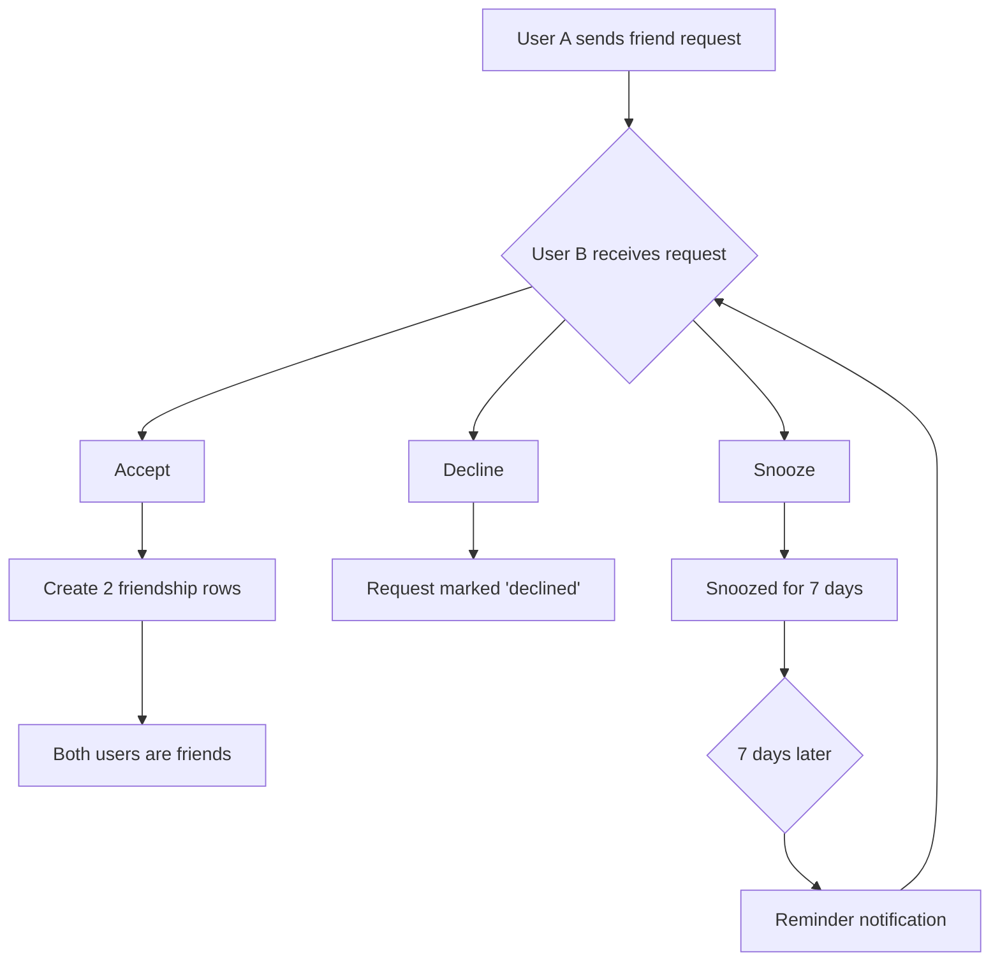

# Friendship Tables Documentation

## Overview
The friendship system in Mundo Tango implements a sophisticated mutual connection model with **closeness scoring**, **friend requests with media**, and **activity tracking**. This is distinct from the one-way "follow" system.

## Table of Contents
- [Core Tables](#core-tables)
- [Friend Request System](#friend-request-system)
- [Closeness Scoring Algorithm](#closeness-scoring-algorithm)
- [Activity Tracking](#activity-tracking)
- [Schemas & Types](#schemas--types)
- [H2AC Handoff Notes](#h2ac-handoff-notes)

---

## Core Tables

### 1. `friendships`
Accepted mutual friend connections with closeness scoring.

**Schema:**
```sql
CREATE TABLE friendships (
  id SERIAL PRIMARY KEY,
  user_id INTEGER NOT NULL REFERENCES users(id) ON DELETE CASCADE,
  friend_id INTEGER NOT NULL REFERENCES users(id) ON DELETE CASCADE,
  created_at TIMESTAMP DEFAULT NOW() NOT NULL,
  
  -- Enhanced fields
  closeness_score INTEGER DEFAULT 75 NOT NULL,  -- 0-100, starts at 75
  connection_degree INTEGER DEFAULT 1 NOT NULL, -- Always 1 for direct friends
  last_interaction_at TIMESTAMP DEFAULT NOW(),
  status VARCHAR DEFAULT 'active' NOT NULL,      -- 'active' | 'blocked'
  
  UNIQUE(user_id, friend_id)
);

-- Indexes
CREATE INDEX friendships_user_idx ON friendships(user_id);
CREATE INDEX friendships_friend_idx ON friendships(friend_id);
CREATE INDEX friendships_closeness_idx ON friendships(closeness_score);
CREATE UNIQUE INDEX unique_friendship ON friendships(user_id, friend_id);
```

**Key Concepts:**

1. **Bidirectional Storage:**
   When User A and User B become friends, TWO rows are created:
   ```sql
   INSERT INTO friendships (user_id, friend_id) VALUES (A, B);
   INSERT INTO friendships (user_id, friend_id) VALUES (B, A);
   ```
   This allows efficient querying: "Get all of User A's friends" = simple WHERE user_id = A

2. **Closeness Score (0-100):**
   - Starts at 75 upon friendship creation
   - Increases with positive interactions (+1 to +5 per event)
   - Decreases with inactivity (-1 per month of no interaction)
   - Capped at 100, floored at 0

3. **Connection Degree:**
   - Always `1` for direct friends
   - Used in mutual friend calculations
   - Reserved for future "friend of friend" features

### 2. `friend_requests`
Pending friend requests with media attachments and snoozing.

**Schema:**
```sql
CREATE TABLE friend_requests (
  id SERIAL PRIMARY KEY,
  sender_id INTEGER NOT NULL REFERENCES users(id) ON DELETE CASCADE,
  receiver_id INTEGER NOT NULL REFERENCES users(id) ON DELETE CASCADE,
  
  -- Request content
  message TEXT,
  media_urls TEXT[],  -- Photos/videos attached to request
  
  -- Status
  status VARCHAR DEFAULT 'pending' NOT NULL,  -- 'pending' | 'accepted' | 'declined' | 'snoozed'
  
  -- Response
  response VARCHAR,  -- Optional text response from receiver
  responded_at TIMESTAMP,
  
  -- Snoozing (reminder system)
  snoozed_count INTEGER DEFAULT 0,
  last_snoozed_at TIMESTAMP,
  
  created_at TIMESTAMP DEFAULT NOW()
);

-- Indexes
CREATE INDEX friend_requests_sender_idx ON friend_requests(sender_id);
CREATE INDEX friend_requests_receiver_idx ON friend_requests(receiver_id);
CREATE INDEX friend_requests_status_idx ON friend_requests(status);
```

**Friend Request Flow:**


**Snooze Functionality:**
Users can "snooze" friend requests to be reminded later:
```typescript
// Snooze a request
POST /api/friends/requests/:requestId/snooze

// Backend logic
const snoozeRequest = async (requestId: number) => {
  await db.update(friendRequests)
    .set({
      status: 'snoozed',
      snoozedCount: sql`${friendRequests.snoozedCount} + 1`,
      lastSnoozedAt: new Date()
    })
    .where(eq(friendRequests.id, requestId));
  
  // Schedule reminder for 7 days later
  scheduleReminder(requestId, 7);
};
```

### 3. `friendship_media`
Photos/videos shared during friend requests or as friendship memories.

**Schema:**
```sql
CREATE TABLE friendship_media (
  id SERIAL PRIMARY KEY,
  friend_request_id INTEGER REFERENCES friend_requests(id) ON DELETE CASCADE,
  friendship_id INTEGER REFERENCES friendships(id) ON DELETE CASCADE,
  uploader_id INTEGER NOT NULL REFERENCES users(id) ON DELETE CASCADE,
  
  media_url TEXT NOT NULL,
  media_type VARCHAR NOT NULL,  -- 'image' | 'video'
  caption TEXT,
  phase VARCHAR NOT NULL,        -- 'request' | 'acceptance' | 'memory'
  
  created_at TIMESTAMP DEFAULT NOW() NOT NULL
);

-- Indexes
CREATE INDEX friendship_media_request_idx ON friendship_media(friend_request_id);
CREATE INDEX friendship_media_friendship_idx ON friendship_media(friendship_id);
CREATE INDEX friendship_media_uploader_idx ON friendship_media(uploader_id);
```

**Media Phases:**
1. **`request`**: Photo attached when sending friend request
   - Example: "Remember dancing together at XYZ milonga?"
2. **`acceptance`**: Photo shared when accepting request
   - Example: Selfie with acceptance message
3. **`memory`**: Shared photo to commemorate friendship
   - Example: Annual "friendiversary" photo

---

## Friend Request System

### Sending a Friend Request

**API Endpoint:**
```typescript
POST /api/friends/request/:userId
Content-Type: multipart/form-data

{
  message: "Hey! It was great dancing with you at the milonga last night!",
  mediaFiles: [File],  // Optional photos
}

// Response
{
  id: 123,
  senderId: 1,
  receiverId: 2,
  message: "Hey! It was great dancing...",
  mediaUrls: ["https://..."],
  status: "pending",
  createdAt: "2025-11-02T10:00:00Z"
}
```

**Backend Implementation:**
```typescript
// server/routes/friends-routes.ts
router.post("/friends/request/:userId", authenticateToken, async (req, res) => {
  const senderId = req.userId!;
  const receiverId = parseInt(req.params.userId);
  
  // Check for existing request or friendship
  const existing = await storage.checkFriendshipStatus(senderId, receiverId);
  if (existing) {
    return res.status(400).json({ error: "Friendship or request already exists" });
  }
  
  const request = await storage.sendFriendRequest({
    senderId,
    receiverId,
    message: req.body.message,
    mediaUrls: req.body.mediaUrls || []
  });
  
  // Send notification
  await storage.createNotification({
    userId: receiverId,
    type: "friend_request",
    title: `${senderName} sent you a friend request`,
    message: req.body.message,
    relatedId: request.id,
    relatedType: "friend_request"
  });
  
  res.json(request);
});
```

### Accepting a Friend Request

**API Endpoint:**
```typescript
POST /api/friends/requests/:requestId/accept
Content-Type: application/json

{
  response: "Absolutely! Can't wait to dance again!",  // Optional
  mediaUrls: ["https://..."]  // Optional acceptance photo
}

// Response
{
  requestId: 123,
  status: "accepted",
  friendshipIds: [456, 457],  // Two-way friendship created
  closenessScore: 75
}
```

**Backend Implementation:**
```typescript
router.post("/friends/requests/:requestId/accept", authenticateToken, async (req, res) => {
  const requestId = parseInt(req.params.requestId);
  const { response, mediaUrls } = req.body;
  
  const result = await db.transaction(async (tx) => {
    // 1. Update friend request
    await tx.update(friendRequests)
      .set({ 
        status: 'accepted', 
        response,
        respondedAt: new Date() 
      })
      .where(eq(friendRequests.id, requestId));
    
    const request = await tx.query.friendRequests.findFirst({
      where: eq(friendRequests.id, requestId)
    });
    
    // 2. Create TWO friendship rows (bidirectional)
    const friendships = await tx.insert(friendships).values([
      {
        userId: request.senderId,
        friendId: request.receiverId,
        closenessScore: 75,
        connectionDegree: 1
      },
      {
        userId: request.receiverId,
        friendId: request.senderId,
        closenessScore: 75,
        connectionDegree: 1
      }
    ]).returning();
    
    // 3. Store acceptance media if provided
    if (mediaUrls?.length) {
      await tx.insert(friendshipMedia).values(
        mediaUrls.map(url => ({
          friendshipId: friendships[0].id,
          uploaderId: request.receiverId,
          mediaUrl: url,
          mediaType: 'image',
          phase: 'acceptance'
        }))
      );
    }
    
    // 4. Notify sender
    await tx.insert(notifications).values({
      userId: request.senderId,
      type: 'friend_request_accepted',
      title: `${receiverName} accepted your friend request!`,
      message: response || null
    });
    
    return { requestId, friendships };
  });
  
  res.json(result);
});
```

---

## Closeness Scoring Algorithm

### Scoring Factors

The closeness score (0-100) dynamically adjusts based on interactions:

```typescript
// server/algorithms/closeness-scoring.ts

interface ClosenessFactors {
  messages: number;           // +2 per message sent
  postsLiked: number;         // +1 per like
  commentsExchanged: number;  // +3 per comment thread
  eventsAttendedTogether: number; // +5 per shared event
  danceSessionsTogether: number;  // +10 per dance session logged
  monthsSinceLastInteraction: number; // -1 per month
}

const calculateCloseness = (friendship: Friendship, activities: Activity[]): number => {
  let score = friendship.closenessScore;
  
  // Positive interactions
  score += activities.filter(a => a.type === 'message_sent').length * 2;
  score += activities.filter(a => a.type === 'post_liked').length * 1;
  score += activities.filter(a => a.type === 'comment_exchanged').length * 3;
  score += activities.filter(a => a.type === 'event_attended_together').length * 5;
  score += activities.filter(a => a.type === 'dance_together').length * 10;
  
  // Decay over time
  const monthsSinceInteraction = getMonthsSince(friendship.lastInteractionAt);
  score -= monthsSinceInteraction * 1;
  
  // Clamp between 0-100
  return Math.max(0, Math.min(100, score));
};
```

### Score Categories

```typescript
enum ClosenessTier {
  ACQUAINTANCE = 'acquaintance',  // 0-40
  FRIEND = 'friend',               // 41-70
  CLOSE_FRIEND = 'close_friend',   // 71-85
  BEST_FRIEND = 'best_friend'      // 86-100
}

const getClosenessTier = (score: number): ClosenessTier => {
  if (score >= 86) return ClosenessTier.BEST_FRIEND;
  if (score >= 71) return ClosenessTier.CLOSE_FRIEND;
  if (score >= 41) return ClosenessTier.FRIEND;
  return ClosenessTier.ACQUAINTANCE;
};
```

---

## Activity Tracking

### 4. `friendship_activities`
Tracks all interactions between friends for closeness scoring.

**Schema:**
```sql
CREATE TABLE friendship_activities (
  id SERIAL PRIMARY KEY,
  friendship_id INTEGER NOT NULL REFERENCES friendships(id) ON DELETE CASCADE,
  activity_type VARCHAR NOT NULL,
  metadata TEXT,  -- JSON string for additional data
  created_at TIMESTAMP DEFAULT NOW() NOT NULL
);

-- Indexes
CREATE INDEX friendship_activities_friendship_idx ON friendship_activities(friendship_id);
CREATE INDEX friendship_activities_type_idx ON friendship_activities(activity_type);
CREATE INDEX friendship_activities_date_idx ON friendship_activities(created_at);
```

**Activity Types:**
```typescript
type ActivityType =
  | 'message_sent'              // Direct message sent
  | 'post_liked'                // Liked friend's post
  | 'post_commented'            // Commented on friend's post
  | 'event_attended_together'   // Both RSVPed to same event
  | 'group_joined_together'     // Joined same group
  | 'memory_shared'             // Shared a friendship memory photo
  | 'dance_together'            // Logged dance session together
  | 'profile_viewed';           // Viewed friend's profile
```

**Recording Activities:**
```typescript
// Automatically record when friends interact
const recordActivity = async (friendshipId: number, type: ActivityType, metadata?: any) => {
  await db.insert(friendshipActivities).values({
    friendshipId,
    activityType: type,
    metadata: JSON.stringify(metadata)
  });
  
  // Update closeness score
  await updateClosenessScore(friendshipId);
  
  // Update last interaction timestamp
  await db.update(friendships)
    .set({ lastInteractionAt: new Date() })
    .where(eq(friendships.id, friendshipId));
};
```

---

## Mutual Friends

### Finding Mutual Friends

**API Endpoint:**
```typescript
GET /api/friends/mutual/:userId

// Response
{
  mutualCount: 5,
  mutualFriends: [
    { id: 10, name: "John Doe", profileImage: "..." },
    { id: 15, name: "Jane Smith", profileImage: "..." }
  ]
}
```

**SQL Query:**
```sql
-- Find mutual friends between User A and User B
SELECT u.id, u.name, u.profile_image
FROM users u
WHERE u.id IN (
  -- Friends of User A
  SELECT friend_id FROM friendships WHERE user_id = $1
)
AND u.id IN (
  -- Friends of User B
  SELECT friend_id FROM friendships WHERE user_id = $2
);
```

**TypeScript Implementation:**
```typescript
const getMutualFriends = async (userId1: number, userId2: number) => {
  const mutual = await db
    .select({
      id: users.id,
      name: users.name,
      profileImage: users.profileImage
    })
    .from(users)
    .where(
      and(
        inArray(users.id, 
          db.select({ id: friendships.friendId })
            .from(friendships)
            .where(eq(friendships.userId, userId1))
        ),
        inArray(users.id,
          db.select({ id: friendships.friendId })
            .from(friendships)
            .where(eq(friendships.userId, userId2))
        )
      )
    );
  
  return mutual;
};
```

---

## Schemas & Types

### TypeScript Types

```typescript
// From shared/schema.ts

export type SelectFriendship = typeof friendships.$inferSelect;
export type InsertFriendship = z.infer<typeof insertFriendshipSchema>;

export type SelectFriendRequest = typeof friendRequests.$inferSelect;
export type InsertFriendRequest = z.infer<typeof insertFriendRequestSchema>;

export type SelectFriendshipActivity = typeof friendshipActivities.$inferSelect;
export type InsertFriendshipActivity = z.infer<typeof insertFriendshipActivitySchema>;

export type SelectFriendshipMedia = typeof friendshipMedia.$inferSelect;
export type InsertFriendshipMedia = z.infer<typeof insertFriendshipMediaSchema>;
```

---

## H2AC Handoff Notes

### 🔧 Manual Configuration Required

#### 1. Closeness Score Tuning
**Human Decision Required:**
- What activities should increase closeness score?
- How much should each activity type boost the score?
- How quickly should scores decay without interaction?

**Recommendation:**
```typescript
const CLOSENESS_WEIGHTS = {
  message_sent: 2,
  post_liked: 1,
  comment_exchanged: 3,
  event_attended_together: 5,
  dance_together: 10,
  monthly_decay: -1
};
```

#### 2. Friend Request Limits
**Human Decision Required:**
- Maximum pending requests per user?
- Cooldown period after declined request?
- Allow re-sending requests?

**Recommendation:**
```typescript
const FRIEND_REQUEST_LIMITS = {
  maxPending: 50,
  cooldownAfterDecline: 30,  // days
  allowResend: true
};
```

#### 3. Snooze Duration
**Human Decision Required:**
- How long should snooze last (currently 7 days)?
- Maximum snooze count before auto-decline?

**Current Setting:** 7 days, unlimited snoozes

---

## Related Documentation
- [SOCIAL_TABLES.md](./SOCIAL_TABLES.md) - Posts and social content
- [MESSAGING_TABLES.md](./MESSAGING_TABLES.md) - Direct messaging between friends
- [USER_TABLES.md](./USER_TABLES.md) - User profiles
- [FRIENDSHIP_API.md](../api/FRIENDSHIP_API.md) - API endpoints

---

**Last Updated:** November 2, 2025  
**Maintained By:** ESA Documentation Agent (P89)
