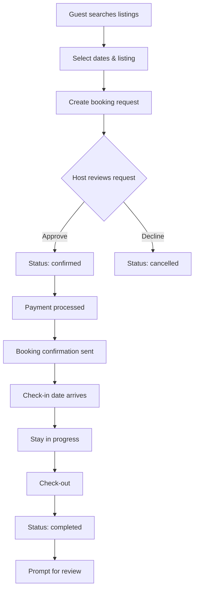

# Housing Tables Documentation

## Overview
The Mundo Tango housing platform connects travelers with local tango dancers offering accommodation. This Airbnb-style system includes listings, bookings, reviews, and payments.

## Table of Contents
- [Core Housing Tables](#core-housing-tables)
- [Booking System](#booking-system)
- [Reviews & Ratings](#reviews--ratings)
- [Search & Discovery](#search--discovery)
- [Schemas & Types](#schemas--types)
- [H2AC Handoff Notes](#h2ac-handoff-notes)

---

## Core Housing Tables

### 1. `housing_listings`
Property listings from hosts.

**Schema:**
```sql
CREATE TABLE housing_listings (
  id SERIAL PRIMARY KEY,
  host_id INTEGER NOT NULL REFERENCES users(id) ON DELETE CASCADE,
  
  -- Basic info
  title VARCHAR NOT NULL,
  description TEXT NOT NULL,
  property_type VARCHAR NOT NULL,  -- 'apartment' | 'house' | 'room' | 'studio'
  
  -- Capacity
  bedrooms INTEGER,
  bathrooms INTEGER,
  max_guests INTEGER,
  
  -- Pricing
  price_per_night INTEGER NOT NULL,  -- in cents
  currency VARCHAR DEFAULT 'USD',
  
  -- Location
  address TEXT NOT NULL,
  city VARCHAR NOT NULL,
  country VARCHAR NOT NULL,
  latitude TEXT,
  longitude TEXT,
  
  -- Amenities
  amenities TEXT[],  -- ['wifi', 'kitchen', 'parking', 'washer']
  house_rules TEXT,
  
  -- Media
  images TEXT[],
  
  -- Status
  status VARCHAR DEFAULT 'active' NOT NULL,  -- 'active' | 'inactive' | 'suspended'
  
  created_at TIMESTAMP DEFAULT NOW(),
  updated_at TIMESTAMP DEFAULT NOW()
);

-- Indexes
CREATE INDEX housing_host_idx ON housing_listings(host_id);
CREATE INDEX housing_city_idx ON housing_listings(city);
CREATE INDEX housing_status_idx ON housing_listings(status);
CREATE INDEX housing_created_at_idx ON housing_listings(created_at);
```

**Property Types:**
```typescript
enum PropertyType {
  APARTMENT = 'apartment',  // Full apartment
  HOUSE = 'house',          // Entire house
  ROOM = 'room',            // Private room in shared space
  STUDIO = 'studio',        // Studio apartment
  SHARED_ROOM = 'shared_room' // Shared room (hostel-style)
}
```

**Amenities List:**
```typescript
const STANDARD_AMENITIES = [
  // Essentials
  'wifi', 'kitchen', 'washer', 'dryer', 'air_conditioning', 'heating',
  
  // Space
  'dedicated_workspace', 'private_entrance',
  
  // Safety
  'smoke_alarm', 'carbon_monoxide_alarm', 'first_aid_kit',
  
  // Parking & Transportation
  'free_parking', 'paid_parking', 'ev_charger',
  
  // Entertainment
  'tv', 'pool', 'gym', 'hot_tub',
  
  // Tango-specific
  'dance_floor', 'sound_system', 'near_milongas'
];
```

**Create Listing Example:**
```typescript
POST /api/housing/listings
{
  title: "Cozy Studio in San Telmo - Perfect for Tango Dancers",
  description: "Beautiful studio in the heart of Buenos Aires tango district...",
  propertyType: "studio",
  bedrooms: 0,
  bathrooms: 1,
  maxGuests: 2,
  pricePerNight: 5000,  // $50.00
  currency: "USD",
  address: "Calle Defensa 755",
  city: "Buenos Aires",
  country: "Argentina",
  latitude: "-34.6214",
  longitude: "-58.3731",
  amenities: ["wifi", "kitchen", "air_conditioning", "near_milongas"],
  houseRules: "No smoking. Quiet hours after 11 PM.",
  images: ["https://...", "https://..."]
}
```

---

## Booking System

### 2. `housing_bookings`
Guest reservations for listings.

**Schema:**
```sql
CREATE TABLE housing_bookings (
  id SERIAL PRIMARY KEY,
  listing_id INTEGER NOT NULL REFERENCES housing_listings(id) ON DELETE CASCADE,
  guest_id INTEGER NOT NULL REFERENCES users(id) ON DELETE CASCADE,
  
  -- Dates
  check_in_date TIMESTAMP NOT NULL,
  check_out_date TIMESTAMP NOT NULL,
  
  -- Guests
  guests INTEGER NOT NULL,
  
  -- Pricing
  total_amount INTEGER NOT NULL,  -- in cents
  
  -- Status
  status VARCHAR DEFAULT 'pending' NOT NULL,  -- 'pending' | 'confirmed' | 'cancelled' | 'completed'
  
  created_at TIMESTAMP DEFAULT NOW()
);

-- Indexes
CREATE INDEX housing_bookings_listing_idx ON housing_bookings(listing_id);
CREATE INDEX housing_bookings_guest_idx ON housing_bookings(guest_id);
CREATE INDEX housing_bookings_status_idx ON housing_bookings(status);
```

**Booking States:**
```typescript
enum BookingStatus {
  PENDING = 'pending',       // Awaiting host approval
  CONFIRMED = 'confirmed',   // Host approved
  CANCELLED = 'cancelled',   // Cancelled by host or guest
  COMPLETED = 'completed'    // Stay completed
}
```

**Booking Flow:**


**Create Booking:**
```typescript
POST /api/housing/listings/:listingId/book
{
  checkInDate: "2025-12-01",
  checkOutDate: "2025-12-07",
  guests: 2,
  message: "Hi! We're traveling to Buenos Aires for a tango festival..."
}

// Backend calculates total
const nights = differenceInDays(checkOutDate, checkInDate);
const totalAmount = listing.pricePerNight * nights;

// Response
{
  bookingId: 123,
  totalAmount: 35000,  // $350.00 for 7 nights
  status: "pending",
  message: "Your booking request has been sent to the host."
}
```

**Availability Check:**
```typescript
// Check if listing is available for dates
GET /api/housing/listings/:listingId/availability?from=2025-12-01&to=2025-12-07

// SQL query
SELECT COUNT(*) as conflicts
FROM housing_bookings
WHERE listing_id = $1
  AND status IN ('pending', 'confirmed')
  AND (
    (check_in_date <= $2 AND check_out_date >= $2)
    OR (check_in_date <= $3 AND check_out_date >= $3)
    OR (check_in_date >= $2 AND check_out_date <= $3)
  );

// Response
{
  available: true,
  conflicts: 0
}
```

---

## Reviews & Ratings

### 3. `reviews`
Reviews for listings and hosts (multi-purpose table).

**Schema:**
```sql
CREATE TABLE reviews (
  id SERIAL PRIMARY KEY,
  user_id INTEGER NOT NULL REFERENCES users(id) ON DELETE CASCADE,
  target_type VARCHAR NOT NULL,  -- 'housing_listing' | 'event' | 'workshop'
  target_id INTEGER NOT NULL,
  
  -- Review content
  rating INTEGER NOT NULL,  -- 1-5 stars
  title TEXT,
  content TEXT NOT NULL,
  
  -- Verification
  verified BOOLEAN DEFAULT FALSE,  -- Only guests who stayed can review
  
  -- Engagement
  helpful_count INTEGER DEFAULT 0,
  
  created_at TIMESTAMP DEFAULT NOW(),
  updated_at TIMESTAMP DEFAULT NOW()
);

-- Indexes
CREATE INDEX reviews_user_idx ON reviews(user_id);
CREATE INDEX reviews_target_idx ON reviews(target_type, target_id);
```

**Review Criteria for Housing:**
```typescript
interface HousingReview {
  rating: number;        // Overall 1-5 stars
  title?: string;
  content: string;
  categories?: {
    cleanliness: number;   // 1-5
    accuracy: number;      // How well listing matched description
    communication: number; // Host responsiveness
    location: number;      // Neighborhood quality
    value: number;         // Price vs. quality
  };
}
```

**Create Review:**
```typescript
POST /api/housing/bookings/:bookingId/review
{
  rating: 5,
  title: "Amazing stay in San Telmo!",
  content: "The studio was spotless and exactly as described...",
  categories: {
    cleanliness: 5,
    accuracy: 5,
    communication: 5,
    location: 5,
    value: 4
  }
}

// Validation: Only guests who completed their stay can review
const booking = await db.query.housingBookings.findFirst({
  where: and(
    eq(housingBookings.id, bookingId),
    eq(housingBookings.guestId, userId),
    eq(housingBookings.status, 'completed')
  )
});

if (!booking) {
  throw new Error('You must complete your stay before reviewing');
}
```

**Calculate Listing Average Rating:**
```sql
SELECT 
  AVG(rating) as average_rating,
  COUNT(*) as review_count
FROM reviews
WHERE target_type = 'housing_listing'
  AND target_id = $1
  AND verified = TRUE;
```

---

## Search & Discovery

### 4. Housing Search

**Search Query:**
```typescript
GET /api/housing/listings?city=Buenos%20Aires&checkIn=2025-12-01&checkOut=2025-12-07&guests=2&minPrice=20&maxPrice=100

// SQL
SELECT hl.*,
  AVG(r.rating) as avg_rating,
  COUNT(r.id) as review_count
FROM housing_listings hl
LEFT JOIN reviews r ON r.target_type = 'housing_listing' AND r.target_id = hl.id
WHERE hl.city = $1
  AND hl.max_guests >= $2
  AND hl.price_per_night >= $3
  AND hl.price_per_night <= $4
  AND hl.status = 'active'
  AND hl.id NOT IN (
    -- Exclude booked listings
    SELECT listing_id FROM housing_bookings
    WHERE status IN ('pending', 'confirmed')
      AND (check_in_date <= $5 AND check_out_date >= $6)
  )
GROUP BY hl.id
ORDER BY avg_rating DESC, review_count DESC;
```

**Filter Options:**
```typescript
interface HousingFilters {
  city: string;
  checkIn: Date;
  checkOut: Date;
  guests: number;
  minPrice?: number;
  maxPrice?: number;
  propertyTypes?: PropertyType[];
  amenities?: string[];
  minRating?: number;
}
```

**Nearby Milongas Search:**
```typescript
// Find listings near milongas
GET /api/housing/listings?nearMilongas=true&city=Buenos%20Aires

// This uses the 'near_milongas' amenity + proximity to event venues
SELECT hl.*, 
  COUNT(e.id) as nearby_milongas
FROM housing_listings hl
LEFT JOIN events e ON e.city = hl.city
  AND e.event_type = 'milonga'
  AND ST_Distance(
    ST_Point(hl.latitude::float, hl.longitude::float),
    ST_Point(e.latitude::float, e.longitude::float)
  ) < 2  -- Within 2km
GROUP BY hl.id
HAVING COUNT(e.id) > 0
ORDER BY nearby_milongas DESC;
```

---

## Payment Integration

### 5. `payments`
Payment records for bookings (reuses existing table).

**Schema (from shared/schema.ts):**
```sql
CREATE TABLE payments (
  id SERIAL PRIMARY KEY,
  user_id INTEGER NOT NULL REFERENCES users(id) ON DELETE CASCADE,
  booking_id INTEGER REFERENCES bookings(id) ON DELETE CASCADE,  -- Can link to housing_bookings
  amount INTEGER NOT NULL,
  currency VARCHAR DEFAULT 'USD',
  status VARCHAR DEFAULT 'pending',  -- 'pending' | 'completed' | 'failed' | 'refunded'
  transaction_id VARCHAR UNIQUE,
  payment_method VARCHAR,
  created_at TIMESTAMP DEFAULT NOW()
);
```

**Stripe Integration:**
```typescript
import Stripe from 'stripe';
const stripe = new Stripe(process.env.STRIPE_SECRET_KEY);

// Create payment intent for booking
const createBookingPayment = async (booking: HousingBooking) => {
  const paymentIntent = await stripe.paymentIntents.create({
    amount: booking.totalAmount,
    currency: 'usd',
    metadata: {
      bookingId: booking.id,
      listingId: booking.listingId,
      guestId: booking.guestId
    }
  });
  
  // Store payment record
  await db.insert(payments).values({
    userId: booking.guestId,
    amount: booking.totalAmount,
    currency: 'usd',
    status: 'pending',
    transactionId: paymentIntent.id,
    paymentMethod: 'stripe'
  });
  
  return paymentIntent.client_secret;
};

// Webhook to confirm payment
app.post('/webhooks/stripe', async (req, res) => {
  const event = req.body;
  
  if (event.type === 'payment_intent.succeeded') {
    const paymentIntent = event.data.object;
    const bookingId = paymentIntent.metadata.bookingId;
    
    // Confirm booking
    await db.update(housingBookings)
      .set({ status: 'confirmed' })
      .where(eq(housingBookings.id, bookingId));
    
    // Update payment
    await db.update(payments)
      .set({ status: 'completed' })
      .where(eq(payments.transactionId, paymentIntent.id));
    
    // Notify host
    await sendNotification(booking.hostId, {
      type: 'booking_confirmed',
      message: 'Your listing has been booked!'
    });
  }
  
  res.json({ received: true });
});
```

---

## Schemas & Types

### TypeScript Types

```typescript
// From shared/schema.ts

export type SelectHousingListing = typeof housingListings.$inferSelect;
export type InsertHousingListing = z.infer<typeof insertHousingListingSchema>;

export type SelectHousingBooking = typeof housingBookings.$inferSelect;
export type InsertHousingBooking = z.infer<typeof insertHousingBookingSchema>;

export type SelectReview = typeof reviews.$inferSelect;
export type InsertReview = z.infer<typeof insertReviewSchema>;
```

---

## H2AC Handoff Notes

### 🔧 Manual Configuration Required

#### 1. Host Verification
**Human Decision Required:**
- Require ID verification for hosts?
- Require minimum number of reviews before activating listing?

**Recommendation:**
```typescript
const HOST_VERIFICATION = {
  requireIdVerification: true,
  requirePhoneVerification: true,
  minReviewsBeforeAutoApproval: 3
};
```

#### 2. Cancellation Policy
**Human Decision Required:**
- Refund policy for guest cancellations?
- Host cancellation penalties?

**Recommendation:**
```typescript
const CANCELLATION_POLICY = {
  guest: {
    fullRefund: 7,      // Days before check-in
    partialRefund: 3,   // 50% refund
    noRefund: 1         // No refund within 24h
  },
  host: {
    allowCancellation: true,
    penaltyFee: 100     // $100 penalty for host cancellation
  }
};
```

#### 3. Platform Fees
**Human Decision Required:**
- Service fee percentage?
- Who pays the fee (guest, host, or split)?

**Recommendation:**
```typescript
const PLATFORM_FEES = {
  guestServiceFee: 0.12,  // 12% of booking
  hostServiceFee: 0.03,   // 3% of booking
  stripeFee: 0.029 + 0.30 // Stripe's fee
};
```

---

## Related Documentation
- [HOUSING_PLATFORM.md](../features/HOUSING_PLATFORM.md) - Feature implementation
- [HOUSING_API.md](../api/HOUSING_API.md) - API endpoints
- [MATCHING_ENGINE.md](../algorithms/MATCHING_ENGINE.md) - Housing match algorithm

---

**Last Updated:** November 2, 2025  
**Maintained By:** ESA Documentation Agent (P89)
