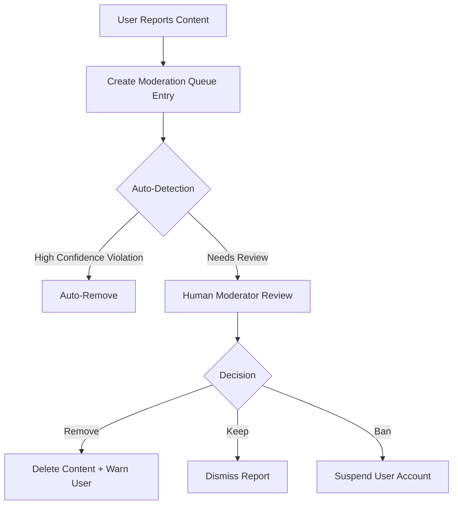

# Social Tables Documentation

## Overview
The social tables power Mundo Tango's core social networking features, including posts, comments, likes, shares, bookmarks, and user interactions. This document covers 20+ tables that enable rich social media experiences.

## Table of Contents
- [Core Social Tables](#core-social-tables)
- [Interaction Tables](#interaction-tables)
- [Content Enrichment Tables](#content-enrichment-tables)
- [Moderation & Safety Tables](#moderation--safety-tables)
- [Schemas & Types](#schemas--types)
- [H2AC Handoff Notes](#h2ac-handoff-notes)

---

## Core Social Tables

### 1. `posts`
The primary table for all user-generated social content.

**Schema:**
```sql
CREATE TABLE posts (
  id SERIAL PRIMARY KEY,
  user_id INTEGER NOT NULL REFERENCES users(id) ON DELETE CASCADE,
  event_id INTEGER REFERENCES events(id) ON DELETE CASCADE,
  
  -- Content
  content TEXT NOT NULL,
  rich_content JSONB,
  plain_text TEXT,
  
  -- Media
  image_url TEXT,
  video_url TEXT,
  media_embeds JSONB,
  
  -- Metadata
  mentions TEXT[],
  hashtags TEXT[],
  tags TEXT[],
  
  -- Location
  location TEXT,
  coordinates JSONB,
  place_id TEXT,
  formatted_address TEXT,
  
  -- Settings
  visibility VARCHAR DEFAULT 'public',  -- 'public' | 'friends' | 'private'
  post_type VARCHAR DEFAULT 'post',     -- 'post' | 'announcement' | 'poll'
  
  -- Engagement counts (denormalized for performance)
  likes INTEGER DEFAULT 0,
  comments INTEGER DEFAULT 0,
  shares INTEGER DEFAULT 0,
  
  created_at TIMESTAMP DEFAULT NOW(),
  updated_at TIMESTAMP DEFAULT NOW()
);

-- Indexes
CREATE INDEX posts_user_idx ON posts(user_id);
CREATE INDEX posts_event_idx ON posts(event_id);
CREATE INDEX posts_created_at_idx ON posts(created_at);
```

**TypeScript Schema:**
```typescript
import { posts } from '@shared/schema';

export const insertPostSchema = createInsertSchema(posts).omit({
  id: true,
  createdAt: true,
  updatedAt: true
});

export type InsertPost = z.infer<typeof insertPostSchema>;
export type SelectPost = typeof posts.$inferSelect;
```

**Rich Content Format:**
```typescript
interface RichContent {
  blocks: Array<{
    type: 'text' | 'mention' | 'hashtag' | 'link' | 'embed';
    content: string;
    metadata?: {
      userId?: number;
      eventId?: number;
      url?: string;
    };
  }>;
}
```

### 2. `post_comments`
Threaded comments system with support for nested replies.

**Schema:**
```sql
CREATE TABLE post_comments (
  id SERIAL PRIMARY KEY,
  post_id INTEGER NOT NULL REFERENCES posts(id) ON DELETE CASCADE,
  user_id INTEGER NOT NULL REFERENCES users(id) ON DELETE CASCADE,
  parent_comment_id INTEGER REFERENCES post_comments(id),
  
  content TEXT NOT NULL,
  likes INTEGER DEFAULT 0,
  
  created_at TIMESTAMP DEFAULT NOW(),
  updated_at TIMESTAMP DEFAULT NOW()
);

-- Indexes
CREATE INDEX post_comments_post_idx ON post_comments(post_id);
CREATE INDEX post_comments_user_idx ON post_comments(user_id);
CREATE INDEX post_comments_parent_idx ON post_comments(parent_comment_id);
```

**Usage Example:**
```typescript
// Create a top-level comment
const comment = await storage.createComment({
  postId: 123,
  userId: 456,
  content: 'Great post!',
});

// Create a reply
const reply = await storage.createComment({
  postId: 123,
  userId: 789,
  parentCommentId: comment.id,
  content: 'I agree!',
});
```

---

## Interaction Tables

### 3. `post_likes`
Tracks which users liked which posts.

**Schema:**
```sql
CREATE TABLE post_likes (
  id SERIAL PRIMARY KEY,
  post_id INTEGER NOT NULL REFERENCES posts(id) ON DELETE CASCADE,
  user_id INTEGER NOT NULL REFERENCES users(id) ON DELETE CASCADE,
  created_at TIMESTAMP DEFAULT NOW() NOT NULL,
  
  UNIQUE(post_id, user_id)
);

-- Indexes
CREATE INDEX post_likes_post_idx ON post_likes(post_id);
CREATE INDEX post_likes_user_idx ON post_likes(user_id);
CREATE UNIQUE INDEX unique_post_like ON post_likes(post_id, user_id);
```

**API Usage:**
```typescript
// Toggle like
POST /api/posts/:id/like
DELETE /api/posts/:id/like

// Response
{
  postId: 123,
  liked: true,
  totalLikes: 42
}
```

### 4. `post_shares`
Tracks post shares across different platforms.

**Schema:**
```sql
CREATE TABLE post_shares (
  id SERIAL PRIMARY KEY,
  post_id INTEGER NOT NULL REFERENCES posts(id) ON DELETE CASCADE,
  user_id INTEGER NOT NULL REFERENCES users(id) ON DELETE CASCADE,
  share_type VARCHAR NOT NULL,  -- 'internal' | 'facebook' | 'twitter' | 'link'
  created_at TIMESTAMP DEFAULT NOW() NOT NULL,
  
  UNIQUE(post_id, user_id, share_type)
);

-- Indexes
CREATE INDEX post_shares_post_idx ON post_shares(post_id);
CREATE INDEX post_shares_user_idx ON post_shares(user_id);
CREATE UNIQUE INDEX unique_post_share ON post_shares(post_id, user_id, share_type);
```

**Share Types:**
- `internal`: Reshare within Mundo Tango
- `facebook`: Share to Facebook
- `twitter`: Share to Twitter
- `link`: Copy share link

### 5. `saved_posts` (Bookmarks)
Allows users to save posts to collections.

**Schema:**
```sql
CREATE TABLE saved_posts (
  id SERIAL PRIMARY KEY,
  user_id INTEGER NOT NULL REFERENCES users(id) ON DELETE CASCADE,
  post_id INTEGER NOT NULL REFERENCES posts(id) ON DELETE CASCADE,
  collection_name VARCHAR,
  notes TEXT,
  created_at TIMESTAMP DEFAULT NOW(),
  
  UNIQUE(user_id, post_id)
);

-- Indexes
CREATE INDEX saved_posts_user_idx ON saved_posts(user_id);
CREATE INDEX saved_posts_post_idx ON saved_posts(post_id);
CREATE UNIQUE INDEX unique_saved_post ON saved_posts(user_id, post_id);
```

**Bookmark Collections:**
```typescript
// Save to default collection
POST /api/posts/:postId/bookmark
{
  collectionName: "Saved Posts",  // Optional
  notes: "Read later"             // Optional
}

// Get user's bookmarks
GET /api/bookmarks?collection=Tango%20Resources

// Get all collections
GET /api/bookmarks/collections
// Response: ["Saved Posts", "Tango Resources", "Event Ideas"]
```

### 6. `post_edit_history`
Tracks all edits made to posts for transparency.

**Schema:**
```sql
CREATE TABLE post_edit_history (
  id SERIAL PRIMARY KEY,
  post_id INTEGER NOT NULL REFERENCES posts(id) ON DELETE CASCADE,
  previous_content TEXT NOT NULL,
  previous_rich_content JSONB,
  edited_at TIMESTAMP DEFAULT NOW()
);

-- Indexes
CREATE INDEX post_edit_history_post_idx ON post_edit_history(post_id);
```

---

## Content Enrichment Tables

### 7. `media`
Centralized media gallery for photos and videos.

**Schema:**
```sql
CREATE TABLE media (
  id SERIAL PRIMARY KEY,
  user_id INTEGER NOT NULL REFERENCES users(id) ON DELETE CASCADE,
  type VARCHAR NOT NULL,  -- 'image' | 'video' | 'album'
  url TEXT NOT NULL,
  thumbnail TEXT,
  caption TEXT,
  likes INTEGER DEFAULT 0,
  comments INTEGER DEFAULT 0,
  created_at TIMESTAMP DEFAULT NOW()
);

-- Indexes
CREATE INDEX media_user_idx ON media(user_id);
CREATE INDEX media_type_idx ON media(type);
```

### 8. `media_albums`
Organize media into albums.

**Schema:**
```sql
CREATE TABLE media_albums (
  id SERIAL PRIMARY KEY,
  user_id INTEGER NOT NULL REFERENCES users(id) ON DELETE CASCADE,
  name VARCHAR NOT NULL,
  description TEXT,
  cover_image_url TEXT,
  media_count INTEGER DEFAULT 0,
  privacy VARCHAR DEFAULT 'public',  -- 'public' | 'friends' | 'private'
  created_at TIMESTAMP DEFAULT NOW()
);

-- Indexes
CREATE INDEX media_albums_user_idx ON media_albums(user_id);
```

### 9. `media_album_items`
Links media to albums.

**Schema:**
```sql
CREATE TABLE media_album_items (
  id SERIAL PRIMARY KEY,
  album_id INTEGER NOT NULL REFERENCES media_albums(id) ON DELETE CASCADE,
  media_id INTEGER NOT NULL REFERENCES media(id) ON DELETE CASCADE,
  position INTEGER DEFAULT 0,
  added_at TIMESTAMP DEFAULT NOW(),
  
  UNIQUE(album_id, media_id)
);

-- Indexes
CREATE INDEX media_album_items_album_idx ON media_album_items(album_id);
CREATE INDEX media_album_items_media_idx ON media_album_items(media_id);
```

### 10. `follows`
User-to-user follow relationships.

**Schema:**
```sql
CREATE TABLE follows (
  id SERIAL PRIMARY KEY,
  follower_id INTEGER NOT NULL REFERENCES users(id) ON DELETE CASCADE,
  following_id INTEGER NOT NULL REFERENCES users(id) ON DELETE CASCADE,
  created_at TIMESTAMP DEFAULT NOW() NOT NULL,
  
  UNIQUE(follower_id, following_id)
);

-- Indexes
CREATE INDEX follows_follower_idx ON follows(follower_id);
CREATE INDEX follows_following_idx ON follows(following_id);
CREATE UNIQUE INDEX unique_follow ON follows(follower_id, following_id);
```

**Follower vs. Friend:**
- **Follow**: One-way relationship, like Twitter
- **Friend**: Two-way mutual connection (see FRIENDSHIP_TABLES.md)

---

## Moderation & Safety Tables

### 11. `moderation_queue`
Reported content awaiting moderation review.

**Schema:**
```sql
CREATE TABLE moderation_queue (
  id SERIAL PRIMARY KEY,
  content_type VARCHAR NOT NULL,  -- 'post' | 'comment' | 'user' | 'event'
  content_id INTEGER NOT NULL,
  reporter_id INTEGER NOT NULL REFERENCES users(id) ON DELETE CASCADE,
  reason VARCHAR NOT NULL,  -- 'spam' | 'harassment' | 'inappropriate' | 'other'
  details TEXT,
  status VARCHAR DEFAULT 'pending' NOT NULL,  -- 'pending' | 'reviewed' | 'actioned' | 'dismissed'
  reviewed_by INTEGER REFERENCES users(id),
  reviewed_at TIMESTAMP,
  action VARCHAR,  -- 'remove' | 'warn' | 'ban' | 'none'
  created_at TIMESTAMP DEFAULT NOW() NOT NULL
);

-- Indexes
CREATE INDEX moderation_queue_content_idx ON moderation_queue(content_type, content_id);
CREATE INDEX moderation_queue_reporter_idx ON moderation_queue(reporter_id);
CREATE INDEX moderation_queue_status_idx ON moderation_queue(status);
```

**Report Flow:**


### 12. `blocked_users`
Users blocking other users.

**Schema:**
```sql
CREATE TABLE blocked_users (
  id SERIAL PRIMARY KEY,
  user_id INTEGER NOT NULL REFERENCES users(id) ON DELETE CASCADE,
  blocked_user_id INTEGER NOT NULL REFERENCES users(id) ON DELETE CASCADE,
  created_at TIMESTAMP DEFAULT NOW() NOT NULL,
  
  UNIQUE(user_id, blocked_user_id)
);

-- Indexes
CREATE INDEX blocked_users_user_idx ON blocked_users(user_id);
CREATE INDEX blocked_users_blocked_idx ON blocked_users(blocked_user_id);
CREATE UNIQUE INDEX unique_blocked_user ON blocked_users(user_id, blocked_user_id);
```

**Block Effects:**
- Blocked user cannot see blocker's posts
- Blocked user cannot comment on blocker's posts
- Blocked user cannot send messages to blocker
- Blocked user is removed from blocker's friends

### 13. `blocked_content`
Users hiding specific posts/comments from their feed.

**Schema:**
```sql
CREATE TABLE blocked_content (
  id SERIAL PRIMARY KEY,
  user_id INTEGER NOT NULL REFERENCES users(id) ON DELETE CASCADE,
  content_type VARCHAR NOT NULL,  -- 'post' | 'comment'
  content_id INTEGER NOT NULL,
  reason TEXT,
  created_at TIMESTAMP DEFAULT NOW() NOT NULL
);

-- Indexes
CREATE INDEX blocked_content_user_idx ON blocked_content(user_id);
CREATE INDEX blocked_content_content_idx ON blocked_content(content_type, content_id);
```

---

## Analytics & Tracking Tables

### 14. `analytics_events`
Tracks user interactions for analytics.

**Schema:**
```sql
CREATE TABLE analytics_events (
  id SERIAL PRIMARY KEY,
  user_id INTEGER REFERENCES users(id),
  event_type VARCHAR NOT NULL,  -- 'post_view' | 'post_share' | 'event_view' | 'profile_view'
  entity_type VARCHAR,           -- 'post' | 'event' | 'user'
  entity_id INTEGER,
  metadata JSONB,
  created_at TIMESTAMP DEFAULT NOW()
);

-- Indexes
CREATE INDEX analytics_events_user_idx ON analytics_events(user_id);
CREATE INDEX analytics_events_type_idx ON analytics_events(event_type);
CREATE INDEX analytics_events_entity_idx ON analytics_events(entity_type, entity_id);
CREATE INDEX analytics_events_created_at_idx ON analytics_events(created_at);
```

**Tracked Events:**
```typescript
interface AnalyticsEvent {
  eventType: 'post_view' | 'post_share' | 'post_like' | 'comment_create' | 'profile_view';
  userId?: number;
  entityType?: 'post' | 'comment' | 'user' | 'event';
  entityId?: number;
  metadata?: {
    duration?: number;       // Time spent viewing (ms)
    platform?: string;       // Share platform
    referrer?: string;       // Where they came from
    deviceType?: string;     // 'mobile' | 'desktop'
  };
}
```

### 15. `activity_logs`
User activity timeline for "Recent Activity" features.

**Schema:**
```sql
CREATE TABLE activity_logs (
  id SERIAL PRIMARY KEY,
  user_id INTEGER NOT NULL REFERENCES users(id) ON DELETE CASCADE,
  type VARCHAR NOT NULL,  -- 'post_created' | 'comment_added' | 'event_rsvp' | 'friend_added'
  text TEXT NOT NULL,     -- Human-readable description
  time VARCHAR NOT NULL,  -- Relative time string
  created_at TIMESTAMP DEFAULT NOW()
);

-- Indexes
CREATE INDEX activity_logs_user_idx ON activity_logs(user_id);
CREATE INDEX activity_logs_created_at_idx ON activity_logs(created_at);
```

---

## Schemas & Types

### TypeScript Types

```typescript
// From shared/schema.ts

export type SelectPost = typeof posts.$inferSelect;
export type InsertPost = z.infer<typeof insertPostSchema>;

export type SelectComment = typeof postComments.$inferSelect;
export type InsertComment = z.infer<typeof insertCommentSchema>;

export type SelectPostLike = typeof postLikes.$inferSelect;
export type InsertPostLike = z.infer<typeof insertPostLikeSchema>;

export type SelectPostShare = typeof postShares.$inferSelect;
export type InsertPostShare = z.infer<typeof insertPostShareSchema>;

export type SelectSavedPost = typeof savedPosts.$inferSelect;
export type InsertSavedPost = z.infer<typeof insertSavedPostSchema>;

export type SelectFollow = typeof follows.$inferSelect;
export type InsertFollow = z.infer<typeof insertFollowSchema>;

export type SelectModerationQueue = typeof moderationQueue.$inferSelect;
export type InsertModerationQueue = z.infer<typeof insertModerationQueueSchema>;
```

### Validation Schemas

```typescript
import { z } from 'zod';

export const createPostSchema = z.object({
  content: z.string().min(1).max(5000),
  imageUrl: z.string().url().optional(),
  videoUrl: z.string().url().optional(),
  visibility: z.enum(['public', 'friends', 'private']).default('public'),
  eventId: z.number().optional(),
  mentions: z.array(z.string()).optional(),
  hashtags: z.array(z.string()).optional(),
  location: z.string().optional(),
});

export const createCommentSchema = z.object({
  postId: z.number(),
  content: z.string().min(1).max(2000),
  parentCommentId: z.number().optional(),
});
```

---

## H2AC Handoff Notes

### 🔧 Manual Configuration Required

#### 1. Content Moderation Rules
**Human Decision Required:**
- Define what constitutes "spam" vs "promotional content"
- Set thresholds for auto-flagging (e.g., 5 reports = auto-review)
- Establish escalation paths for controversial content

**Implementation:**
```typescript
// server/services/ModerationService.ts
const MODERATION_RULES = {
  autoRemoveThreshold: 10,  // Reports needed for auto-removal
  spamKeywords: [...],       // Define spam keywords
  reviewQueuePriority: {
    harassment: 'critical',
    spam: 'high',
    other: 'medium'
  }
};
```

#### 2. Post Visibility Rules
**Human Decision Required:**
- Should "friends" visibility show posts to followers?
- Allow users to set default visibility preference?
- Enable post visibility editing after publication?

**Recommendation:**
- Friends-only posts visible to accepted friends only
- Allow visibility editing within 24 hours
- Default to "public" for new users

#### 3. Hashtag & Mention Policies
**Human Decision Required:**
- Maximum hashtags per post?
- Allow @-mentions of non-friends?
- Notify users when mentioned?

**Recommendation:**
```typescript
const POST_LIMITS = {
  maxHashtags: 30,
  maxMentions: 10,
  notifyOnMention: true,
  allowNonFriendMentions: true
};
```

#### 4. Media Upload Limits
**Human Decision Required:**
- Maximum file size for images/videos?
- Allowed file formats?
- Auto-compression settings?

**Recommendation:**
```typescript
const MEDIA_LIMITS = {
  image: {
    maxSize: 10 * 1024 * 1024,  // 10 MB
    formats: ['jpg', 'jpeg', 'png', 'gif', 'webp'],
    autoCompress: true
  },
  video: {
    maxSize: 100 * 1024 * 1024, // 100 MB
    formats: ['mp4', 'mov', 'avi'],
    maxDuration: 300  // 5 minutes
  }
};
```

### 🔄 Integration Points

#### Feed Algorithm
Social tables integrate with `server/algorithms/feedRanking.ts`:
```typescript
interface FeedRankingFactors {
  recency: number;        // Post age
  engagement: number;     // Likes + comments + shares
  authorCloseness: number;// Friendship closeness score
  contentRelevance: number;// User interests match
  diversityBonus: number; // Prevent echo chamber
}
```

#### Spam Detection
Posts analyzed by `server/algorithms/spam-detection.ts`:
```typescript
const isSpam = await spamDetection.analyzePost({
  content: post.content,
  authorId: post.userId,
  hashtags: post.hashtags,
  links: extractLinks(post.content)
});
```

---

## Performance Considerations

### Denormalized Counts
The `likes`, `comments`, and `shares` fields on `posts` are denormalized for performance:

```typescript
// When a like is created, increment post.likes
await db.transaction(async (tx) => {
  await tx.insert(postLikes).values({ postId, userId });
  await tx.update(posts)
    .set({ likes: sql`${posts.likes} + 1` })
    .where(eq(posts.id, postId));
});
```

### Pagination Best Practices
```typescript
// Cursor-based pagination for infinite scroll
GET /api/posts?cursor=123&limit=20

// Response
{
  posts: [...],
  nextCursor: 143,
  hasMore: true
}
```

---

## Related Documentation
- [FRIENDSHIP_TABLES.md](./FRIENDSHIP_TABLES.md) - Friend connections vs follows
- [USER_TABLES.md](./USER_TABLES.md) - User profiles and settings
- [MESSAGING_TABLES.md](./MESSAGING_TABLES.md) - Direct messaging system
- [SOCIAL_API.md](../api/SOCIAL_API.md) - API endpoints for social features

---

**Last Updated:** November 2, 2025  
**Maintained By:** ESA Documentation Agent (P89)
