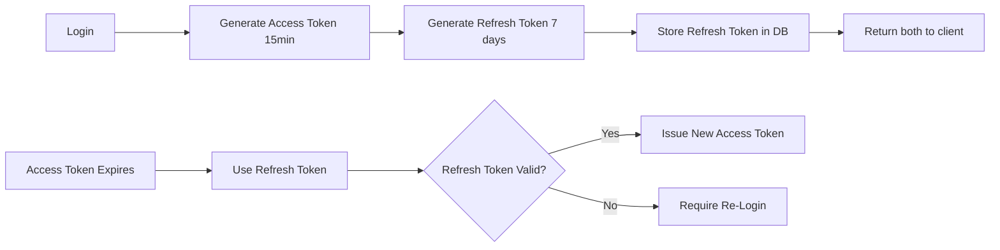

# User Tables Documentation

## Overview
The user system in Mundo Tango encompasses 15+ tables covering authentication, profiles, settings, subscriptions, and security. This document details the complete user management infrastructure.

## Table of Contents
- [Core User Tables](#core-user-tables)
- [Authentication & Security](#authentication--security)
- [User Profiles & Settings](#user-profiles--settings)
- [Subscription & Billing](#subscription--billing)
- [Schemas & Types](#schemas--types)
- [H2AC Handoff Notes](#h2ac-handoff-notes)

---

## Core User Tables

### 1. `users`
The primary user table with comprehensive profile information.

**Schema:**
```sql
CREATE TABLE users (
  id SERIAL PRIMARY KEY,
  
  -- Core identity
  name VARCHAR NOT NULL,
  username VARCHAR NOT NULL UNIQUE,
  email VARCHAR NOT NULL UNIQUE,
  password TEXT NOT NULL,  -- bcrypt hashed
  
  -- Contact
  mobile_no VARCHAR,
  
  -- Profile images
  profile_image TEXT,
  background_image TEXT,
  bio TEXT,
  
  -- Personal info
  first_name VARCHAR,
  last_name VARCHAR,
  nickname VARCHAR,
  occupation VARCHAR,
  
  -- Location
  country VARCHAR,
  city VARCHAR,
  state VARCHAR,
  country_code VARCHAR,
  state_code VARCHAR,
  
  -- Tango-specific fields
  languages TEXT[],
  tango_roles TEXT[],  -- ['leader', 'follower', 'both']
  leader_level INTEGER DEFAULT 0,    -- 0-5 skill level
  follower_level INTEGER DEFAULT 0,  -- 0-5 skill level
  years_of_dancing INTEGER DEFAULT 0,
  started_dancing_year INTEGER,
  
  -- Social
  facebook_url TEXT,
  
  -- Account status
  is_verified BOOLEAN DEFAULT FALSE,
  is_active BOOLEAN DEFAULT TRUE,
  suspended BOOLEAN DEFAULT FALSE,
  
  -- Device info
  device_type VARCHAR,
  device_token TEXT,  -- For push notifications
  api_token TEXT,
  
  -- Replit integration
  replit_id VARCHAR,
  
  -- Onboarding
  form_status INTEGER DEFAULT 0,
  is_onboarding_complete BOOLEAN DEFAULT FALSE,
  code_of_conduct_accepted BOOLEAN DEFAULT FALSE,
  terms_accepted BOOLEAN DEFAULT FALSE,
  
  -- Subscription (Stripe)
  stripe_customer_id VARCHAR,
  stripe_subscription_id VARCHAR,
  subscription_status VARCHAR,
  subscription_tier VARCHAR DEFAULT 'free',  -- 'free' | 'basic' | 'premium' | 'ultimate'
  
  -- Security
  two_factor_enabled BOOLEAN DEFAULT FALSE,
  last_login_at TIMESTAMP,
  last_login_ip VARCHAR,
  
  -- Customer journey
  customer_journey_state VARCHAR DEFAULT 'J1',  -- J1-J5 stages
  last_journey_update TIMESTAMP,
  
  -- Permissions
  role VARCHAR DEFAULT 'user' NOT NULL,  -- 'user' | 'moderator' | 'admin' | 'super_admin'
  
  created_at TIMESTAMP DEFAULT NOW(),
  updated_at TIMESTAMP DEFAULT NOW()
);

-- Indexes
CREATE INDEX users_email_idx ON users(email);
CREATE INDEX users_username_idx ON users(username);
```

**User Roles Explained:**
```typescript
enum UserRole {
  USER = 'user',              // Regular user
  MODERATOR = 'moderator',    // Can moderate content
  ADMIN = 'admin',            // Can manage users, events, groups
  SUPER_ADMIN = 'super_admin' // Full system access
}
```

**Subscription Tiers:**
```typescript
enum SubscriptionTier {
  FREE = 'free',       // Limited features
  BASIC = 'basic',     // $9.99/mo - More events, groups
  PREMIUM = 'premium', // $19.99/mo - All features + AI
  ULTIMATE = 'ultimate' // $49.99/mo - Everything + priority support
}
```

**Customer Journey States:**
```typescript
enum JourneyState {
  J1 = 'J1',  // Just signed up
  J2 = 'J2',  // Completed profile
  J3 = 'J3',  // Made first post or RSVP
  J4 = 'J4',  // Actively engaged (5+ interactions)
  J5 = 'J5',  // Power user (subscribed or 20+ interactions)
}
```

---

## Authentication & Security

### 2. `refresh_tokens`
JWT refresh tokens for session management.

**Schema:**
```sql
CREATE TABLE refresh_tokens (
  id SERIAL PRIMARY KEY,
  user_id INTEGER NOT NULL REFERENCES users(id) ON DELETE CASCADE,
  token TEXT NOT NULL UNIQUE,
  expires_at TIMESTAMP NOT NULL,
  created_at TIMESTAMP DEFAULT NOW()
);

-- Indexes
CREATE INDEX refresh_tokens_user_idx ON refresh_tokens(user_id);
CREATE INDEX refresh_tokens_token_idx ON refresh_tokens(token);
```

**Token Flow:**


### 3. `email_verification_tokens`
Email verification for new accounts.

**Schema:**
```sql
CREATE TABLE email_verification_tokens (
  id SERIAL PRIMARY KEY,
  user_id INTEGER NOT NULL REFERENCES users(id) ON DELETE CASCADE,
  token TEXT NOT NULL UNIQUE,
  expires_at TIMESTAMP NOT NULL,  -- 24 hours
  created_at TIMESTAMP DEFAULT NOW()
);

-- Indexes
CREATE INDEX email_verification_tokens_user_idx ON email_verification_tokens(user_id);
CREATE INDEX email_verification_tokens_token_idx ON email_verification_tokens(token);
```

**Verification Flow:**
```typescript
// 1. User signs up
POST /api/auth/register
{
  email: "user@example.com",
  password: "***",
  name: "John Doe"
}

// 2. Backend creates verification token
const token = crypto.randomBytes(32).toString('hex');
await db.insert(emailVerificationTokens).values({
  userId: newUser.id,
  token,
  expiresAt: new Date(Date.now() + 24 * 60 * 60 * 1000)
});

// 3. Send verification email
await sendEmail({
  to: "user@example.com",
  subject: "Verify your Mundo Tango account",
  html: `<a href="https://mundotango.com/verify/${token}">Verify Email</a>`
});

// 4. User clicks link
GET /verify/:token

// 5. Backend verifies
await db.update(users)
  .set({ isVerified: true })
  .where(eq(users.id, userId));
```

### 4. `password_reset_tokens`
Password reset functionality.

**Schema:**
```sql
CREATE TABLE password_reset_tokens (
  id SERIAL PRIMARY KEY,
  user_id INTEGER NOT NULL REFERENCES users(id) ON DELETE CASCADE,
  token TEXT NOT NULL UNIQUE,
  expires_at TIMESTAMP NOT NULL,  -- 1 hour
  created_at TIMESTAMP DEFAULT NOW()
);

-- Indexes
CREATE INDEX password_reset_tokens_user_idx ON password_reset_tokens(user_id);
CREATE INDEX password_reset_tokens_token_idx ON password_reset_tokens(token);
```

### 5. `two_factor_secrets`
TOTP-based two-factor authentication.

**Schema:**
```sql
CREATE TABLE two_factor_secrets (
  id SERIAL PRIMARY KEY,
  user_id INTEGER NOT NULL REFERENCES users(id) ON DELETE CASCADE UNIQUE,
  secret TEXT NOT NULL,              -- TOTP secret
  backup_codes TEXT[],               -- Emergency recovery codes
  created_at TIMESTAMP DEFAULT NOW()
);

-- Indexes
CREATE INDEX two_factor_secrets_user_idx ON two_factor_secrets(user_id);
```

**2FA Setup:**
```typescript
import speakeasy from 'speakeasy';
import QRCode from 'qrcode';

// Enable 2FA
POST /api/auth/2fa/enable

// Backend generates secret
const secret = speakeasy.generateSecret({
  name: `Mundo Tango (${user.email})`
});

// Generate backup codes
const backupCodes = Array.from({ length: 10 }, () => 
  crypto.randomBytes(4).toString('hex')
);

await db.insert(twoFactorSecrets).values({
  userId: user.id,
  secret: secret.base32,
  backupCodes
});

// Return QR code to user
const qrCodeUrl = await QRCode.toDataURL(secret.otpauth_url);

// Response
{
  qrCode: qrCodeUrl,
  backupCodes: backupCodes
}
```

**2FA Verification:**
```typescript
// Login with 2FA
POST /api/auth/login
{
  email: "user@example.com",
  password: "***",
  totpCode: "123456"  // Required if 2FA enabled
}

// Verify TOTP
const verified = speakeasy.totp.verify({
  secret: secret.base32,
  encoding: 'base32',
  token: totpCode,
  window: 2  // Allow 60s time drift
});
```

---

## User Profiles & Settings

### 6. `user_settings`
Privacy, notification, and app preferences.

**Schema:**
```sql
CREATE TABLE user_settings (
  id SERIAL PRIMARY KEY,
  user_id INTEGER NOT NULL REFERENCES users(id) ON DELETE CASCADE UNIQUE,
  
  -- Notifications
  email_notifications BOOLEAN DEFAULT TRUE,
  push_notifications BOOLEAN DEFAULT TRUE,
  
  -- Privacy
  profile_visibility VARCHAR DEFAULT 'public',  -- 'public' | 'friends' | 'private'
  show_online_status BOOLEAN DEFAULT TRUE,
  allow_messages VARCHAR DEFAULT 'everyone',    -- 'everyone' | 'friends' | 'none'
  
  -- Preferences
  language VARCHAR DEFAULT 'en',
  theme VARCHAR DEFAULT 'system',  -- 'system' | 'light' | 'dark'
  
  created_at TIMESTAMP DEFAULT NOW(),
  updated_at TIMESTAMP DEFAULT NOW()
);

-- Indexes
CREATE INDEX user_settings_user_idx ON user_settings(user_id);
```

**Settings Schema:**
```typescript
interface UserSettings {
  emailNotifications: boolean;
  pushNotifications: boolean;
  profileVisibility: 'public' | 'friends' | 'private';
  showOnlineStatus: boolean;
  allowMessages: 'everyone' | 'friends' | 'none';
  language: string;
  theme: 'system' | 'light' | 'dark';
}
```

### 7. `activity_logs`
User activity timeline for audit trail.

**Schema:**
```sql
CREATE TABLE activity_logs (
  id SERIAL PRIMARY KEY,
  user_id INTEGER NOT NULL REFERENCES users(id) ON DELETE CASCADE,
  type VARCHAR NOT NULL,  -- 'login' | 'post_created' | 'profile_updated' | etc.
  text TEXT NOT NULL,     -- Human-readable description
  time VARCHAR NOT NULL,  -- Relative time ("2 hours ago")
  created_at TIMESTAMP DEFAULT NOW()
);

-- Indexes
CREATE INDEX activity_logs_user_idx ON activity_logs(user_id);
CREATE INDEX activity_logs_created_at_idx ON activity_logs(created_at);
```

**Activity Types:**
```typescript
type ActivityType =
  | 'login'
  | 'logout'
  | 'profile_updated'
  | 'password_changed'
  | 'post_created'
  | 'comment_added'
  | 'event_created'
  | 'event_rsvp'
  | 'friend_added'
  | 'group_joined';
```

### 8. `blocked_users`
User blocking for safety.

**Schema:**
```sql
CREATE TABLE blocked_users (
  id SERIAL PRIMARY KEY,
  user_id INTEGER NOT NULL REFERENCES users(id) ON DELETE CASCADE,
  blocked_user_id INTEGER NOT NULL REFERENCES users(id) ON DELETE CASCADE,
  created_at TIMESTAMP DEFAULT NOW() NOT NULL,
  
  UNIQUE(user_id, blocked_user_id)
);

-- Indexes
CREATE INDEX blocked_users_user_idx ON blocked_users(user_id);
CREATE INDEX blocked_users_blocked_idx ON blocked_users(blocked_user_id);
CREATE UNIQUE INDEX unique_blocked_user ON blocked_users(user_id, blocked_user_id);
```

---

## Subscription & Billing

### 9. Subscription Fields in `users` Table

**Stripe Integration:**
```typescript
interface StripeFields {
  stripeCustomerId: string;        // Stripe customer ID
  stripeSubscriptionId: string;    // Current subscription ID
  subscriptionStatus: string;      // 'active' | 'canceled' | 'past_due'
  subscriptionTier: string;        // 'free' | 'basic' | 'premium' | 'ultimate'
}
```

**Subscription Creation:**
```typescript
import Stripe from 'stripe';
const stripe = new Stripe(process.env.STRIPE_SECRET_KEY);

// Upgrade to premium
POST /api/subscriptions/upgrade
{
  tier: "premium",
  paymentMethodId: "pm_..."
}

// Backend creates Stripe subscription
const customer = await stripe.customers.create({
  email: user.email,
  payment_method: paymentMethodId,
  invoice_settings: {
    default_payment_method: paymentMethodId
  }
});

const subscription = await stripe.subscriptions.create({
  customer: customer.id,
  items: [{ price: PRICE_IDS.premium }],
  expand: ['latest_invoice.payment_intent']
});

// Update user
await db.update(users).set({
  stripeCustomerId: customer.id,
  stripeSubscriptionId: subscription.id,
  subscriptionStatus: 'active',
  subscriptionTier: 'premium'
});
```

---

## Schemas & Types

### TypeScript Types

```typescript
// From shared/schema.ts

export const insertUserSchema = createInsertSchema(users, {
  email: z.string().email(),
  username: z.string().min(3).max(30),
  password: z.string().min(8).max(100),
  tangoRoles: z.array(z.enum(['leader', 'follower', 'both'])),
  leaderLevel: z.number().min(0).max(5),
  followerLevel: z.number().min(0).max(5),
}).omit({
  id: true,
  createdAt: true,
  updatedAt: true
});

export type InsertUser = z.infer<typeof insertUserSchema>;
export type SelectUser = typeof users.$inferSelect;
```

### Registration Validation

```typescript
import { z } from 'zod';

export const registerSchema = z.object({
  email: z.string().email(),
  username: z.string().min(3).max(30).regex(/^[a-zA-Z0-9_]+$/),
  password: z.string().min(8).max(100),
  name: z.string().min(1).max(100),
  termsAccepted: z.literal(true),
});

export const loginSchema = z.object({
  email: z.string().email(),
  password: z.string(),
  totpCode: z.string().length(6).optional(),
});
```

---

## H2AC Handoff Notes

### 🔧 Manual Configuration Required

#### 1. Password Policy
**Human Decision Required:**
- Minimum password length?
- Require special characters?
- Password expiration policy?

**Current Policy:**
```typescript
const PASSWORD_POLICY = {
  minLength: 8,
  requireUppercase: false,  // ⚠️ Consider enabling
  requireLowercase: false,
  requireNumbers: false,
  requireSpecial: false,
  expireDays: null  // No expiration
};
```

**Recommendation:** Enable at least 1 uppercase + 1 number

#### 2. Email Verification Required?
**Human Decision Required:**
- Force email verification before full access?
- Allow unverified users to post/comment?

**Current Setting:** Optional verification (users can skip)

**Recommendation:**
```typescript
const EMAIL_VERIFICATION = {
  required: true,  // Block unverified users
  gracePeriodDays: 7,  // Allow 7 days before blocking
  reminderIntervalDays: 1
};
```

#### 3. Session Expiration
**Human Decision Required:**
- How long should sessions last?
- Require re-login for sensitive actions?

**Current Settings:**
```typescript
const SESSION_CONFIG = {
  accessTokenExpiry: '15m',
  refreshTokenExpiry: '7d',
  requireReLoginFor: ['password_change', 'email_change', '2fa_disable']
};
```

#### 4. User Deletion Policy
**Human Decision Required:**
- Soft delete vs. hard delete?
- Retention period for deleted accounts?

**Recommendation:**
```typescript
const DELETION_POLICY = {
  type: 'soft',  // Mark as deleted, don't actually delete
  retentionDays: 30,  // Permanent delete after 30 days
  anonymizeData: true  // Remove PII immediately
};
```

---

## Related Documentation
- [FRIENDSHIP_TABLES.md](./FRIENDSHIP_TABLES.md) - Friend connections
- [SOCIAL_TABLES.md](./SOCIAL_TABLES.md) - User-generated content
- [MESSAGING_TABLES.md](./MESSAGING_TABLES.md) - User messaging
- [AUTH_API.md](../api/AUTH_API.md) - Authentication endpoints

---

**Last Updated:** November 2, 2025  
**Maintained By:** ESA Documentation Agent (P89)
