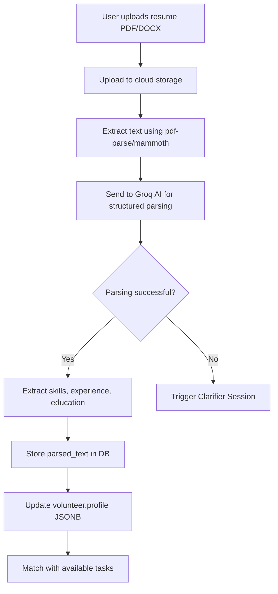
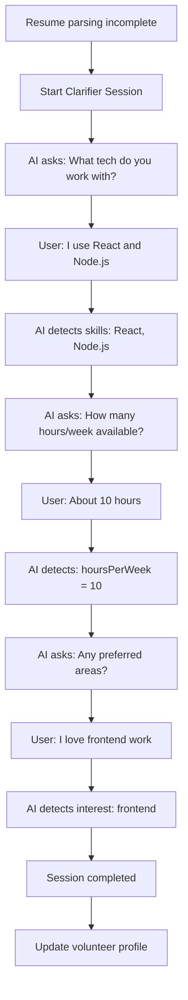

# Volunteer Tables Documentation (Talent Match AI)

## Overview
The Volunteer/Talent Match system uses AI-powered resume parsing and skill matching to connect volunteers with project tasks. This "Talent Match AI" system includes clarifier sessions, signal detection, and intelligent task assignment.

## Table of Contents
- [Core Volunteer Tables](#core-volunteer-tables)
- [Resume AI System](#resume-ai-system)
- [Task Matching](#task-matching)
- [Clarifier Sessions](#clarifier-sessions)
- [Schemas & Types](#schemas--types)
- [H2AC Handoff Notes](#h2ac-handoff-notes)

---

## Core Volunteer Tables

### 1. `volunteers`
Volunteer profiles with skills and availability.

**Schema:**
```sql
CREATE TABLE volunteers (
  id SERIAL PRIMARY KEY,
  user_id INTEGER REFERENCES users(id) ON DELETE CASCADE,
  
  -- Profile (AI-generated from resume)
  profile JSONB,
  
  -- Extracted skills
  skills TEXT[],  -- ['JavaScript', 'React', 'Node.js', 'PostgreSQL']
  
  -- Availability
  availability VARCHAR,  -- 'weekdays' | 'weekends' | 'evenings' | 'flexible'
  hours_per_week INTEGER,
  
  created_at TIMESTAMP DEFAULT NOW()
);

-- Indexes
CREATE INDEX volunteers_user_idx ON volunteers(user_id);
```

**Profile JSONB Structure:**
```typescript
interface VolunteerProfile {
  summary: string;
  experience: Array<{
    title: string;
    company: string;
    duration: string;
    description: string;
  }>;
  education: Array<{
    degree: string;
    institution: string;
    year: number;
  }>;
  skills: {
    technical: string[];
    soft: string[];
    languages: string[];
  };
  interests: string[];
  availability: {
    hoursPerWeek: number;
    preferredTimes: string[];
  };
}
```

---

## Resume AI System

### 2. `resumes`
Uploaded resumes with AI-parsed text.

**Schema:**
```sql
CREATE TABLE resumes (
  id SERIAL PRIMARY KEY,
  volunteer_id INTEGER NOT NULL REFERENCES volunteers(id) ON DELETE CASCADE,
  
  -- File info
  filename TEXT,
  file_url TEXT,
  
  -- AI-parsed content
  parsed_text TEXT,  -- Full text extraction
  links TEXT[],      -- Extracted URLs (portfolio, LinkedIn, GitHub)
  
  created_at TIMESTAMP DEFAULT NOW()
);

-- Indexes
CREATE INDEX resumes_volunteer_idx ON resumes(volunteer_id);
```

**Resume Upload & Parsing Flow:**


**Resume Parsing Implementation:**
```typescript
// server/services/ResumeParserService.ts
import pdf from 'pdf-parse';
import mammoth from 'mammoth';
import Groq from 'groq-sdk';

const groq = new Groq({ apiKey: process.env.GROQ_API_KEY });

class ResumeParserService {
  async parseResume(file: Buffer, filename: string): Promise<VolunteerProfile> {
    // Extract text
    const text = await this.extractText(file, filename);
    
    // Parse with Groq AI
    const completion = await groq.chat.completions.create({
      model: "mixtral-8x7b-32768",
      messages: [
        {
          role: "system",
          content: `You are a resume parser. Extract structured data from resumes.
          Return JSON with: summary, experience, education, skills, interests.`
        },
        {
          role: "user",
          content: `Parse this resume:\n\n${text}`
        }
      ],
      response_format: { type: "json_object" }
    });
    
    const profile = JSON.parse(completion.choices[0].message.content);
    return profile;
  }
  
  async extractText(file: Buffer, filename: string): Promise<string> {
    const ext = filename.split('.').pop()?.toLowerCase();
    
    if (ext === 'pdf') {
      const data = await pdf(file);
      return data.text;
    } else if (ext === 'docx') {
      const result = await mammoth.extractRawText({ buffer: file });
      return result.value;
    }
    
    throw new Error('Unsupported file format');
  }
}
```

**API Endpoint:**
```typescript
// Upload resume
POST /api/volunteers/resume
Content-Type: multipart/form-data

{
  file: <PDF or DOCX file>
}

// Response
{
  resumeId: 123,
  profile: {
    summary: "Experienced full-stack developer...",
    skills: {
      technical: ["JavaScript", "React", "Node.js"],
      soft: ["Communication", "Leadership"]
    },
    experience: [...]
  },
  matchedTasks: 5  // Number of suitable tasks found
}
```

---

## Task Matching

### 3. `tasks`
Available volunteer tasks/projects.

**Schema:**
```sql
CREATE TABLE tasks (
  id SERIAL PRIMARY KEY,
  title TEXT NOT NULL,
  description TEXT NOT NULL,
  
  -- Categorization
  domain VARCHAR,  -- 'frontend' | 'backend' | 'design' | 'marketing' | 'community'
  phase VARCHAR,   -- 'phase1' | 'phase2' | 'phase3' | 'phase4'
  
  -- Requirements
  estimated_hours INTEGER,
  required_skills TEXT[],
  
  -- Status
  status VARCHAR DEFAULT 'open',  -- 'open' | 'assigned' | 'in_progress' | 'completed'
  
  created_at TIMESTAMP DEFAULT NOW()
);

-- Indexes
CREATE INDEX tasks_status_idx ON tasks(status);
CREATE INDEX tasks_domain_idx ON tasks(domain);
```

**Task Domains:**
```typescript
enum TaskDomain {
  FRONTEND = 'frontend',         // UI/UX development
  BACKEND = 'backend',           // API, database work
  DESIGN = 'design',             // Graphics, branding
  MARKETING = 'marketing',       // Content, outreach
  COMMUNITY = 'community',       // Community management
  TESTING = 'testing',           // QA, bug testing
  DOCUMENTATION = 'documentation' // Writing docs
}
```

**Example Tasks:**
```typescript
const tasks = [
  {
    title: "Build Dashboard Analytics Component",
    description: "Create React component to visualize user engagement metrics",
    domain: "frontend",
    phase: "phase2",
    estimatedHours: 8,
    requiredSkills: ["React", "TypeScript", "D3.js"],
    status: "open"
  },
  {
    title: "Implement Email Notification Service",
    description: "Build email service using SendGrid to send event reminders",
    domain: "backend",
    phase: "phase3",
    estimatedHours: 12,
    requiredSkills: ["Node.js", "SendGrid", "PostgreSQL"],
    status: "open"
  }
];
```

### 4. `assignments`
Task assignments to volunteers.

**Schema:**
```sql
CREATE TABLE assignments (
  id SERIAL PRIMARY KEY,
  volunteer_id INTEGER NOT NULL REFERENCES volunteers(id) ON DELETE CASCADE,
  task_id INTEGER NOT NULL REFERENCES tasks(id) ON DELETE CASCADE,
  
  -- Matching
  match_reason TEXT,  -- AI-generated explanation of why this is a good match
  
  -- Status
  status VARCHAR DEFAULT 'pending',  -- 'pending' | 'accepted' | 'in_progress' | 'completed' | 'rejected'
  admin_notes TEXT,
  
  -- Timestamps
  created_at TIMESTAMP DEFAULT NOW(),
  approved_at TIMESTAMP,
  rejected_at TIMESTAMP
);

-- Indexes
CREATE INDEX assignments_volunteer_idx ON assignments(volunteer_id);
CREATE INDEX assignments_task_idx ON assignments(task_id);
CREATE INDEX assignments_status_idx ON assignments(status);
```

**Matching Algorithm:**
```typescript
// server/algorithms/talent-matching.ts

interface MatchScore {
  taskId: number;
  score: number;  // 0-100
  reasons: string[];
}

const matchVolunteerToTasks = (volunteer: Volunteer): MatchScore[] => {
  const openTasks = await db.query.tasks.findMany({
    where: eq(tasks.status, 'open')
  });
  
  return openTasks.map(task => {
    let score = 0;
    const reasons = [];
    
    // Skill match (70% weight)
    const skillOverlap = intersection(volunteer.skills, task.requiredSkills);
    const skillMatchPct = skillOverlap.length / task.requiredSkills.length;
    score += skillMatchPct * 70;
    
    if (skillMatchPct >= 0.8) {
      reasons.push(`Strong skill match (${skillOverlap.join(', ')})`);
    }
    
    // Availability match (20% weight)
    if (task.estimatedHours <= volunteer.hoursPerWeek) {
      score += 20;
      reasons.push('Availability aligns with estimated time');
    }
    
    // Interest match (10% weight)
    if (volunteer.profile.interests.includes(task.domain)) {
      score += 10;
      reasons.push(`Interested in ${task.domain}`);
    }
    
    return {
      taskId: task.id,
      score,
      reasons
    };
  }).filter(match => match.score >= 50)  // Minimum 50% match
    .sort((a, b) => b.score - a.score);
};
```

**Assignment Creation:**
```typescript
// Auto-assign top matches
POST /api/volunteers/:volunteerId/auto-assign

// Response
{
  assignmentsCreated: 3,
  assignments: [
    {
      id: 123,
      taskId: 45,
      taskTitle: "Build Dashboard Analytics Component",
      matchScore: 92,
      matchReason: "Strong skill match (React, TypeScript), Availability aligns",
      status: "pending"
    }
  ]
}
```

---

## Clarifier Sessions

### 5. `clarifier_sessions`
AI-powered chat sessions to clarify volunteer skills and interests.

**Schema:**
```sql
CREATE TABLE clarifier_sessions (
  id SERIAL PRIMARY KEY,
  volunteer_id INTEGER NOT NULL REFERENCES volunteers(id) ON DELETE CASCADE,
  
  -- Conversation log
  chat_log JSONB,
  
  -- Detected signals (skills, interests, availability)
  detected_signals TEXT[],
  
  -- Status
  status VARCHAR DEFAULT 'active',  -- 'active' | 'completed' | 'abandoned'
  
  created_at TIMESTAMP DEFAULT NOW(),
  completed_at TIMESTAMP
);

-- Indexes
CREATE INDEX clarifier_sessions_volunteer_idx ON clarifier_sessions(volunteer_id);
```

**Chat Log Structure:**
```typescript
interface ChatLog {
  messages: Array<{
    role: 'assistant' | 'user';
    content: string;
    timestamp: string;
  }>;
}
```

**Clarifier Flow:**


**Implementation:**
```typescript
// server/services/ClarifierService.ts

class ClarifierService {
  async startSession(volunteerId: number): Promise<number> {
    const session = await db.insert(clarifierSessions).values({
      volunteerId,
      chatLog: { messages: [] },
      detectedSignals: [],
      status: 'active'
    }).returning();
    
    // Send initial message
    await this.sendMessage(session[0].id, {
      role: 'assistant',
      content: "Hi! I'd love to learn more about your skills. What technologies do you work with?"
    });
    
    return session[0].id;
  }
  
  async processUserResponse(sessionId: number, userMessage: string) {
    // Get session
    const session = await db.query.clarifierSessions.findFirst({
      where: eq(clarifierSessions.id, sessionId)
    });
    
    // Add user message to chat log
    const chatLog = session.chatLog as ChatLog;
    chatLog.messages.push({
      role: 'user',
      content: userMessage,
      timestamp: new Date().toISOString()
    });
    
    // Detect signals using Groq AI
    const signals = await this.detectSignals(chatLog.messages);
    
    // Generate next question
    const nextQuestion = await this.generateNextQuestion(chatLog, signals);
    
    // Update session
    await db.update(clarifierSessions)
      .set({
        chatLog,
        detectedSignals: signals
      })
      .where(eq(clarifierSessions.id, sessionId));
    
    // Send AI response
    await this.sendMessage(sessionId, {
      role: 'assistant',
      content: nextQuestion
    });
    
    // Check if session should end
    if (signals.length >= 5) {
      await this.completeSession(sessionId);
    }
  }
  
  async detectSignals(messages: ChatLog['messages']): Promise<string[]> {
    const completion = await groq.chat.completions.create({
      model: "mixtral-8x7b-32768",
      messages: [
        {
          role: "system",
          content: `Extract skills, interests, and availability from conversation.
          Return JSON array of detected signals like:
          ["skill:React", "skill:Node.js", "interest:frontend", "hours:10"]`
        },
        ...messages
      ],
      response_format: { type: "json_object" }
    });
    
    const result = JSON.parse(completion.choices[0].message.content);
    return result.signals || [];
  }
}
```

---

## Schemas & Types

### TypeScript Types

```typescript
// From shared/schema.ts

export type SelectVolunteer = typeof volunteers.$inferSelect;
export type InsertVolunteer = z.infer<typeof insertVolunteerSchema>;

export type SelectResume = typeof resumes.$inferSelect;
export type InsertResume = z.infer<typeof insertResumeSchema>;

export type SelectTask = typeof tasks.$inferSelect;
export type InsertTask = z.infer<typeof insertTaskSchema>;

export type SelectAssignment = typeof assignments.$inferSelect;
export type InsertAssignment = z.infer<typeof insertAssignmentSchema>;

export type SelectClarifierSession = typeof clarifierSessions.$inferSelect;
export type InsertClarifierSession = z.infer<typeof insertClarifierSessionSchema>;
```

---

## H2AC Handoff Notes

### 🔧 Manual Configuration Required

#### 1. Matching Threshold
**Human Decision Required:**
- What minimum match score should trigger auto-assignment?
- Allow volunteers to see all tasks or only matched ones?

**Current Setting:** 50% minimum match score

**Recommendation:**
```typescript
const MATCHING_CONFIG = {
  autoAssignThreshold: 80,  // Auto-assign if 80%+ match
  suggestThreshold: 50,     // Show as suggestion if 50%+ match
  showAllTasks: true        // Let volunteers browse all tasks
};
```

#### 2. Resume Privacy
**Human Decision Required:**
- Store resume files permanently or delete after parsing?
- Allow volunteers to make resume public?

**Recommendation:**
```typescript
const RESUME_PRIVACY = {
  retainOriginalFile: false,  // Delete after parsing
  allowPublicResume: true,    // Let volunteers opt-in to public profile
  deleteAfterDays: 30
};
```

#### 3. Task Assignment Approval
**Human Decision Required:**
- Require admin approval for all assignments?
- Auto-approve high-match (90%+) assignments?

**Current:** All assignments require admin approval

**Recommendation:**
```typescript
const ASSIGNMENT_APPROVAL = {
  requireApproval: true,
  autoApproveThreshold: 90,  // Auto-approve 90%+ matches
  notifyAdminOnAssignment: true
};
```

---

## Integration with Groq AI

### API Configuration

```typescript
// .env
GROQ_API_KEY=your_groq_api_key_here

// server/services/GroqService.ts
import Groq from 'groq-sdk';

const groq = new Groq({
  apiKey: process.env.GROQ_API_KEY
});

export const parseResumeWithGroq = async (resumeText: string) => {
  const completion = await groq.chat.completions.create({
    model: "mixtral-8x7b-32768",
    messages: [
      {
        role: "system",
        content: RESUME_PARSER_SYSTEM_PROMPT
      },
      {
        role: "user",
        content: resumeText
      }
    ],
    response_format: { type: "json_object" },
    temperature: 0.3
  });
  
  return JSON.parse(completion.choices[0].message.content);
};
```

---

## Related Documentation
- [VOLUNTEER_MATCHING.md](../features/VOLUNTEER_MATCHING.md) - Feature implementation
- [MATCHING_ENGINE.md](../algorithms/MATCHING_ENGINE.md) - Matching algorithms
- [VOLUNTEER_API.md](../api/VOLUNTEER_API.md) - API endpoints

---

**Last Updated:** November 2, 2025  
**Maintained By:** ESA Documentation Agent (P89)
