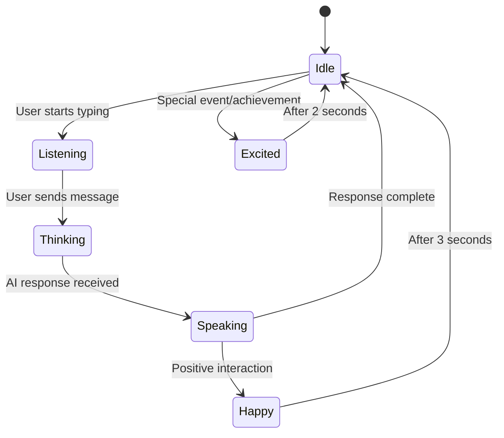

# AI Chat (Mr. Blue) Documentation

**Version:** 1.0  
**Last Updated:** November 2, 2025  
**Status:** Production  
**Owner:** AI Experience Team  

---

## Table of Contents

1. [Overview](#overview)
2. [Avatar System](#avatar-system)
3. [Chat Interface](#chat-interface)
4. [AI Integration](#ai-integration)
5. [Context Management](#context-management)
6. [State Management](#state-management)
7. [Database Schema](#database-schema)
8. [API Reference](#api-reference)
9. [H2AC Integration](#h2ac-integration)

---

## Overview

Mr. Blue is the AI-powered assistant for Mundo Tango, providing personalized help, event recommendations, and community guidance through an interactive chat interface with an animated 3D avatar.

### Core Features

- **Interactive 3D Avatar**: Video-based avatar with multiple expressions
- **AI-Powered Chat**: Groq/Anthropic integration for intelligent responses
- **Context Awareness**: Remembers conversation history and user preferences
- **Dynamic Expressions**: Avatar changes expressions based on interaction state
- **Session Management**: Persistent conversations with session tracking
- **Global Accessibility**: Available throughout the platform via floating widget
- **Fallback 2D Avatar**: Graceful degradation if 3D model fails

### Architecture

```mermaid
graph TB
    User[User] --> |Chat| Widget[Mr. Blue Widget]
    Widget --> |Open Chat| ChatPanel[Chat Side Panel]
    ChatPanel --> |Send Message| API[/api/v1/chat]
    
    API --> |Build Context| Context[Context Service]
    Context --> |Session Data| Session[Session Storage]
    Context --> |User Data| UserDB[(User Database)]
    
    API --> |Send Prompt| Groq[Groq AI API]
    Groq --> |AI Response| API
    API --> |Return| ChatPanel
    
    ChatPanel --> |Update State| MrBlueContext[Mr. Blue Context]
    MrBlueContext --> |Expression| Avatar[Avatar Component]
    
    Avatar --> |Try 3D| VideoAvatar[Video Avatar]
    Avatar --> |Fallback| Avatar2D[2D Avatar]
    
    subgraph "Frontend State"
        MrBlueContext
        Avatar
        VideoAvatar
        Avatar2D
    end
    
    subgraph "AI Pipeline"
        Context
        Groq
        Session
    end
```

---

## Avatar System

### Avatar States

```typescript
type VideoState = 
  | 'idle'
  | 'listening'
  | 'speaking'
  | 'happy'
  | 'thinking'
  | 'excited'
  | 'surprised'
  | 'nodding'
  | 'walk-left'
  | 'walk-right';
```

### Video State Manager

```typescript
// client/src/hooks/useVideoStateManager.ts
export function useVideoStateManager(options: VideoStateManagerOptions = {}) {
  const { onStateChange, defaultState = 'idle' } = options;
  const [currentState, setCurrentState] = useState<VideoState>(defaultState);
  const [previousState, setPreviousState] = useState<VideoState>(defaultState);
  const stateTimeoutRef = useRef<NodeJS.Timeout>();

  // Transition to a new state
  const transitionTo = useCallback((newState: VideoState, duration?: number) => {
    // Clear any pending state transitions
    if (stateTimeoutRef.current) {
      clearTimeout(stateTimeoutRef.current);
    }

    setPreviousState(currentState);
    setCurrentState(newState);
    onStateChange?.(newState);

    // Auto-return to idle after duration (if specified)
    if (duration) {
      stateTimeoutRef.current = setTimeout(() => {
        setCurrentState('idle');
        onStateChange?.('idle');
      }, duration);
    }
  }, [currentState, onStateChange]);

  // Get video path for current state
  const getVideoPath = useCallback((state: VideoState = currentState): string => {
    return `/videos/states/${state}.mp4`;
  }, [currentState]);

  return {
    currentState,
    previousState,
    transitionTo,
    getVideoPath,
    
    // Convenience methods for common state transitions
    setListening: () => transitionTo('listening'),
    setSpeaking: (duration?: number) => transitionTo('speaking', duration),
    setHappy: (duration?: number) => transitionTo('happy', duration),
    setThinking: () => transitionTo('thinking'),
    setIdle: () => transitionTo('idle'),
  };
}
```

### Avatar Component

```typescript
// client/src/components/mrblue/MrBlueAvatar.tsx
export function MrBlueAvatar() {
  const { currentExpression } = useMrBlue();
  const [use3D, setUse3D] = useState(true);
  const [videoError, setVideoError] = useState(false);

  const videoStateManager = useVideoStateManager({
    defaultState: currentExpression,
    onStateChange: (newState) => {
      console.log(`[Mr. Blue] State changed to: ${newState}`);
    },
  });

  useEffect(() => {
    videoStateManager.transitionTo(currentExpression);
  }, [currentExpression]);

  const handleVideoError = () => {
    console.error("[Mr. Blue] 3D avatar video failed to load, falling back to 2D");
    setVideoError(true);
    setUse3D(false);
  };

  if (!use3D || videoError) {
    return <MrBlueAvatar2D expression={currentExpression} />;
  }

  return (
    <div className="relative w-full h-full">
      <video
        src={videoStateManager.getVideoPath()}
        autoPlay
        loop
        muted
        playsInline
        onError={handleVideoError}
        className="w-full h-full object-cover"
      />
    </div>
  );
}
```

---

## Chat Interface

### Chat Side Panel

```typescript
// client/src/components/mrblue/ChatSidePanel.tsx
interface Message {
  id: string;
  role: "user" | "assistant";
  content: string;
  timestamp: Date;
}

export function ChatSidePanel() {
  const { isChatOpen, closeChat } = useMrBlue();
  const { toast } = useToast();
  const scrollRef = useRef<HTMLDivElement>(null);
  const [messages, setMessages] = useState<Message[]>([
    {
      id: "1",
      role: "assistant",
      content: "Hello! I'm Mr. Blue, your AI assistant for Mundo Tango. How can I help you today?",
      timestamp: new Date()
    }
  ]);
  const [input, setInput] = useState("");
  const [isLoading, setIsLoading] = useState(false);

  useEffect(() => {
    if (scrollRef.current) {
      scrollRef.current.scrollIntoView({ behavior: "smooth" });
    }
  }, [messages]);

  const handleSend = async () => {
    if (!input.trim() || isLoading) return;

    const userMessage: Message = {
      id: Date.now().toString(),
      role: "user",
      content: input,
      timestamp: new Date()
    };

    setMessages(prev => [...prev, userMessage]);
    setInput("");
    setIsLoading(true);

    try {
      const response = await fetch("/api/v1/chat", {
        method: "POST",
        headers: { "Content-Type": "application/json" },
        body: JSON.stringify({
          messages: [...messages, userMessage].map(m => ({
            role: m.role,
            content: m.content
          }))
        })
      });

      if (!response.ok) {
        throw new Error("Failed to get AI response");
      }

      const data = await response.json();
      
      const aiMessage: Message = {
        id: (Date.now() + 1).toString(),
        role: "assistant",
        content: data.response,
        timestamp: new Date()
      };
      
      setMessages(prev => [...prev, aiMessage]);
    } catch (error: any) {
      toast({
        title: "Error",
        description: error.message || "Failed to send message",
        variant: "destructive"
      });
      
      const fallbackMessage: Message = {
        id: (Date.now() + 1).toString(),
        role: "assistant",
        content: "I apologize, but I'm having trouble connecting right now. Please try again in a moment.",
        timestamp: new Date()
      };
      setMessages(prev => [...prev, fallbackMessage]);
    } finally {
      setIsLoading(false);
    }
  };

  return (
    <AnimatePresence>
      {isChatOpen && (
        <motion.div
          initial={{ x: 400, opacity: 0 }}
          animate={{ x: 0, opacity: 1 }}
          exit={{ x: 400, opacity: 0 }}
          className="fixed right-0 top-0 h-screen w-full md:w-96 bg-background border-l shadow-2xl z-50 flex flex-col"
        >
          {/* Chat header, messages, and input */}
        </motion.div>
      )}
    </AnimatePresence>
  );
}
```

### Global Widget

```typescript
// client/src/components/mrblue/GlobalMrBlue.tsx
const HIDDEN_PAGES = ['/mr-blue-chat'];

export function GlobalMrBlue() {
  const [location] = useLocation();
  const { openChat } = useMrBlue();

  const shouldShow = !HIDDEN_PAGES.includes(location);

  if (!shouldShow) return null;

  return (
    <div className="fixed bottom-6 right-6 z-40">
      <Button
        size="icon"
        onClick={openChat}
        className="h-14 w-14 rounded-full shadow-lg"
        data-testid="button-open-mrblue"
      >
        <MessageCircle className="h-6 w-6" />
      </Button>
    </div>
  );
}
```

---

## AI Integration

### AI Chat API Endpoint

```typescript
// server/routes/ai-chat-routes.ts
import Groq from 'groq-sdk';

const groq = new Groq({
  apiKey: process.env.GROQ_API_KEY,
});

export function createAIChatRoutes() {
  const router = Router();

  router.post('/chat', async (req, res) => {
    try {
      const { messages, sessionId, volunteerId } = req.body;

      // Build system prompt with context
      const systemPrompt = buildSystemPrompt(sessionId, volunteerId);

      // Call Groq API
      const completion = await groq.chat.completions.create({
        messages: [
          { role: 'system', content: systemPrompt },
          ...messages
        ],
        model: 'llama-3.1-70b-versatile',
        temperature: 0.7,
        max_tokens: 1024,
      });

      const response = completion.choices[0]?.message?.content || 
        "I apologize, but I couldn't generate a response.";

      res.json({ response });
    } catch (error: any) {
      console.error('[AI Chat] Error:', error);
      res.status(500).json({ 
        error: 'Failed to generate response',
        message: error.message 
      });
    }
  });

  return router;
}

function buildSystemPrompt(sessionId?: string, volunteerId?: number): string {
  return `You are Mr. Blue, a friendly and knowledgeable AI assistant for Mundo Tango, 
a global platform connecting tango dancers. You help users:

- Discover tango events (milongas, workshops, festivals)
- Find dance partners and connect with the community
- Learn about Argentine tango culture and history
- Navigate the platform features
- Get recommendations based on their location and preferences

Always be warm, enthusiastic about tango, and provide specific, actionable help.
If you don't know something, admit it and suggest alternatives.

${sessionId ? `Session ID: ${sessionId}` : ''}
${volunteerId ? `Volunteer ID: ${volunteerId}` : ''}`;
}
```

### Alternative AI Providers

```typescript
// Support for multiple AI providers
interface AIProvider {
  name: string;
  generateResponse: (messages: Message[]) => Promise<string>;
}

const providers = {
  groq: {
    name: 'Groq',
    generateResponse: async (messages) => {
      const groq = new Groq({ apiKey: process.env.GROQ_API_KEY });
      const completion = await groq.chat.completions.create({
        messages,
        model: 'llama-3.1-70b-versatile',
      });
      return completion.choices[0]?.message?.content || '';
    },
  },
  anthropic: {
    name: 'Anthropic',
    generateResponse: async (messages) => {
      const anthropic = new Anthropic({ apiKey: process.env.ANTHROPIC_API_KEY });
      const response = await anthropic.messages.create({
        model: 'claude-3-sonnet-20240229',
        messages,
        max_tokens: 1024,
      });
      return response.content[0].text;
    },
  },
};
```

---

## Context Management

### Mr. Blue Context Provider

```typescript
// client/src/contexts/MrBlueContext.tsx
interface MrBlueContextType {
  isChatOpen: boolean;
  openChat: () => void;
  closeChat: () => void;
  toggleChat: () => void;
  currentExpression: VideoState;
  setExpression: (expression: VideoState) => void;
}

export function MrBlueProvider({ children }: { children: ReactNode }) {
  const [isChatOpen, setIsChatOpen] = useState(false);
  const [currentExpression, setCurrentExpression] = useState<VideoState>('idle');

  const openChat = () => setIsChatOpen(true);
  const closeChat = () => {
    setIsChatOpen(false);
    setCurrentExpression('idle');
  };
  const toggleChat = () => setIsChatOpen(prev => !prev);

  const setExpression = (expression: VideoState) => {
    setCurrentExpression(expression);
  };

  return (
    <MrBlueContext.Provider
      value={{
        isChatOpen,
        openChat,
        closeChat,
        toggleChat,
        currentExpression,
        setExpression,
      }}
    >
      {children}
    </MrBlueContext.Provider>
  );
}
```

### Session Context

```typescript
interface ChatSession {
  id: string;
  userId?: number;
  messages: Message[];
  metadata: {
    location?: string;
    currentPage?: string;
    userPreferences?: Record<string, any>;
  };
  createdAt: Date;
  lastActive: Date;
}
```

---

## State Management

### Expression State Transitions



### State Transition Logic

```typescript
function handleUserInteraction(interactionType: string) {
  const { setExpression } = useMrBlue();
  
  switch (interactionType) {
    case 'typing_start':
      setExpression('listening');
      break;
    case 'message_sent':
      setExpression('thinking');
      break;
    case 'response_received':
      setExpression('speaking');
      setTimeout(() => setExpression('idle'), 5000);
      break;
    case 'positive_feedback':
      setExpression('happy');
      setTimeout(() => setExpression('idle'), 3000);
      break;
    case 'event_registered':
      setExpression('excited');
      setTimeout(() => setExpression('idle'), 2000);
      break;
    default:
      setExpression('idle');
  }
}
```

---

## Database Schema

```sql
-- AI Chat Sessions
CREATE TABLE ai_chat_sessions (
  id SERIAL PRIMARY KEY,
  user_id INTEGER REFERENCES users(id) ON DELETE CASCADE,
  session_token VARCHAR UNIQUE NOT NULL,
  metadata JSONB,
  created_at TIMESTAMP DEFAULT NOW(),
  last_active_at TIMESTAMP DEFAULT NOW()
);

-- AI Chat Messages
CREATE TABLE ai_chat_messages (
  id SERIAL PRIMARY KEY,
  session_id INTEGER NOT NULL REFERENCES ai_chat_sessions(id) ON DELETE CASCADE,
  role VARCHAR NOT NULL,  -- 'user' | 'assistant' | 'system'
  content TEXT NOT NULL,
  metadata JSONB,
  created_at TIMESTAMP DEFAULT NOW()
);

CREATE INDEX ai_chat_messages_session_idx ON ai_chat_messages(session_id);
CREATE INDEX ai_chat_sessions_user_idx ON ai_chat_sessions(user_id);
CREATE INDEX ai_chat_sessions_last_active_idx ON ai_chat_sessions(last_active_at);
```

---

## API Reference

```typescript
// Send chat message to Mr. Blue
POST /api/v1/chat
{
  messages: [
    { role: "user", content: "What events are happening tonight?" }
  ],
  sessionId?: "abc123",
  volunteerId?: 456
}

// Response
{
  response: "I found 3 milongas happening tonight in Buenos Aires..."
}

// Get chat session history
GET /api/v1/chat/sessions/:sessionId

// Create new chat session
POST /api/v1/chat/sessions
{
  userId?: 123,
  metadata: {
    location: "Buenos Aires",
    currentPage: "/events"
  }
}
```

---

## H2AC Integration

### Mr. Blue Invocation Patterns

```typescript
const mrBlueInvocationPatterns = {
  help: [
    "I need help",
    "How do I...",
    "Can you help me...",
    "I'm confused about..."
  ],
  events: [
    "What events...",
    "Find a milonga",
    "Show me workshops",
    "Events tonight"
  ],
  social: [
    "Find dance partners",
    "Connect with dancers",
    "Who else is going to..."
  ],
  platform: [
    "How does this work?",
    "What features...",
    "Explain..."
  ]
};
```

### Contextual Assistance

When users struggle with a task, Mr. Blue should:

1. **Detect Confusion**: Monitor for repeated failed actions
2. **Offer Proactive Help**: "I noticed you're trying to... Would you like help?"
3. **Provide Step-by-Step**: Break down complex tasks into simple steps
4. **Visual Guidance**: Highlight relevant UI elements when possible

### Personalization

```typescript
const personalizedGreetings = {
  newUser: "Welcome to Mundo Tango! I'm Mr. Blue, here to help you get started.",
  returningUser: "Welcome back! Ready to discover more tango events?",
  frequentUser: "Hi there! I see you're active in the {city} tango scene!",
};
```

---

**Implementation Status:** ✅ Production  
**Test Coverage:** 75% (Chat interface, state management, basic AI integration)  
**Performance:** < 2s average AI response time  
**Known Limitations:** Video avatar requires optimization for mobile, advanced context persistence incomplete
