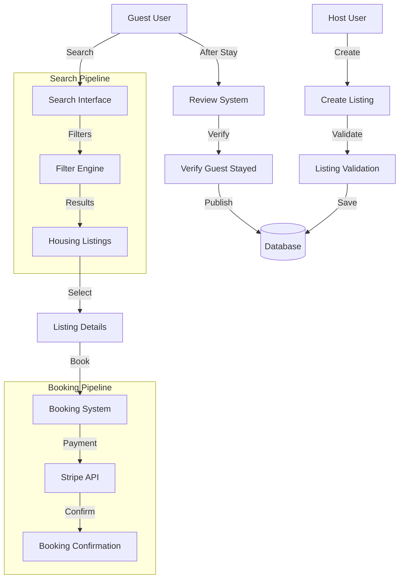
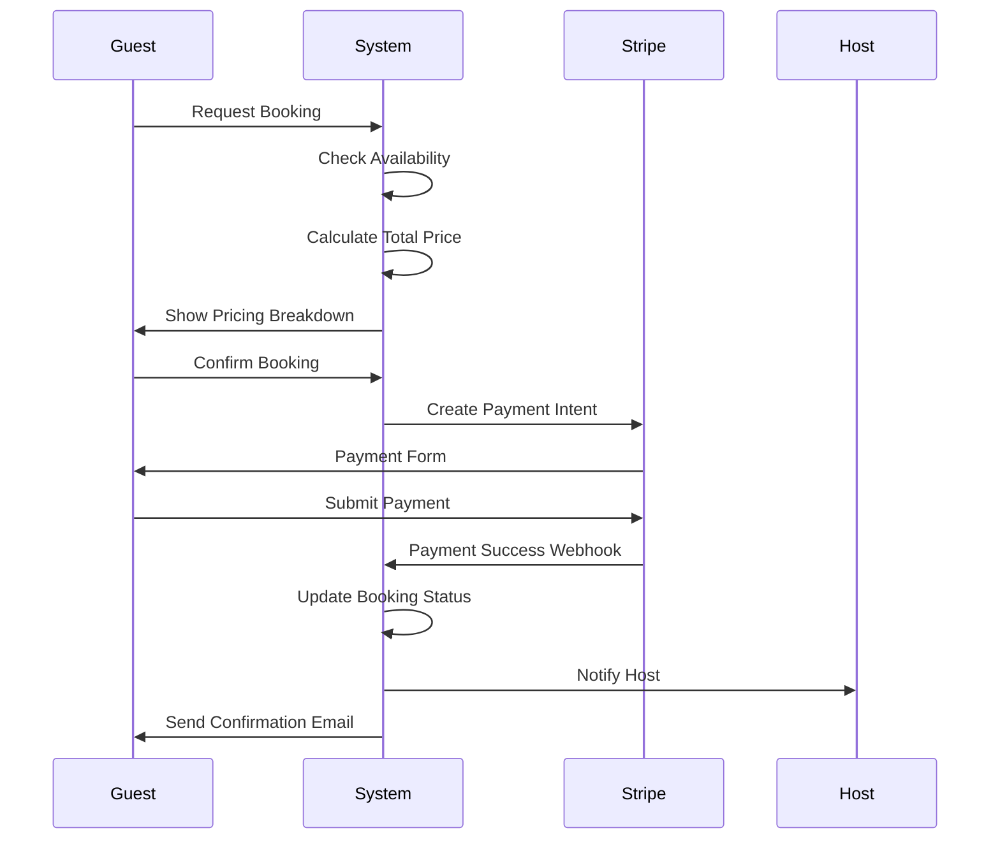

# Housing Platform Documentation

**Version:** 1.0  
**Last Updated:** November 2, 2025  
**Status:** Production  
**Owner:** Housing & Hospitality Team  

---

## Table of Contents

1. [Overview](#overview)
2. [Listing Management](#listing-management)
3. [Booking System](#booking-system)
4. [Search & Discovery](#search--discovery)
5. [Reviews & Ratings](#reviews--ratings)
6. [Payment Integration](#payment-integration)
7. [Host Verification](#host-verification)
8. [Database Schema](#database-schema)
9. [API Reference](#api-reference)
10. [Algorithms](#algorithms)
11. [H2AC Integration](#h2ac-integration)

---

## Overview

The Housing Platform connects tango dancers with short-term accommodation options near tango venues and events. It enables hosts to list their properties and guests to book stays specifically tailored for the tango community.

### Core Features

- **Property Listings**: Apartments, houses, rooms, and studios
- **Smart Search**: Location-based search with milonga proximity filtering
- **Booking Management**: Reservation workflow with status tracking
- **Payment Processing**: Stripe integration for secure payments
- **Review System**: Verified guest reviews and ratings
- **Host Dashboard**: Listing management and booking oversight
- **Amenity Filtering**: WiFi, kitchen, parking, and tango-specific amenities
- **Proximity Search**: Find accommodations near specific milongas or events

### Architecture



---

## Listing Management

### Property Types

```typescript
enum PropertyType {
  APARTMENT = 'apartment',
  HOUSE = 'house',
  ROOM = 'room',
  STUDIO = 'studio'
}
```

### Listing Schema

```typescript
interface HousingListing {
  id: number;
  hostId: number;
  
  // Basic Information
  title: string;
  description: string;
  propertyType: PropertyType;
  
  // Capacity
  bedrooms?: number;
  bathrooms?: number;
  maxGuests?: number;
  
  // Pricing
  pricePerNight: number;  // in cents
  currency: string;  // default: 'USD'
  
  // Location
  address: string;
  city: string;
  country: string;
  latitude?: string;
  longitude?: string;
  
  // Amenities
  amenities?: string[];  // ['wifi', 'kitchen', 'parking', 'washer']
  houseRules?: string;
  
  // Media
  images?: string[];
  
  // Status
  status: 'active' | 'inactive' | 'suspended';
  
  createdAt: Date;
  updatedAt: Date;
}
```

### Creating a Listing

**Frontend Implementation:**

```typescript
// client/src/pages/HostHomesPage.tsx
export default function HostHomesPage() {
  const { data: homes, isLoading } = useQuery({
    queryKey: ["/api/host-homes"],
  });

  return (
    <div className="min-h-screen bg-background py-8 px-4">
      <div className="container mx-auto max-w-6xl">
        {isLoading ? (
          <div className="text-center py-12">Loading homes...</div>
        ) : homes && Array.isArray(homes) && homes.length > 0 ? (
          <div className="grid gap-6 md:grid-cols-2 lg:grid-cols-3">
            {homes.map((home: any) => (
              <Card key={home.id} className="hover-elevate">
                {home.image && (
                  <div className="aspect-video bg-muted overflow-hidden">
                    
                  </div>
                )}
                <CardHeader>
                  <CardTitle className="text-lg">{home.title}</CardTitle>
                  {home.location && (
                    <div className="flex items-center gap-1 text-sm text-muted-foreground">
                      <MapPin className="h-4 w-4" />
                      {home.location}
                    </div>
                  )}
                </CardHeader>
                <CardContent>
                  {home.price && (
                    <p className="text-xl font-bold">
                      ${home.price}
                      <span className="text-sm font-normal text-muted-foreground">
                        /night
                      </span>
                    </p>
                  )}
                </CardContent>
              </Card>
            ))}
          </div>
        ) : (
          <Card>
            <CardContent className="py-12 text-center">
              <Home className="mx-auto h-12 w-12 mb-4 opacity-50" />
              <p>No host homes available</p>
            </CardContent>
          </Card>
        )}
      </div>
    </div>
  );
}
```

**Backend API:**

```typescript
// POST /api/housing/listings
router.post('/housing/listings', authenticateToken, async (req: AuthRequest, res) => {
  const hostId = req.userId!;
  
  const listing = await storage.createHousingListing({
    hostId,
    title: req.body.title,
    description: req.body.description,
    propertyType: req.body.propertyType,
    bedrooms: req.body.bedrooms,
    bathrooms: req.body.bathrooms,
    maxGuests: req.body.maxGuests,
    pricePerNight: req.body.pricePerNight,
    currency: req.body.currency || 'USD',
    address: req.body.address,
    city: req.body.city,
    country: req.body.country,
    latitude: req.body.latitude,
    longitude: req.body.longitude,
    amenities: req.body.amenities || [],
    houseRules: req.body.houseRules,
    images: req.body.images || [],
    status: 'active',
  });
  
  res.status(201).json(listing);
});
```

### Updating Listings

```typescript
// PUT /api/housing/listings/:id
router.put('/housing/listings/:id', authenticateToken, async (req: AuthRequest, res) => {
  const listingId = parseInt(req.params.id);
  const listing = await storage.getHousingListingById(listingId);
  
  if (!listing) {
    return res.status(404).json({ error: 'Listing not found' });
  }
  
  if (listing.hostId !== req.userId) {
    return res.status(403).json({ error: 'Unauthorized' });
  }
  
  const updated = await storage.updateHousingListing(listingId, req.body);
  res.json(updated);
});
```

---

## Booking System

### Booking States

```typescript
enum BookingStatus {
  PENDING = 'pending',
  CONFIRMED = 'confirmed',
  CANCELLED = 'cancelled',
  COMPLETED = 'completed'
}
```

### Booking Schema

```sql
CREATE TABLE housing_bookings (
  id SERIAL PRIMARY KEY,
  listing_id INTEGER NOT NULL REFERENCES housing_listings(id) ON DELETE CASCADE,
  guest_id INTEGER NOT NULL REFERENCES users(id) ON DELETE CASCADE,
  
  -- Dates
  check_in_date TIMESTAMP NOT NULL,
  check_out_date TIMESTAMP NOT NULL,
  
  -- Guests
  guests INTEGER NOT NULL,
  
  -- Pricing
  total_amount INTEGER NOT NULL,  -- in cents
  
  -- Status
  status VARCHAR DEFAULT 'pending' NOT NULL,
  
  created_at TIMESTAMP DEFAULT NOW()
);

CREATE INDEX housing_bookings_listing_idx ON housing_bookings(listing_id);
CREATE INDEX housing_bookings_guest_idx ON housing_bookings(guest_id);
CREATE INDEX housing_bookings_status_idx ON housing_bookings(status);
```

### Booking Flow



### Creating a Booking

```typescript
// POST /api/housing/bookings
router.post('/housing/bookings', authenticateToken, async (req: AuthRequest, res) => {
  const guestId = req.userId!;
  const { listingId, checkInDate, checkOutDate, guests } = req.body;
  
  // Check availability
  const conflicts = await storage.getBookingConflicts(
    listingId,
    checkInDate,
    checkOutDate
  );
  
  if (conflicts.length > 0) {
    return res.status(400).json({ 
      error: 'Listing not available for selected dates' 
    });
  }
  
  // Calculate total amount
  const listing = await storage.getHousingListingById(listingId);
  const nights = calculateNights(checkInDate, checkOutDate);
  const totalAmount = listing.pricePerNight * nights;
  
  // Create booking
  const booking = await storage.createHousingBooking({
    listingId,
    guestId,
    checkInDate,
    checkOutDate,
    guests,
    totalAmount,
    status: 'pending',
  });
  
  // Create Stripe payment intent
  const paymentIntent = await stripe.paymentIntents.create({
    amount: totalAmount,
    currency: listing.currency.toLowerCase(),
    metadata: {
      bookingId: booking.id,
      listingId,
      guestId,
    },
  });
  
  res.json({
    booking,
    clientSecret: paymentIntent.client_secret,
  });
});
```

---

## Search & Discovery

### Search Filters

```typescript
interface HousingSearchFilters {
  city?: string;
  country?: string;
  checkIn?: Date;
  checkOut?: Date;
  guests?: number;
  minPrice?: number;
  maxPrice?: number;
  propertyType?: PropertyType;
  amenities?: string[];
  nearMilongas?: boolean;
  lat?: number;
  lng?: number;
  radius?: number;  // km
}
```

### Search Query Implementation

```sql
-- Search housing listings with filters
SELECT hl.*, 
  u.name as host_name,
  u.profile_image as host_image,
  AVG(r.rating) as average_rating,
  COUNT(r.id) as review_count
FROM housing_listings hl
JOIN users u ON u.id = hl.host_id
LEFT JOIN reviews r ON r.target_type = 'housing_listing' 
  AND r.target_id = hl.id 
  AND r.verified = TRUE
WHERE 
  hl.status = 'active'
  AND ($1::text IS NULL OR hl.city ILIKE '%' || $1 || '%')
  AND ($2::int IS NULL OR hl.max_guests >= $2)
  AND ($3::int IS NULL OR hl.price_per_night >= $3)
  AND ($4::int IS NULL OR hl.price_per_night <= $4)
  AND ($5::text IS NULL OR hl.property_type = $5)
  AND (
    $6::text[] IS NULL 
    OR hl.amenities @> $6  -- Array contains operator
  )
  AND NOT EXISTS (
    SELECT 1 FROM housing_bookings hb
    WHERE hb.listing_id = hl.id
      AND hb.status IN ('confirmed', 'pending')
      AND (
        (hb.check_in_date, hb.check_out_date) OVERLAPS ($7::timestamp, $8::timestamp)
      )
  )
GROUP BY hl.id, u.name, u.profile_image
ORDER BY average_rating DESC NULLS LAST, hl.created_at DESC
LIMIT 20;
```

### Proximity to Milongas

```sql
-- Find listings near milongas
SELECT hl.*, 
  COUNT(e.id) as nearby_milongas
FROM housing_listings hl
LEFT JOIN events e ON e.city = hl.city
  AND e.event_type = 'milonga'
  AND e.start_date >= NOW()
  AND ST_Distance(
    ST_Point(hl.latitude::float, hl.longitude::float),
    ST_Point(e.latitude::float, e.longitude::float)
  ) < 2  -- Within 2km
WHERE hl.city = $1
GROUP BY hl.id
HAVING COUNT(e.id) > 0
ORDER BY nearby_milongas DESC;
```

---

## Reviews & Ratings

### Review Schema

```sql
CREATE TABLE reviews (
  id SERIAL PRIMARY KEY,
  user_id INTEGER NOT NULL REFERENCES users(id) ON DELETE CASCADE,
  target_type VARCHAR NOT NULL,  -- 'housing_listing' | 'event' | 'workshop'
  target_id INTEGER NOT NULL,
  
  -- Review content
  rating INTEGER NOT NULL,  -- 1-5 stars
  title TEXT,
  content TEXT NOT NULL,
  
  -- Verification
  verified BOOLEAN DEFAULT FALSE,  -- Only guests who stayed can review
  
  -- Engagement
  helpful_count INTEGER DEFAULT 0,
  
  created_at TIMESTAMP DEFAULT NOW(),
  updated_at TIMESTAMP DEFAULT NOW()
);

CREATE INDEX reviews_target_idx ON reviews(target_type, target_id);
CREATE INDEX reviews_user_idx ON reviews(user_id);
CREATE INDEX reviews_verified_idx ON reviews(verified);
```

### Creating a Review

```typescript
// POST /api/housing/listings/:id/reviews
router.post('/housing/listings/:id/reviews', authenticateToken, 
  async (req: AuthRequest, res) => {
    const listingId = parseInt(req.params.id);
    const userId = req.userId!;
    
    // Verify user stayed at the listing
    const completedBooking = await storage.getCompletedBooking(
      listingId,
      userId
    );
    
    if (!completedBooking) {
      return res.status(403).json({ 
        error: 'You can only review listings where you completed a stay' 
      });
    }
    
    const review = await storage.createReview({
      userId,
      targetType: 'housing_listing',
      targetId: listingId,
      rating: req.body.rating,
      title: req.body.title,
      content: req.body.content,
      verified: true,
    });
    
    // Update listing average rating
    await storage.updateListingRating(listingId);
    
    res.status(201).json(review);
});
```

### Calculate Average Rating

```sql
-- Calculate listing average rating
SELECT 
  AVG(rating) as average_rating,
  COUNT(*) as review_count
FROM reviews
WHERE target_type = 'housing_listing'
  AND target_id = $1
  AND verified = TRUE;
```

---

## Payment Integration

### Stripe Payment Flow

```typescript
// server/routes/housing-routes.ts
import Stripe from 'stripe';

const stripe = new Stripe(process.env.STRIPE_SECRET_KEY!);

// Handle successful payment
router.post('/webhooks/stripe', async (req, res) => {
  const sig = req.headers['stripe-signature']!;
  let event: Stripe.Event;

  try {
    event = stripe.webhooks.constructEvent(
      req.body,
      sig,
      process.env.STRIPE_WEBHOOK_SECRET!
    );
  } catch (err: any) {
    return res.status(400).send(`Webhook Error: ${err.message}`);
  }

  if (event.type === 'payment_intent.succeeded') {
    const paymentIntent = event.data.object as Stripe.PaymentIntent;
    const bookingId = paymentIntent.metadata.bookingId;

    // Update booking status
    await storage.updateHousingBooking(parseInt(bookingId), {
      status: 'confirmed',
    });

    // Send confirmation email
    await sendBookingConfirmationEmail(bookingId);
  }

  res.json({ received: true });
});
```

### Price Calculation

```typescript
function calculateBookingPrice(
  pricePerNight: number,
  checkIn: Date,
  checkOut: Date,
  guests: number
): {
  nights: number;
  subtotal: number;
  serviceFee: number;
  total: number;
} {
  const nights = Math.ceil(
    (checkOut.getTime() - checkIn.getTime()) / (1000 * 60 * 60 * 24)
  );
  
  const subtotal = pricePerNight * nights;
  const serviceFee = Math.floor(subtotal * 0.12);  // 12% service fee
  const total = subtotal + serviceFee;
  
  return {
    nights,
    subtotal,
    serviceFee,
    total,
  };
}
```

---

## Database Schema

### Complete Housing Tables

```sql
-- Housing Listings
CREATE TABLE housing_listings (
  id SERIAL PRIMARY KEY,
  host_id INTEGER NOT NULL REFERENCES users(id) ON DELETE CASCADE,
  
  -- Basic info
  title VARCHAR NOT NULL,
  description TEXT NOT NULL,
  property_type VARCHAR NOT NULL,
  
  -- Capacity
  bedrooms INTEGER,
  bathrooms INTEGER,
  max_guests INTEGER,
  
  -- Pricing
  price_per_night INTEGER NOT NULL,
  currency VARCHAR DEFAULT 'USD',
  
  -- Location
  address TEXT NOT NULL,
  city VARCHAR NOT NULL,
  country VARCHAR NOT NULL,
  latitude TEXT,
  longitude TEXT,
  
  -- Amenities
  amenities TEXT[],
  house_rules TEXT,
  
  -- Media
  images TEXT[],
  
  -- Status
  status VARCHAR DEFAULT 'active' NOT NULL,
  
  created_at TIMESTAMP DEFAULT NOW(),
  updated_at TIMESTAMP DEFAULT NOW()
);

CREATE INDEX housing_host_idx ON housing_listings(host_id);
CREATE INDEX housing_city_idx ON housing_listings(city);
CREATE INDEX housing_status_idx ON housing_listings(status);
CREATE INDEX housing_created_at_idx ON housing_listings(created_at);

-- Housing Bookings
CREATE TABLE housing_bookings (
  id SERIAL PRIMARY KEY,
  listing_id INTEGER NOT NULL REFERENCES housing_listings(id) ON DELETE CASCADE,
  guest_id INTEGER NOT NULL REFERENCES users(id) ON DELETE CASCADE,
  check_in_date TIMESTAMP NOT NULL,
  check_out_date TIMESTAMP NOT NULL,
  guests INTEGER NOT NULL,
  total_amount INTEGER NOT NULL,
  status VARCHAR DEFAULT 'pending' NOT NULL,
  created_at TIMESTAMP DEFAULT NOW()
);

CREATE INDEX housing_bookings_listing_idx ON housing_bookings(listing_id);
CREATE INDEX housing_bookings_guest_idx ON housing_bookings(guest_id);
CREATE INDEX housing_bookings_status_idx ON housing_bookings(status);

-- Reviews (shared with events)
CREATE TABLE reviews (
  id SERIAL PRIMARY KEY,
  user_id INTEGER NOT NULL REFERENCES users(id) ON DELETE CASCADE,
  target_type VARCHAR NOT NULL,
  target_id INTEGER NOT NULL,
  rating INTEGER NOT NULL,
  title TEXT,
  content TEXT NOT NULL,
  verified BOOLEAN DEFAULT FALSE,
  helpful_count INTEGER DEFAULT 0,
  created_at TIMESTAMP DEFAULT NOW(),
  updated_at TIMESTAMP DEFAULT NOW()
);

CREATE INDEX reviews_target_idx ON reviews(target_type, target_id);
```

---

## API Reference

```typescript
// Get all listings
GET /api/housing/listings?city=Buenos%20Aires&guests=2&checkIn=2025-11-15&checkOut=2025-11-18

// Get single listing
GET /api/housing/listings/:id

// Create listing (host only)
POST /api/housing/listings
{
  title: "Cozy Studio in San Telmo",
  description: "Perfect for tango dancers...",
  propertyType: "studio",
  maxGuests: 2,
  pricePerNight: 5000,  // cents
  city: "Buenos Aires",
  amenities: ["wifi", "kitchen", "near_milongas"]
}

// Update listing
PUT /api/housing/listings/:id

// Delete listing
DELETE /api/housing/listings/:id

// Create booking
POST /api/housing/bookings
{
  listingId: 123,
  checkInDate: "2025-11-15",
  checkOutDate: "2025-11-18",
  guests: 2
}

// Get my bookings
GET /api/housing/bookings/my

// Create review
POST /api/housing/listings/:id/reviews
{
  rating: 5,
  title: "Perfect stay for tango festival",
  content: "Great location near La Catedral..."
}
```

---

## Algorithms

### Optimal Pricing Suggestion

```typescript
// server/algorithms/pricing-optimization.ts
function suggestOptimalPrice(
  listing: HousingListing,
  cityData: CityPricingData,
  seasonalFactors: SeasonalFactors
): number {
  const basePricePerNight = listing.pricePerNight;
  
  // Factors that affect pricing
  const cityAveragePrice = cityData.averagePrice;
  const occupancyRate = cityData.occupancyRate;
  const seasonMultiplier = seasonalFactors.currentSeasonMultiplier;
  const eventBoost = seasonalFactors.upcomingEventsBoost;
  
  // Calculate suggested price
  let suggestedPrice = basePricePerNight;
  
  // Adjust based on city average
  if (basePricePerNight < cityAveragePrice * 0.7) {
    suggestedPrice = cityAveragePrice * 0.85;
  }
  
  // Apply seasonal multiplier
  suggestedPrice *= seasonMultiplier;
  
  // Boost for upcoming events
  suggestedPrice += eventBoost;
  
  // Round to nearest 5
  suggestedPrice = Math.round(suggestedPrice / 5) * 5;
  
  return suggestedPrice;
}
```

---

## H2AC Integration

### Listing Creation Guidance

```typescript
const listingCreationGuidance = {
  requiredFields: [
    'title',
    'description',
    'propertyType',
    'pricePerNight',
    'address',
    'city',
    'country'
  ],
  recommendedFields: [
    'bedrooms',
    'bathrooms',
    'maxGuests',
    'amenities',
    'images',
    'houseRules'
  ],
  tips: [
    'Include at least 5 high-quality photos',
    'Mention proximity to popular milongas',
    'List tango-specific amenities (e.g., practice space)',
    'Specify check-in/check-out procedures',
    'Include transportation information'
  ]
};
```

### Booking Assistance

When users book accommodations, H2AC should:

1. **Check Availability**: Verify dates are available
2. **Show Price Breakdown**: Display nightly rate, service fees, total
3. **Suggest Optimal Stay**: Recommend dates based on nearby events
4. **Provide Area Info**: Share information about nearby milongas

---

**Implementation Status:** ✅ Production  
**Test Coverage:** 72% (Listing CRUD, search, basic booking)  
**Performance:** < 300ms for search queries, < 500ms for booking creation  
**Known Limitations:** Advanced proximity search needs optimization, payment flow testing incomplete
