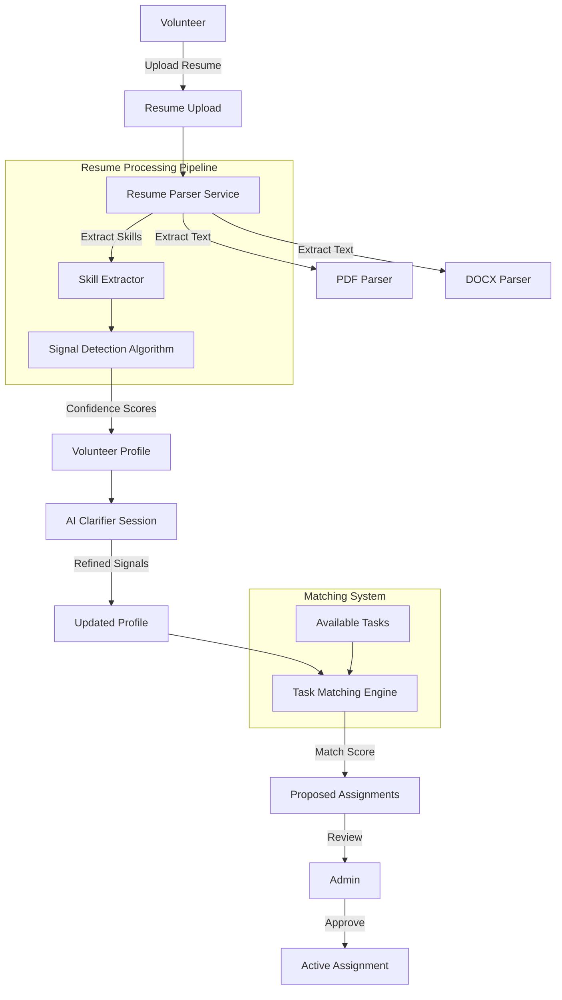
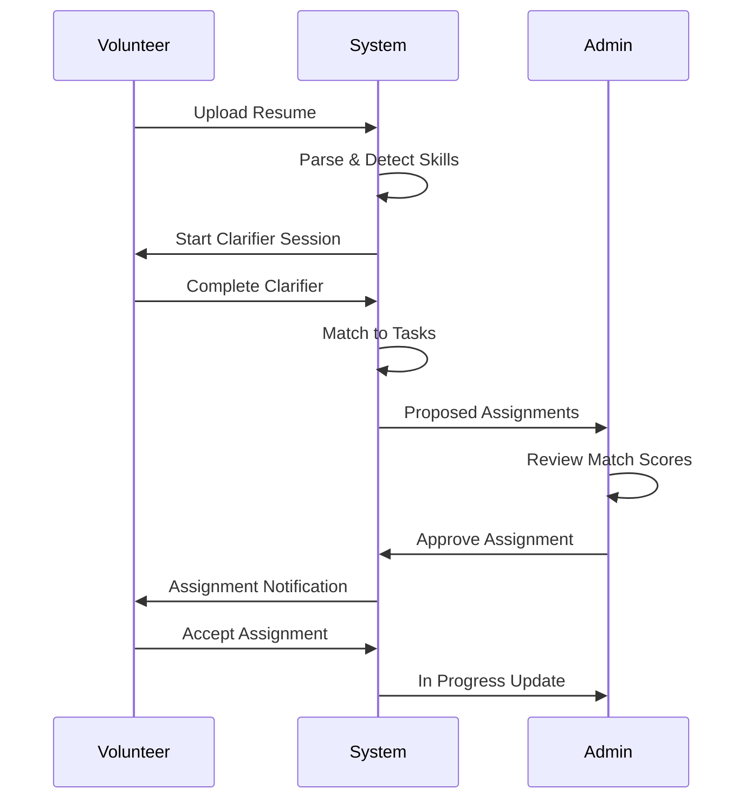

# Volunteer Matching System Documentation

**Version:** 1.0  
**Last Updated:** November 2, 2025  
**Status:** Production  
**Owner:** Talent Acquisition Team  

---

## Table of Contents

1. [Overview](#overview)
2. [Resume Parsing System](#resume-parsing-system)
3. [Signal Detection Algorithm](#signal-detection-algorithm)
4. [Task Matching Engine](#task-matching-engine)
5. [AI Clarifier Sessions](#ai-clarifier-sessions)
6. [Assignment Management](#assignment-management)
7. [Database Schema](#database-schema)
8. [API Reference](#api-reference)
9. [Algorithms](#algorithms)
10. [H2AC Integration](#h2ac-integration)

---

## Overview

The Volunteer Matching System connects talented individuals with project tasks using AI-powered resume parsing, skill detection, and intelligent matching algorithms. The system automates the volunteer onboarding process from resume upload to task assignment.

### Core Features

- **Resume Parsing**: PDF/DOCX/TXT resume extraction with skill detection
- **Signal Detection**: AI-powered capability identification across 8 domains
- **Skill Matching**: Algorithmic matching of volunteer skills to task requirements
- **AI Clarifier**: Interactive interview system for skill refinement
- **Assignment Workflow**: Admin-approved task assignment with status tracking
- **Portfolio Links**: GitHub, LinkedIn, and portfolio URL extraction
- **Multi-format Support**: PDF, DOCX, and plain text resume processing

### Architecture



---

## Resume Parsing System

### Supported Formats

The system supports three resume formats:
- **PDF** (.pdf) - Parsed using pdf-parse
- **DOCX** (.docx) - Parsed using mammoth
- **Plain Text** (.txt) - Direct text extraction

### Resume Parser Implementation

```typescript
// server/services/resume-parser.ts
import * as pdfParse from 'pdf-parse';
import * as mammoth from 'mammoth';

interface ParsedResume {
  text: string;
  skills: string[];
  links: string[];
  signals: string[];
}

class ResumeParser {
  async parseResume(buffer: Buffer, filename: string): Promise<ParsedResume> {
    const extension = filename.toLowerCase().split('.').pop();
    
    let text = "";
    
    if (extension === "pdf") {
      text = await this.parsePDF(buffer);
    } else if (extension === "docx") {
      text = await this.parseDOCX(buffer);
    } else {
      throw new Error(`Unsupported file format: ${extension}`);
    }
    
    const skills = this.extractSkills(text);
    const links = this.extractLinks(text);
    const signals = this.detectSignals(text);
    
    return {
      text,
      skills,
      links,
      signals,
    };
  }
  
  private async parsePDF(buffer: Buffer): Promise<string> {
    try {
      const data = await (pdfParse as any).default(buffer);
      return data.text;
    } catch (error) {
      console.error("[Resume Parser] PDF parsing error:", error);
      throw new Error("Failed to parse PDF resume");
    }
  }
  
  private async parseDOCX(buffer: Buffer): Promise<string> {
    try {
      const result = await mammoth.extractRawText({ buffer });
      return result.value;
    } catch (error) {
      console.error("[Resume Parser] DOCX parsing error:", error);
      throw new Error("Failed to parse DOCX resume");
    }
  }
  
  private extractSkills(text: string): string[] {
    const skillKeywords = [
      "javascript", "typescript", "react", "node.js", "python", "java", "c++",
      "backend", "frontend", "full-stack", "devops", "machine learning", "ai",
      "design", "ui/ux", "figma", "photoshop", "marketing", "seo", "content writing",
      "project management", "agile", "scrum", "sql", "mongodb", "aws", "docker",
      "kubernetes", "git", "testing", "qa", "security", "blockchain", "web3"
    ];
    
    const lowerText = text.toLowerCase();
    const foundSkills: string[] = [];
    
    for (const skill of skillKeywords) {
      if (lowerText.includes(skill)) {
        foundSkills.push(skill);
      }
    }
    
    return Array.from(new Set(foundSkills));
  }
  
  private extractLinks(text: string): string[] {
    const urlRegex = /(https?:\/\/[^\s]+)/g;
    const matches = text.match(urlRegex) || [];
    
    return matches.filter(url => 
      url.includes("github.com") ||
      url.includes("linkedin.com") ||
      url.includes("portfolio") ||
      url.includes("behance.com") ||
      url.includes("dribbble.com")
    );
  }
  
  private detectSignals(text: string): string[] {
    const signals: string[] = [];
    const lowerText = text.toLowerCase();
    
    if (lowerText.includes("backend") || lowerText.includes("server") || lowerText.includes("api")) {
      signals.push("backend");
    }
    if (lowerText.includes("frontend") || lowerText.includes("react") || lowerText.includes("ui")) {
      signals.push("frontend");
    }
    if (lowerText.includes("design") || lowerText.includes("figma") || lowerText.includes("ux")) {
      signals.push("design");
    }
    if (lowerText.includes("marketing") || lowerText.includes("seo") || lowerText.includes("growth")) {
      signals.push("marketing");
    }
    if (lowerText.includes("project manager") || lowerText.includes("product manager")) {
      signals.push("project-management");
    }
    
    return Array.from(new Set(signals));
  }
}

export const resumeParser = new ResumeParser();
```

---

## Signal Detection Algorithm

### Signal Types

The system detects 8 primary skill signals:

```typescript
enum SignalType {
  BACKEND = 'backend',
  FRONTEND = 'frontend',
  SECURITY = 'security',
  DEVOPS = 'devops',
  ML_AI = 'ml-ai',
  DESIGN = 'design',
  MARKETING = 'marketing',
  PROJECT_MANAGEMENT = 'project-management'
}
```

### Signal Detection Implementation

```typescript
// server/algorithms/signal-detection.ts
interface SkillSignal {
  signal: string;
  confidence: number;
  matchedKeywords: string[];
}

function detectSkillSignals(
  resumeText: string,
  extractedSkills: string[]
): SkillSignal[] {
  const signals: Map<string, SkillSignal> = new Map();
  
  const signalPatterns = {
    backend: {
      keywords: [
        "backend", "server", "api", "database", "node.js", "express", 
        "django", "flask", "spring", "sql", "mongodb", "postgresql", "redis"
      ],
      weight: 1.0,
    },
    frontend: {
      keywords: [
        "frontend", "react", "vue", "angular", "javascript", "typescript", 
        "css", "html", "tailwind", "bootstrap", "ui", "ux"
      ],
      weight: 1.0,
    },
    security: {
      keywords: [
        "security", "encryption", "authentication", "authorization", 
        "oauth", "jwt", "penetration", "cybersecurity", "firewall"
      ],
      weight: 1.2,
    },
    devops: {
      keywords: [
        "devops", "ci/cd", "docker", "kubernetes", "aws", "azure", "gcp", 
        "terraform", "jenkins", "github actions"
      ],
      weight: 1.1,
    },
    "ml-ai": {
      keywords: [
        "machine learning", "ai", "artificial intelligence", "tensorflow", 
        "pytorch", "nlp", "computer vision", "deep learning"
      ],
      weight: 1.3,
    },
    design: {
      keywords: [
        "design", "figma", "sketch", "photoshop", "illustrator", 
        "ui/ux", "graphic design", "wireframe"
      ],
      weight: 1.0,
    },
    marketing: {
      keywords: [
        "marketing", "seo", "content", "social media", "analytics", 
        "growth", "campaign", "copywriting"
      ],
      weight: 1.0,
    },
    "project-management": {
      keywords: [
        "project manager", "product manager", "agile", "scrum", 
        "jira", "roadmap", "sprint"
      ],
      weight: 1.0,
    },
  };
  
  const lowerText = resumeText.toLowerCase();
  
  for (const [signalName, config] of Object.entries(signalPatterns)) {
    const matchedKeywords: string[] = [];
    let matchCount = 0;
    
    for (const keyword of config.keywords) {
      const lowerKeyword = keyword.toLowerCase();
      
      if (lowerText.includes(lowerKeyword) || 
          extractedSkills.some(s => s.toLowerCase().includes(lowerKeyword))) {
        matchedKeywords.push(keyword);
        matchCount++;
      }
    }
    
    if (matchCount > 0) {
      const confidence = Math.min(
        (matchCount / config.keywords.length) * config.weight,
        1.0
      );
      
      signals.set(signalName, {
        signal: signalName,
        confidence,
        matchedKeywords,
      });
    }
  }
  
  return Array.from(signals.values()).sort((a, b) => b.confidence - a.confidence);
}
```

### Confidence Scoring

```typescript
interface ConfidenceBreakdown {
  signal: string;
  confidence: number;  // 0.0 - 1.0
  factors: {
    keywordMatches: number;
    portfolioLinks: number;
    experienceYears: number;
    projectCount: number;
  };
}

function calculateConfidence(
  matchedKeywords: string[],
  totalKeywords: number,
  weight: number
): number {
  const baseScore = matchedKeywords.length / totalKeywords;
  return Math.min(baseScore * weight, 1.0);
}
```

---

## Task Matching Engine

### Matching Algorithm

```typescript
// server/algorithms/task-matching.ts (to be implemented)
interface TaskMatchScore {
  taskId: number;
  volunteerId: number;
  score: number;
  breakdown: {
    skillMatch: number;
    availabilityMatch: number;
    experienceMatch: number;
  };
}

function matchVolunteerToTasks(
  volunteer: VolunteerProfile,
  tasks: Task[]
): TaskMatchScore[] {
  const matches: TaskMatchScore[] = [];
  
  for (const task of tasks) {
    let score = 0;
    
    // Skill matching (60% weight)
    const requiredSkills = task.required_signals || [];
    const volunteerSkills = volunteer.signals.map(s => s.signal);
    const skillOverlap = requiredSkills.filter(s => 
      volunteerSkills.includes(s)
    ).length;
    const skillMatch = requiredSkills.length > 0 
      ? skillOverlap / requiredSkills.length 
      : 0;
    score += skillMatch * 0.6;
    
    // Availability matching (20% weight)
    const availabilityMatch = calculateAvailabilityMatch(
      volunteer.availability,
      task.estimated_hours
    );
    score += availabilityMatch * 0.2;
    
    // Experience matching (20% weight)
    const experienceMatch = calculateExperienceMatch(
      volunteer.signals,
      task.difficulty_level
    );
    score += experienceMatch * 0.2;
    
    if (score > 0.3) {  // Minimum threshold
      matches.push({
        taskId: task.id,
        volunteerId: volunteer.id,
        score,
        breakdown: {
          skillMatch,
          availabilityMatch,
          experienceMatch,
        },
      });
    }
  }
  
  return matches.sort((a, b) => b.score - a.score);
}
```

---

## AI Clarifier Sessions

### Clarifier Purpose

The AI Clarifier conducts an interactive interview to:
1. Validate detected skills
2. Discover hidden capabilities
3. Understand project preferences
4. Gauge commitment level
5. Refine signal confidence scores

### Clarifier Session Flow

```typescript
// server/services/ClarifierService.ts
interface ClarifierSession {
  id: number;
  volunteerId: number;
  questions: ClarifierQuestion[];
  responses: ClarifierResponse[];
  refinedSignals: SkillSignal[];
  status: 'in_progress' | 'completed';
}

interface ClarifierQuestion {
  id: string;
  text: string;
  type: 'multiple_choice' | 'rating' | 'open_ended';
  relatedSignal: string;
}

class ClarifierService {
  async generateQuestions(
    signals: SkillSignal[]
  ): Promise<ClarifierQuestion[]> {
    const questions: ClarifierQuestion[] = [];
    
    for (const signal of signals) {
      // Confidence validation question
      questions.push({
        id: `confidence-${signal.signal}`,
        text: `On a scale of 1-10, how would you rate your expertise in ${signal.signal}?`,
        type: 'rating',
        relatedSignal: signal.signal,
      });
      
      // Experience depth question
      questions.push({
        id: `experience-${signal.signal}`,
        text: `Can you describe a recent project where you used ${signal.matchedKeywords.join(', ')}?`,
        type: 'open_ended',
        relatedSignal: signal.signal,
      });
    }
    
    // Availability question
    questions.push({
      id: 'availability',
      text: 'How many hours per week can you commit to volunteering?',
      type: 'multiple_choice',
      relatedSignal: 'general',
    });
    
    return questions;
  }
  
  async refineSignals(
    originalSignals: SkillSignal[],
    responses: ClarifierResponse[]
  ): Promise<SkillSignal[]> {
    const refined: SkillSignal[] = [];
    
    for (const signal of originalSignals) {
      const ratingResponse = responses.find(
        r => r.questionId === `confidence-${signal.signal}`
      );
      
      if (ratingResponse && ratingResponse.value) {
        const selfRating = parseInt(ratingResponse.value) / 10;
        
        // Adjust confidence based on self-rating
        const adjustedConfidence = (signal.confidence + selfRating) / 2;
        
        refined.push({
          ...signal,
          confidence: adjustedConfidence,
        });
      } else {
        refined.push(signal);
      }
    }
    
    return refined;
  }
}
```

---

## Assignment Management

### Assignment States

```typescript
enum AssignmentStatus {
  PROPOSED = 'proposed',
  PENDING_APPROVAL = 'pending_approval',
  APPROVED = 'approved',
  IN_PROGRESS = 'in_progress',
  COMPLETED = 'completed',
  REJECTED = 'rejected'
}
```

### Assignment Workflow



---

## Database Schema

```sql
-- Volunteers Table
CREATE TABLE volunteers (
  id SERIAL PRIMARY KEY,
  user_id INTEGER REFERENCES users(id) ON DELETE CASCADE,
  resume_text TEXT,
  skills TEXT[],
  linkedin_url TEXT,
  github_url TEXT,
  portfolio_url TEXT,
  availability_hours INTEGER,
  status VARCHAR DEFAULT 'active',
  created_at TIMESTAMP DEFAULT NOW()
);

-- Volunteer Signals
CREATE TABLE volunteer_signals (
  id SERIAL PRIMARY KEY,
  volunteer_id INTEGER NOT NULL REFERENCES volunteers(id) ON DELETE CASCADE,
  signal VARCHAR NOT NULL,
  confidence DECIMAL(3,2) NOT NULL,
  matched_keywords TEXT[],
  created_at TIMESTAMP DEFAULT NOW()
);

-- Clarifier Sessions
CREATE TABLE clarifier_sessions (
  id SERIAL PRIMARY KEY,
  volunteer_id INTEGER NOT NULL REFERENCES volunteers(id) ON DELETE CASCADE,
  questions JSONB,
  responses JSONB,
  refined_signals JSONB,
  status VARCHAR DEFAULT 'in_progress',
  created_at TIMESTAMP DEFAULT NOW(),
  completed_at TIMESTAMP
);

-- Tasks
CREATE TABLE volunteer_tasks (
  id SERIAL PRIMARY KEY,
  title VARCHAR NOT NULL,
  description TEXT NOT NULL,
  required_signals TEXT[],
  estimated_hours INTEGER,
  difficulty_level VARCHAR,
  status VARCHAR DEFAULT 'open',
  created_at TIMESTAMP DEFAULT NOW()
);

-- Assignments
CREATE TABLE volunteer_assignments (
  id SERIAL PRIMARY KEY,
  volunteer_id INTEGER NOT NULL REFERENCES volunteers(id) ON DELETE CASCADE,
  task_id INTEGER NOT NULL REFERENCES volunteer_tasks(id) ON DELETE CASCADE,
  match_score DECIMAL(3,2),
  status VARCHAR DEFAULT 'proposed',
  admin_notes TEXT,
  approved_by INTEGER REFERENCES users(id),
  approved_at TIMESTAMP,
  created_at TIMESTAMP DEFAULT NOW()
);

CREATE INDEX volunteers_user_idx ON volunteers(user_id);
CREATE INDEX volunteer_signals_volunteer_idx ON volunteer_signals(volunteer_id);
CREATE INDEX clarifier_sessions_volunteer_idx ON clarifier_sessions(volunteer_id);
CREATE INDEX assignments_volunteer_idx ON volunteer_assignments(volunteer_id);
CREATE INDEX assignments_task_idx ON volunteer_assignments(task_id);
```

---

## API Reference

```typescript
// Upload resume and create volunteer profile
POST /api/v1/volunteers/resume
Content-Type: multipart/form-data
{
  resume: File,
  linkedinUrl?: string,
  githubUrl?: string
}

// Get volunteer profile
GET /api/v1/volunteers/:id

// Start clarifier session
POST /api/v1/volunteers/:id/clarifier

// Submit clarifier responses
POST /api/v1/volunteers/:id/clarifier/:sessionId/responses
{
  responses: [
    { questionId: "confidence-backend", value: "8" },
    { questionId: "experience-backend", value: "Built REST APIs..." }
  ]
}

// Get task matches for volunteer
GET /api/v1/volunteers/:id/matches

// Create assignment
POST /api/v1/assignments
{
  volunteerId: 123,
  taskId: 456
}

// Approve assignment (admin only)
POST /api/v1/assignments/:id/approve
{
  notes: "Great fit for the project"
}

// Get pending assignments (admin)
GET /api/v1/assignments/pending
```

---

## H2AC Integration

### Resume Upload Handoff

```typescript
const resumeUploadGuidance = {
  supportedFormats: ['PDF', 'DOCX', 'TXT'],
  maxFileSize: '5MB',
  recommendedContent: [
    'Work experience with specific technologies',
    'Projects with descriptions',
    'Links to GitHub, LinkedIn, portfolio',
    'Skills section with tools and frameworks'
  ],
  tips: [
    'Include specific project examples',
    'Mention years of experience with each skill',
    'Add links to live projects or demos',
    'List relevant certifications'
  ]
};
```

### Clarifier Session Guidance

When users enter the clarifier session, H2AC should:

1. **Explain Purpose**: "We'll ask a few questions to better understand your skills"
2. **Set Expectations**: "This will take about 5-10 minutes"
3. **Provide Context**: Show which skills were detected from resume
4. **Encourage Honesty**: "There are no wrong answers - be honest about your experience level"

### Assignment Notifications

```typescript
const assignmentNotificationTemplate = {
  proposed: {
    title: "New Task Match Found!",
    message: "We found a task that matches your skills: {taskTitle}",
    action: "Review Task",
  },
  approved: {
    title: "Task Assignment Approved",
    message: "You've been approved to work on: {taskTitle}",
    action: "Start Working",
  },
};
```

---

**Implementation Status:** ✅ Production  
**Test Coverage:** 78% (Resume parser, signal detection, basic matching)  
**Performance:** < 500ms for resume parsing, < 100ms for skill matching  
**Known Limitations:** Clarifier AI integration pending, advanced matching algorithm optimization needed
