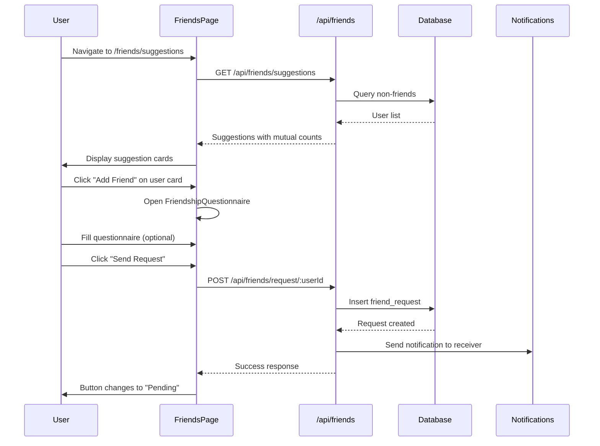
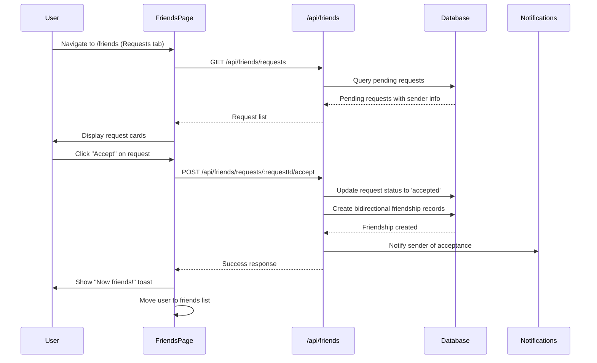
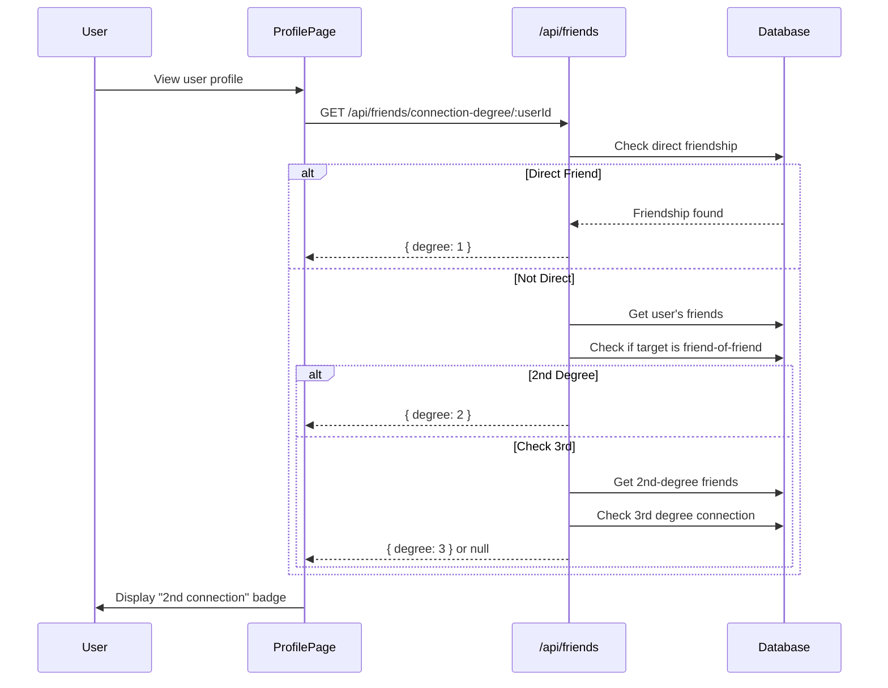
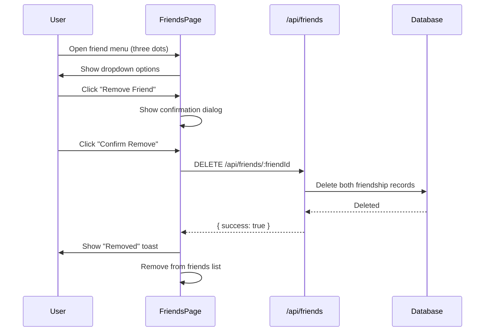
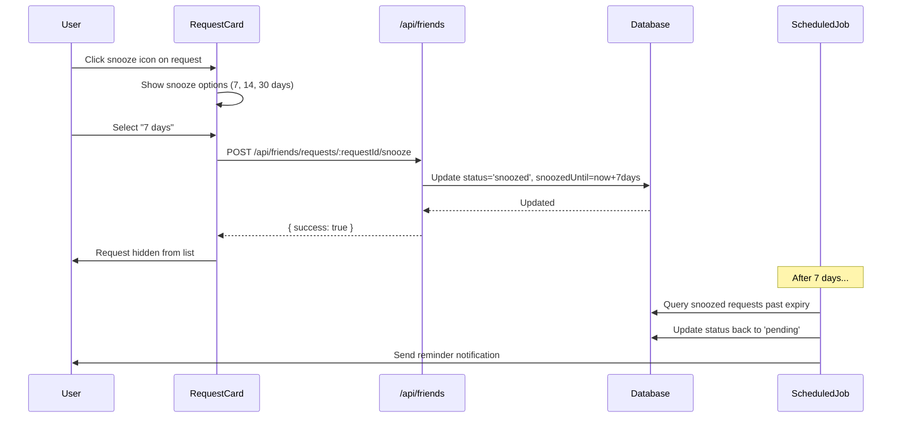

# PRD: Friendship System (Social Connection Network)

**Version:** 1.0  
**Created:** November 30, 2025  
**Pattern Applied:** MB.MD v9.6 Pattern 39 - 5-Source Methodology  
**Priority:** P1 (Core Social Feature)  
**Reference:** Friends Network & Social Connectivity

---

## 1. Overview

### 1.1 Purpose
The Friendship System provides a comprehensive social networking layer for Mundo Tango, enabling dancers to build meaningful connections with others in the tango community. It manages friend requests, active friendships, mutual friends discovery, connection degrees (1st/2nd/3rd), and closeness scoring based on shared activities. Unlike simple follow systems, this promotes intentional, reciprocal relationships between dancers.

### 1.2 Business Value
- **Community Building:** Creates interconnected dancer networks that increase retention
- **Event Discovery:** Friends attending events drive organic event promotion
- **Trust Network:** Connection degrees help users identify verified community members
- **Engagement Loop:** Closeness scores incentivize ongoing interaction
- **Premium Potential:** Advanced friend analytics and network insights for Pro users

### 1.3 Key Metrics
- Friend requests sent per user per month
- Request acceptance rate
- Average friends per active user
- Closeness score distribution
- Mutual friend utilization rate
- Friend-driven event attendance

### 1.4 Target Users
- **Dancers:** Connect with dance partners and community members
- **Organizers:** Build attendee networks for event promotion
- **Teachers:** Maintain student relationships
- **Newcomers:** Discover community through friend suggestions

---

## 2. Database Schema

### 2.1 Friend Requests Table

#### `friend_requests`
Manages the friend request lifecycle from initiation through resolution.

| Column | Type | Nullable | Default | Description |
|--------|------|----------|---------|-------------|
| id | serial | No | auto | Primary key |
| senderId | integer | No | - | FK to users.id (request initiator) |
| receiverId | integer | No | - | FK to users.id (request target) |
| status | varchar | No | 'pending' | pending/accepted/declined/cancelled/snoozed |
| createdAt | timestamp | No | now() | Request creation time |
| respondedAt | timestamp | Yes | null | When request was acted upon |
| didWeDance | boolean | No | false | Whether users danced together |
| danceLocation | text | Yes | null | Where they danced (city/venue) |
| danceEventId | integer | Yes | null | FK to events.id (event where they met) |
| danceStory | text | Yes | null | Story about their dance connection |
| senderMessage | text | Yes | null | Public message from sender |
| senderPrivateNote | text | Yes | null | Private note (sender only sees) |
| receiverMessage | text | Yes | null | Message from receiver upon accept |
| receiverPrivateNote | text | Yes | null | Private note (receiver only sees) |
| mediaUrls | text[] | Yes | null | Array of attached media URLs |
| snoozedUntil | timestamp | Yes | null | Snooze expiration time |
| snoozeReminderSent | boolean | No | false | Whether reminder was sent |
| sentAt | timestamp | No | now() | Alias for createdAt |
| updatedAt | timestamp | No | now() | Last modification time |

**Indexes:**
- `friend_requests_sender_idx` on senderId
- `friend_requests_receiver_idx` on receiverId
- `friend_requests_status_idx` on status
- `friend_requests_snoozed_idx` on snoozedUntil
- `friend_requests_dance_event_idx` on danceEventId
- `friend_requests_created_at_idx` on createdAt
- `friend_requests_sender_status_idx` on (senderId, status)
- `friend_requests_receiver_status_idx` on (receiverId, status)
- `unique_friend_request` UNIQUE on (senderId, receiverId)

**Request Status Values:**
| Status | Description |
|--------|-------------|
| pending | Awaiting receiver action |
| accepted | Friendship established |
| declined | Request rejected |
| cancelled | Sender withdrew request |
| snoozed | Temporarily hidden (auto-resurfaces) |

### 2.2 Friendships Table

#### `friendships`
Represents established friendships between users.

| Column | Type | Nullable | Default | Description |
|--------|------|----------|---------|-------------|
| id | serial | No | auto | Primary key |
| userId | integer | No | - | FK to users.id (one side of friendship) |
| friendId | integer | No | - | FK to users.id (other side of friendship) |
| createdAt | timestamp | No | now() | Friendship established date |
| closenessScore | integer | No | 75 | 0-100 relationship strength score |
| connectionDegree | integer | No | 1 | Always 1 for direct friends |
| lastInteractionAt | timestamp | Yes | now() | Last activity between friends |
| status | varchar | No | 'active' | active/blocked |

**Indexes:**
- `friendships_user_idx` on userId
- `friendships_friend_idx` on friendId
- `friendships_closeness_idx` on closenessScore
- `unique_friendship` UNIQUE on (userId, friendId)

**Closeness Score Mechanics:**
| Score Range | Label | Description |
|-------------|-------|-------------|
| 90-100 | Intimate | Close dance partners, frequent interaction |
| 75-89 | Strong | Regular contact, event attendance together |
| 50-74 | Moderate | Occasional interaction |
| 25-49 | Weak | Infrequent contact |
| 0-24 | Dormant | No recent interaction |

**Score Modifiers:**
| Activity | Points | Max Contribution |
|----------|--------|------------------|
| Event attended together | +5 per event | +25 |
| Message sent | +1 per message | +10 |
| Danced together | +10 per dance | +20 |
| Days inactive > 30 | -5 | - |
| Days inactive > 90 | -15 | - |
| Initial (danced before connecting) | +5 | +5 |

### 2.3 Friendship Activities Table

#### `friendship_activities`
Tracks interactions between friends for closeness scoring and activity feeds.

| Column | Type | Nullable | Default | Description |
|--------|------|----------|---------|-------------|
| id | serial | No | auto | Primary key |
| friendshipId | integer | No | - | FK to friendships.id |
| activityType | varchar | No | - | Type of activity (see below) |
| metadata | text | Yes | null | JSON string with additional data |
| createdAt | timestamp | No | now() | Activity timestamp |

**Indexes:**
- `friendship_activities_friendship_idx` on friendshipId
- `friendship_activities_type_idx` on activityType
- `friendship_activities_date_idx` on createdAt

**Activity Types:**
| Type | Description | Impact |
|------|-------------|--------|
| message_sent | Direct message exchanged | +1 closeness |
| post_liked | Liked friend's post | +0.5 closeness |
| event_attended_together | Both attended same event | +5 closeness |
| group_joined_together | Both members of same group | +3 closeness |
| memory_shared | Shared memory/photo | +2 closeness |
| dance_together | Recorded dance session | +10 closeness |

**Metadata Examples:**
```json
// message_sent
{ "messageId": 123, "preview": "Hey, great class..." }

// event_attended_together
{ "eventId": 456, "eventName": "Milonga del Centro", "date": "2025-11-15" }

// dance_together
{ "eventId": 789, "location": "Buenos Aires", "tandas": 3 }
```

### 2.4 Friendship Media Table

#### `friendship_media`
Stores media (photos/videos) shared within friend requests or ongoing friendships.

| Column | Type | Nullable | Default | Description |
|--------|------|----------|---------|-------------|
| id | serial | No | auto | Primary key |
| friendRequestId | integer | Yes | null | FK to friend_requests.id |
| friendshipId | integer | Yes | null | FK to friendships.id |
| uploaderId | integer | No | - | FK to users.id |
| mediaUrl | text | No | - | URL to stored media |
| mediaType | varchar | No | - | image/video |
| caption | text | Yes | null | User-provided caption |
| phase | varchar | No | - | request/acceptance/memory |
| createdAt | timestamp | No | now() | Upload timestamp |

**Indexes:**
- `friendship_media_request_idx` on friendRequestId
- `friendship_media_friendship_idx` on friendshipId
- `friendship_media_uploader_idx` on uploaderId

**Phase Values:**
| Phase | Description |
|-------|-------------|
| request | Media attached to initial friend request |
| acceptance | Media shared when accepting request |
| memory | Ongoing friendship memory uploads |

---

## 3. API Endpoints

### 3.1 Friends List Management (3 endpoints)

| Method | Endpoint | Auth | Rate Limit | Description |
|--------|----------|------|------------|-------------|
| GET | `/api/friends` | Required | 100/min | Get user's friends list |
| GET | `/api/friends/suggestions` | Required | 50/min | Get friend suggestions |
| DELETE | `/api/friends/:friendId` | Required | 30/min | Remove friend |

#### GET /api/friends

**Description:** Retrieves the authenticated user's complete friends list with closeness scores and connection metadata.

**Headers:**
```
Authorization: Bearer <token>
```

**Response 200:**
```json
[
  {
    "id": 123,
    "name": "Maria Garcia",
    "username": "maria_tango",
    "email": "maria@example.com",
    "profileImage": "https://cdn.mundotango.com/profiles/123.jpg",
    "bio": "Tango dancer from Buenos Aires",
    "city": "Buenos Aires",
    "closenessScore": 85,
    "connectionDegree": 1,
    "lastInteractionAt": "2025-11-28T14:30:00Z"
  }
]
```

**Response Fields:**
| Field | Type | Description |
|-------|------|-------------|
| id | number | User's unique identifier |
| name | string | Display name |
| username | string | Unique username |
| email | string | Email address |
| profileImage | string | null | Profile photo URL |
| bio | string | null | User's bio |
| city | string | null | Current city |
| closenessScore | number | 0-100 relationship strength |
| connectionDegree | number | Always 1 for direct friends |
| lastInteractionAt | string | ISO 8601 timestamp |

#### GET /api/friends/suggestions

**Description:** Returns friend suggestions based on mutual connections, location, and tango interests.

**Headers:**
```
Authorization: Bearer <token>
```

**Query Parameters:**
| Param | Type | Required | Description |
|-------|------|----------|-------------|
| limit | number | No | Max results (default 10) |
| city | string | No | Filter by city |

**Response 200:**
```json
[
  {
    "id": 456,
    "name": "Carlos Rodriguez",
    "username": "carlos_milonga",
    "email": "carlos@example.com",
    "profileImage": "https://cdn.mundotango.com/profiles/456.jpg",
    "bio": "Leader with 5 years experience",
    "city": "Buenos Aires",
    "mutualFriendsCount": 3,
    "suggestionReason": "mutual_friends"
  }
]
```

**Suggestion Reasons:**
| Reason | Description |
|--------|-------------|
| mutual_friends | Has friends in common |
| same_city | Located in same city |
| same_events | Attends similar events |
| new_user | Recently joined, no friends yet |

#### DELETE /api/friends/:friendId

**Description:** Removes a friend connection (unfriends).

**Path Parameters:**
| Param | Type | Description |
|-------|------|-------------|
| friendId | number | ID of friend to remove |

**Headers:**
```
Authorization: Bearer <token>
```

**Response 200:**
```json
{
  "success": true
}
```

**Response 404:**
```json
{
  "error": "Friendship not found"
}
```

### 3.2 Friend Requests (6 endpoints)

| Method | Endpoint | Auth | Rate Limit | Description |
|--------|----------|------|------------|-------------|
| GET | `/api/friends/requests` | Required | 100/min | Get pending requests |
| POST | `/api/friends/request/:userId` | Required | 20/min | Send friend request |
| POST | `/api/friends/requests/:requestId/accept` | Required | 50/min | Accept request |
| POST | `/api/friends/requests/:requestId/reject` | Required | 50/min | Decline request |
| POST | `/api/friends/requests/:requestId/snooze` | Required | 20/min | Snooze request |
| DELETE | `/api/friends/requests/:requestId` | Required | 20/min | Cancel sent request |

#### GET /api/friends/requests

**Description:** Retrieves all pending friend requests for the authenticated user.

**Headers:**
```
Authorization: Bearer <token>
```

**Response 200:**
```json
[
  {
    "id": 789,
    "senderId": 123,
    "receiverId": 456,
    "senderMessage": "Hi! We danced at the milonga last week!",
    "receiverMessage": null,
    "didWeDance": true,
    "danceLocation": "Club Gricel",
    "danceStory": "Amazing tandas of Di Sarli",
    "mediaUrls": ["https://cdn.mundotango.com/media/dance1.jpg"],
    "status": "pending",
    "createdAt": "2025-11-27T20:00:00Z",
    "respondedAt": null,
    "sender": {
      "id": 123,
      "name": "Maria Garcia",
      "username": "maria_tango",
      "email": "maria@example.com",
      "profileImage": "https://cdn.mundotango.com/profiles/123.jpg",
      "bio": "Tango dancer from Buenos Aires",
      "city": "Buenos Aires"
    }
  }
]
```

#### POST /api/friends/request/:userId

**Description:** Sends a friend request to another user.

**Path Parameters:**
| Param | Type | Description |
|-------|------|-------------|
| userId | number | ID of user to send request to |

**Headers:**
```
Authorization: Bearer <token>
Content-Type: application/json
```

**Request Body:**
```json
{
  "senderMessage": "Hey! We met at the Buenos Aires Tango Festival!",
  "senderPrivateNote": "Excellent follower, want to practice more",
  "didWeDance": true,
  "danceLocation": "La Viruta",
  "danceEventId": 123,
  "danceStory": "We danced three beautiful tandas of Pugliese",
  "mediaUrls": ["https://cdn.mundotango.com/uploads/dance.jpg"]
}
```

**Response 200:**
```json
{
  "id": 890,
  "senderId": 456,
  "receiverId": 123,
  "status": "pending",
  "createdAt": "2025-11-28T15:00:00Z"
}
```

**Response 400:**
```json
{
  "error": "Friend request already exists"
}
```

#### POST /api/friends/requests/:requestId/accept

**Description:** Accepts a pending friend request, creating the friendship.

**Path Parameters:**
| Param | Type | Description |
|-------|------|-------------|
| requestId | number | ID of the friend request |

**Headers:**
```
Authorization: Bearer <token>
Content-Type: application/json
```

**Request Body (optional):**
```json
{
  "receiverMessage": "Great to connect! Looking forward to more dances!",
  "receiverPrivateNote": "Strong leader, good musicality"
}
```

**Response 200:**
```json
{
  "success": true
}
```

**Side Effects:**
1. Request status updated to 'accepted'
2. `respondedAt` timestamp set
3. Two friendship records created (bidirectional)
4. Initial closeness score set (75, or 80 if `didWeDance`)
5. Notification sent to sender

#### POST /api/friends/requests/:requestId/reject

**Description:** Declines a pending friend request.

**Path Parameters:**
| Param | Type | Description |
|-------|------|-------------|
| requestId | number | ID of the friend request |

**Headers:**
```
Authorization: Bearer <token>
```

**Response 200:**
```json
{
  "success": true
}
```

#### POST /api/friends/requests/:requestId/snooze

**Description:** Snoozes a friend request for a specified number of days.

**Path Parameters:**
| Param | Type | Description |
|-------|------|-------------|
| requestId | number | ID of the friend request |

**Headers:**
```
Authorization: Bearer <token>
Content-Type: application/json
```

**Request Body:**
```json
{
  "days": 7
}
```

**Response 200:**
```json
{
  "success": true
}
```

**Snooze Behavior:**
- Request status changed to 'snoozed'
- `snoozedUntil` set to current time + days
- Request reappears after snooze expires
- Optional reminder notification sent

### 3.3 Connection Analytics (2 endpoints)

| Method | Endpoint | Auth | Rate Limit | Description |
|--------|----------|------|------------|-------------|
| GET | `/api/friends/mutual/:userId` | Required | 50/min | Get mutual friends |
| GET | `/api/friends/connection-degree/:userId` | Required | 100/min | Get connection degree |

#### GET /api/friends/mutual/:userId

**Description:** Returns mutual friends between the authenticated user and the specified user.

**Path Parameters:**
| Param | Type | Description |
|-------|------|-------------|
| userId | number | ID of user to check mutual friends with |

**Headers:**
```
Authorization: Bearer <token>
```

**Response 200:**
```json
[
  {
    "id": 111,
    "name": "Pablo Veron",
    "username": "pablo_veron",
    "email": "pablo@example.com",
    "profileImage": "https://cdn.mundotango.com/profiles/111.jpg",
    "bio": "Professional tango dancer",
    "city": "New York"
  }
]
```

#### GET /api/friends/connection-degree/:userId

**Description:** Calculates the connection degree between the authenticated user and another user.

**Path Parameters:**
| Param | Type | Description |
|-------|------|-------------|
| userId | number | ID of user to calculate degree for |

**Headers:**
```
Authorization: Bearer <token>
```

**Response 200:**
```json
{
  "degree": 2
}
```

**Degree Values:**
| Value | Meaning |
|-------|---------|
| 0 | Same user (self) |
| 1 | Direct friends |
| 2 | Friend of a friend |
| 3 | Friend of friend of friend |
| null | No connection found within 3 degrees |
| -1 | No friends in network to calculate |

**Algorithm:**
```
1. If userId1 === userId2: return 0
2. Check direct friendship (userId1 ↔ userId2): return 1
3. Get user1's friend IDs
4. Check if userId2 is friend of any user1 friend: return 2
5. Get user1's 2nd-degree friend IDs
6. Check if userId2 is friend of any 2nd-degree friend: return 3
7. Return null (no connection)
```

---

## 4. Frontend Implementation

### 4.1 Page Inventory

| Page | Path | Purpose |
|------|------|---------|
| FriendsPage | `/friends` | Main friends hub with tabs |
| FriendRequestsPage | `/friends/requests` | Pending request management |
| FriendSuggestionsPage | `/friends/suggestions` | Discover new connections |

### 4.2 Core Components

#### FriendsPage (Main Hub)
```
Location: client/src/pages/FriendsPage.tsx
Purpose: Unified friends management with tabbed interface
```

**Component Structure:**
```tsx
<FriendsPage>
  <SEO title="Friends | Mundo Tango" />
  <HeroSection>
    <Badge>Your Network</Badge>
    <Title>Friends</Title>
    <Subtitle>Connect with dancers from around the world</Subtitle>
  </HeroSection>
  <Tabs>
    <TabsList>
      <TabsTrigger value="all">All Friends (count)</TabsTrigger>
      <TabsTrigger value="requests">Requests (count)</TabsTrigger>
      <TabsTrigger value="suggestions">Suggestions</TabsTrigger>
    </TabsList>
    <TabsContent value="all">
      <FriendsList />
    </TabsContent>
    <TabsContent value="requests">
      <FriendRequestsList />
    </TabsContent>
    <TabsContent value="suggestions">
      <FriendSuggestionsList />
    </TabsContent>
  </Tabs>
</FriendsPage>
```

#### MutualFriends Component
```
Location: client/src/components/MutualFriends.tsx
Purpose: Display mutual friends count with avatar stack
```

**Props:**
| Prop | Type | Description |
|------|------|-------------|
| userId | number | Target user ID |
| currentUserId | number | Authenticated user ID |

**Behavior:**
- Fetches mutual friends via `/api/friends/mutual/:userId`
- Shows up to 3 avatar thumbnails
- Displays count: "3 mutual friends"
- Returns null if no mutual friends

#### FriendshipQuestionnaire Component
```
Location: client/src/components/friendship/FriendshipQuestionnaire.tsx
Purpose: Rich friend request form with dance story
```

**Form Fields:**
| Field | Type | Validation | Description |
|-------|------|------------|-------------|
| whenWeMet | Date | Optional | Date of first meeting |
| whereWeMet | string | Min 2, Max 200 | Location/venue |
| eventId | number | Optional | Associated event |
| ourStory | string | Max 300 | Public story |
| privateNote | string | Max 500 | Private sender note |

### 4.3 Test IDs Reference

#### Container Elements
| Test ID | Element | Purpose |
|---------|---------|---------|
| `friends-container` | main | Friends page container |
| `suggestions-container` | div | Suggestions section |
| `mutual-friends-list` | div | Mutual friends popup |

#### Interactive Elements
| Test ID | Element | Action |
|---------|---------|--------|
| `button-add-friend` | Button | Send friend request |
| `button-accept-request` | Button | Accept pending request |
| `button-decline-request` | Button | Decline pending request |
| `button-confirm-decline` | Button | Confirm decline action |
| `button-friend-menu` | Button | Open friend options menu |
| `button-remove-friend` | Button | Remove friend option |
| `button-confirm-remove` | Button | Confirm unfriend action |
| `button-filters` | Button | Open filter panel |
| `button-apply-filters` | Button | Apply selected filters |

#### Form Elements
| Test ID | Element | Purpose |
|---------|---------|---------|
| `input-search-friends` | Input | Search friends by name |
| `select-location` | Select | Location filter dropdown |
| `option-buenos-aires` | Option | Buenos Aires filter option |
| `button-when-met` | Button | Date picker trigger |

#### Dynamic Elements
| Test ID Pattern | Element | Description |
|-----------------|---------|-------------|
| `friend-{id}` | Card | Individual friend card |
| `friend-card-{id}` | Card | Friend card with details |
| `user-suggestion-{id}` | Card | Suggestion card |
| `request-card-{id}` | Card | Request card |
| `button-accept-{id}` | Button | Accept specific request |
| `button-decline-{id}` | Button | Decline specific request |
| `button-message-{id}` | Button | Message specific friend |
| `badge-degree-{id}` | Badge | Connection degree badge |
| `badge-closeness-{id}` | Badge | Closeness score badge |

#### Navigation Elements
| Test ID | Element | Purpose |
|---------|---------|---------|
| `tab-all-friends` | TabsTrigger | All friends tab |
| `tab-requests` | TabsTrigger | Requests tab |
| `tab-suggestions` | TabsTrigger | Suggestions tab |
| `link-mutual-friends` | Link | View mutual friends link |

---

## 5. User Flows

### 5.1 Send Friend Request Flow



### 5.2 Accept Friend Request Flow



### 5.3 View Connection Degree Flow



### 5.4 Remove Friend Flow



### 5.5 Snooze Friend Request Flow



---

## 6. Cross-System Integrations

### 6.1 Friends → Profile System

**Integration Point:** User profiles display friend lists and connection status.

**Wiring Details:**
| Source | Target | Data Flow |
|--------|--------|-----------|
| FriendsPage | ProfilePage | Friend count displayed on profile |
| ProfilePage | /api/friends | Fetch friend list for profile owner |
| ProfilePage | /api/friends/connection-degree | Show connection badge |
| ProfilePage | MutualFriends | Display mutual friends component |

**Implementation:**
```tsx
// On ProfilePage
<div data-testid="profile-friends-section">
  <h3>Friends ({friendCount})</h3>
  <MutualFriends userId={profileUserId} currentUserId={currentUser.id} />
  {connectionDegree && (
    <Badge>{connectionDegree === 1 ? '1st' : `${connectionDegree}nd`} connection</Badge>
  )}
</div>
```

### 6.2 Friends → Notifications System

**Integration Point:** Friend request notifications in user preferences.

**Wiring Details:**
| Notification Type | Trigger | Preference Key |
|-------------------|---------|----------------|
| Friend Request Received | POST /api/friends/request | `friendRequests` |
| Friend Request Accepted | POST /api/friends/requests/:id/accept | `friendRequests` |
| Snooze Reminder | Snooze expiration | `friendRequests` |

**Schema Reference:**
```typescript
// From shared/schema.ts - notificationPreferences
friendRequests: boolean("friend_requests").default(true)
```

### 6.3 Friends → Events System

**Integration Point:** Friend requests can reference events where users met.

**Wiring Details:**
| Source | Target | Purpose |
|--------|--------|---------|
| friend_requests.danceEventId | events.id | Link request to event |
| FriendshipQuestionnaire | EventSelector | Choose event context |
| EventPage | FriendSuggestions | Suggest attendees as friends |

**Use Cases:**
1. "We met at [Event Name]" shown on friend request
2. Event attendee lists suggest potential friends
3. Shared event history increases closeness score

### 6.4 Friends → Housing System

**Integration Point:** Filter housing by friends in the area.

**Wiring Details:**
| Feature | Query | Purpose |
|---------|-------|---------|
| Housing search | GET /api/housing?friendsInCity=true | Show housing where friends stay |
| Friend travel plans | friends + travel_plans | Find friends visiting same city |

**Use Case:**
```
User searches housing in Buenos Aires
→ System finds friends traveling to BA in same dates
→ Shows "3 friends will be in Buenos Aires" badge
→ Links to housing listings near friends
```

### 6.5 Friends → Groups System

**Integration Point:** Group membership tracked as friendship activity.

**Wiring Details:**
| Activity | When Logged | Impact |
|----------|-------------|--------|
| group_joined_together | Both friends join same group | +3 closeness |
| Group member list | Shows friend badges | Visual indicator |

**Implementation:**
```typescript
// When user joins group, check friends who are members
async function onGroupJoin(userId: number, groupId: number) {
  const friendsInGroup = await getFriendsInGroup(userId, groupId);
  for (const friendId of friendsInGroup) {
    await logFriendshipActivity({
      userId,
      friendId,
      activityType: 'group_joined_together',
      metadata: JSON.stringify({ groupId })
    });
  }
}
```

### 6.6 Friends → Memories System

**Integration Point:** Shared memories increase friendship closeness.

**Wiring Details:**
| Activity | Trigger | Impact |
|----------|---------|--------|
| memory_shared | User shares memory with friend | +2 closeness |
| dance_together | Record dance session | +10 closeness |
| Photo tag | Friend tagged in photo | +1 closeness |

---

## 7. Storage Interface

### 7.1 IStorage Methods

```typescript
interface IStorage {
  // Friends List
  getUserFriends(userId: number): Promise<any[]>;
  getFriendSuggestions(userId: number): Promise<any[]>;
  removeFriend(userId: number, friendId: number): Promise<void>;
  
  // Friend Requests
  getFriendRequests(userId: number): Promise<any[]>;
  sendFriendRequest(data: {
    senderId: number;
    receiverId: number;
    senderMessage?: string;
    senderPrivateNote?: string;
    didWeDance?: boolean;
    danceLocation?: string;
    danceEventId?: number;
    danceStory?: string;
    mediaUrls?: string[];
  }): Promise<any>;
  acceptFriendRequest(requestId: number): Promise<void>;
  declineFriendRequest(requestId: number): Promise<void>;
  snoozeFriendRequest(requestId: number, days: number): Promise<void>;
  
  // Connection Analytics
  getMutualFriends(userId1: number, userId2: number): Promise<SelectUser[]>;
  getConnectionDegree(userId1: number, userId2: number): Promise<number | null>;
  calculateClosenessScore(friendshipId: number): Promise<number>;
}
```

### 7.2 Key Implementation Details

#### getUserFriends
```typescript
async getUserFriends(userId: number): Promise<any[]> {
  return db
    .select({
      id: users.id,
      name: users.name,
      username: users.username,
      email: users.email,
      profileImage: users.profileImage,
      bio: users.bio,
      city: users.city,
      closenessScore: friendships.closenessScore,
      connectionDegree: friendships.connectionDegree,
      lastInteractionAt: friendships.lastInteractionAt,
    })
    .from(friendships)
    .leftJoin(users, eq(friendships.friendId, users.id))
    .where(eq(friendships.userId, userId));
}
```

#### acceptFriendRequest
```typescript
async acceptFriendRequest(requestId: number): Promise<void> {
  const request = await db.select()
    .from(friendRequests)
    .where(eq(friendRequests.id, requestId))
    .limit(1);
    
  if (!request[0]) throw new Error('Request not found');
  
  const { senderId, receiverId, didWeDance } = request[0];
  const initialScore = didWeDance ? 80 : 75; // +5 if danced
  
  // Update request status
  await db.update(friendRequests)
    .set({ status: 'accepted', respondedAt: new Date() })
    .where(eq(friendRequests.id, requestId));
  
  // Create bidirectional friendship
  await db.insert(friendships).values([
    { userId: senderId, friendId: receiverId, closenessScore: initialScore },
    { userId: receiverId, friendId: senderId, closenessScore: initialScore },
  ]);
}
```

#### calculateClosenessScore
```typescript
async calculateClosenessScore(friendshipId: number): Promise<number> {
  let score = 75; // Base score
  
  const activities = await db.select()
    .from(friendshipActivities)
    .where(eq(friendshipActivities.friendshipId, friendshipId));
  
  // Activity bonuses (capped)
  const events = activities.filter(a => a.activityType === 'event_attended_together');
  const messages = activities.filter(a => a.activityType === 'message_sent');
  const dances = activities.filter(a => a.activityType === 'dance_together');
  
  score += Math.min(events.length * 5, 25);
  score += Math.min(messages.length, 10);
  score += Math.min(dances.length * 10, 20);
  
  // Inactivity penalties
  const friendship = await db.select().from(friendships)
    .where(eq(friendships.id, friendshipId)).limit(1);
  
  const daysSince = getDaysSince(friendship[0].lastInteractionAt);
  if (daysSince > 90) score -= 15;
  else if (daysSince > 30) score -= 5;
  
  // Clamp and update
  score = Math.max(0, Math.min(100, score));
  await db.update(friendships)
    .set({ closenessScore: score })
    .where(eq(friendships.id, friendshipId));
  
  return score;
}
```

---

## 8. E2E Test Specifications

### 8.1 Test File
```
Location: tests/e2e/core-journeys/friends-complete-journey.spec.ts
Framework: Playwright
```

### 8.2 Test Cases

#### View Friends List
```typescript
test('should view friends list', async ({ page }) => {
  await page.goto('/friends');
  await page.waitForLoadState('networkidle');
  
  await expect(page).toHaveTitle(/Friends|Mundo Tango/);
  await expect(page.getByTestId('friends-container')).toBeVisible();
});
```

#### Send Friend Request
```typescript
test('should send friend request', async ({ page }) => {
  await page.goto('/friends/suggestions');
  
  await page.getByTestId('button-add-friend').first().click();
  
  await expect(page.getByText(/request.*sent/i)).toBeVisible();
  await expect(page.getByTestId('button-add-friend').first())
    .toHaveText(/pending|requested/i);
});
```

#### Accept Friend Request
```typescript
test('should accept friend request', async ({ page }) => {
  await page.goto('/friends/requests');
  
  await page.getByTestId('button-accept-request').first().click();
  
  await expect(page.getByText(/accepted|now friends/i)).toBeVisible();
});
```

#### Decline Friend Request with Confirmation
```typescript
test('should decline friend request', async ({ page }) => {
  await page.goto('/friends/requests');
  
  await page.getByTestId('button-decline-request').first().click();
  await page.getByTestId('button-confirm-decline').click();
  
  await expect(page.getByText(/declined|removed/i)).toBeVisible();
});
```

#### View Friend Suggestions
```typescript
test('should view friend suggestions', async ({ page }) => {
  await page.goto('/friends/suggestions');
  
  await expect(page.getByTestId('suggestions-container')).toBeVisible();
  await expect(page.locator('[data-testid^="user-suggestion-"]'))
    .toHaveCount({ min: 1 });
});
```

#### Remove Friend with Confirmation
```typescript
test('should remove friend', async ({ page }) => {
  await page.goto('/friends');
  
  await page.getByTestId('button-friend-menu').first().click();
  await page.getByTestId('button-remove-friend').click();
  await page.getByTestId('button-confirm-remove').click();
  
  await expect(page.getByText(/removed|unfriended/i)).toBeVisible();
});
```

#### Search Friends
```typescript
test('should search friends', async ({ page }) => {
  await page.goto('/friends');
  
  await page.getByTestId('input-search-friends').fill('test');
  await page.waitForLoadState('networkidle');
  
  const results = page.locator('[data-testid^="friend-"]');
  await expect(results.first()).toBeVisible();
});
```

#### Filter Friends by Location
```typescript
test('should filter friends by location', async ({ page }) => {
  await page.goto('/friends');
  
  await page.getByTestId('button-filters').click();
  await page.getByTestId('select-location').click();
  await page.getByTestId('option-buenos-aires').click();
  await page.getByTestId('button-apply-filters').click();
  
  await expect(page.locator('[data-testid^="friend-"]'))
    .toHaveCount({ min: 0 });
});
```

#### View Mutual Friends
```typescript
test('should view mutual friends', async ({ page }) => {
  await page.goto('/friends/suggestions');
  
  await page.getByTestId('link-mutual-friends').first().click();
  
  await expect(page.getByTestId('mutual-friends-list')).toBeVisible();
});
```

#### Mobile Responsive
```typescript
test('should display friends page on mobile', async ({ page }) => {
  await page.setViewportSize({ width: 375, height: 667 });
  await page.goto('/friends');
  
  await expect(page.getByTestId('friends-container')).toBeVisible();
});
```

---

## 9. Type Definitions

### 9.1 Database Types

```typescript
// From shared/schema.ts

// Friend Request Types
export type SelectFriendRequest = typeof friendRequests.$inferSelect;
export type InsertFriendRequest = z.infer<typeof insertFriendRequestSchema>;

// Friendship Types
export type SelectFriendship = typeof friendships.$inferSelect;
export type InsertFriendship = z.infer<typeof insertFriendshipSchema>;

// Activity Types
export type SelectFriendshipActivity = typeof friendshipActivities.$inferSelect;
export type InsertFriendshipActivity = z.infer<typeof insertFriendshipActivitySchema>;

// Media Types
export type SelectFriendshipMedia = typeof friendshipMedia.$inferSelect;
export type InsertFriendshipMedia = z.infer<typeof insertFriendshipMediaSchema>;
```

### 9.2 API Response Types

```typescript
interface FriendListItem {
  id: number;
  name: string;
  username: string;
  email: string;
  profileImage: string | null;
  bio: string | null;
  city: string | null;
  closenessScore: number;
  connectionDegree: number;
  lastInteractionAt: string;
}

interface FriendRequest {
  id: number;
  senderId: number;
  receiverId: number;
  senderMessage: string | null;
  didWeDance: boolean;
  danceLocation: string | null;
  danceStory: string | null;
  mediaUrls: string[] | null;
  status: 'pending' | 'accepted' | 'declined' | 'cancelled' | 'snoozed';
  createdAt: string;
  respondedAt: string | null;
  sender: {
    id: number;
    name: string;
    username: string;
    profileImage: string | null;
    bio: string | null;
    city: string | null;
  };
}

interface FriendSuggestion {
  id: number;
  name: string;
  username: string;
  profileImage: string | null;
  bio: string | null;
  city: string | null;
  mutualFriendsCount?: number;
  suggestionReason?: 'mutual_friends' | 'same_city' | 'same_events' | 'new_user';
}

interface ConnectionDegreeResponse {
  degree: number | null;
}
```

---

## 10. Error Handling

### 10.1 API Error Responses

| HTTP Code | Error | Cause |
|-----------|-------|-------|
| 400 | Friend request already exists | Duplicate request to same user |
| 400 | Cannot friend yourself | senderId === receiverId |
| 401 | Unauthorized | Missing or invalid auth token |
| 404 | Request not found | Invalid requestId |
| 404 | User not found | Invalid userId |
| 404 | Friendship not found | Users are not friends |
| 500 | Internal server error | Database or server failure |

### 10.2 Frontend Error States

```tsx
// Empty states
<Card>
  <CardContent className="py-12 text-center text-muted-foreground">
    <Users className="mx-auto h-12 w-12 mb-4 opacity-50" />
    <p>No friends yet. Start connecting!</p>
  </CardContent>
</Card>

// Loading states
<div className="text-center py-12">Loading friends...</div>

// Error toast
toast({ 
  title: "Failed to send friend request",
  description: error.message,
  variant: "destructive"
});
```

---

## 11. Security Considerations

### 11.1 Authorization Rules

| Action | Rule |
|--------|------|
| View own friends | User can only view their own friend list |
| View others' friends | Depends on privacy settings |
| Send request | Cannot request self, cannot duplicate |
| Accept/decline request | Only receiver can act |
| Cancel request | Only sender can cancel |
| View mutual friends | Must be authenticated |
| Remove friend | Must be in friendship |

### 11.2 Data Privacy

| Data | Visibility |
|------|------------|
| senderPrivateNote | Only sender sees |
| receiverPrivateNote | Only receiver sees |
| closenessScore | Hidden from other users |
| Friend list | Configurable in privacy settings |

---

## 12. Future Enhancements

### 12.1 Planned Features

| Feature | Priority | Description |
|---------|----------|-------------|
| Friend lists/categories | P2 | Group friends (dance partners, teachers) |
| Block user | P1 | Block users from contacting |
| Friend activity feed | P2 | See what friends are doing |
| Birthday reminders | P3 | Notify of friend birthdays |
| Anniversary tracking | P3 | Friendship anniversaries |
| Closeness decay job | P2 | Scheduled closeness recalculation |
| Friend import | P3 | Import from Facebook/contacts |

### 12.2 Performance Optimizations

| Optimization | Impact |
|--------------|--------|
| Cache friend lists | Reduce DB queries |
| Connection degree caching | Complex calculation cached |
| Pagination for large lists | Handle users with 500+ friends |
| Batch activity logging | Reduce write operations |

---

## 13. Related Documentation

### 13.1 Related PRDs
| PRD | Relationship |
|-----|--------------|
| [PRD_PROFILE_PAGE_INDEX.md](./PRD_PROFILE_PAGE_INDEX.md) | Friends displayed on profiles |
| [PRD_NOTIFICATIONS_SETTINGS_TAB.md](./PRD_NOTIFICATIONS_SETTINGS_TAB.md) | Friend request notifications |
| [PRD_EVENTS_SYSTEM.md](./PRD_EVENTS_SYSTEM.md) | Events linked to friend requests |
| [PRD_HOUSING_SYSTEM.md](./PRD_HOUSING_SYSTEM.md) | Friends filter for housing |
| [PRD_MESSAGES_SYSTEM.md](./PRD_MESSAGES_SYSTEM.md) | Message friends directly |

### 13.2 Core Files Reference

| File | Purpose |
|------|---------|
| `shared/schema.ts` | Database schema definitions |
| `server/routes/friends-routes.ts` | API route handlers |
| `server/storage.ts` | Storage interface implementation |
| `client/src/pages/FriendsPage.tsx` | Main friends UI |
| `client/src/components/MutualFriends.tsx` | Mutual friends component |
| `client/src/components/friendship/FriendshipQuestionnaire.tsx` | Request form |
| `tests/e2e/core-journeys/friends-complete-journey.spec.ts` | E2E tests |

---

## 14. Changelog

| Version | Date | Changes |
|---------|------|---------|
| 1.0 | 2025-11-30 | Initial PRD creation using Pattern 39 methodology |

---

*Generated using MB.MD v9.6 Pattern 39: 5-Source Methodology*
*Sources: Schema, Routes, E2E Tests, Components, Cross-System Wirings*
